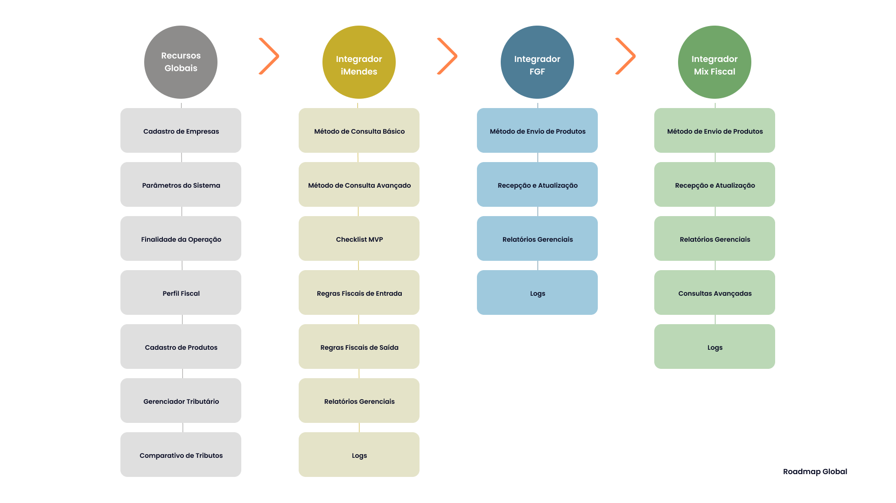
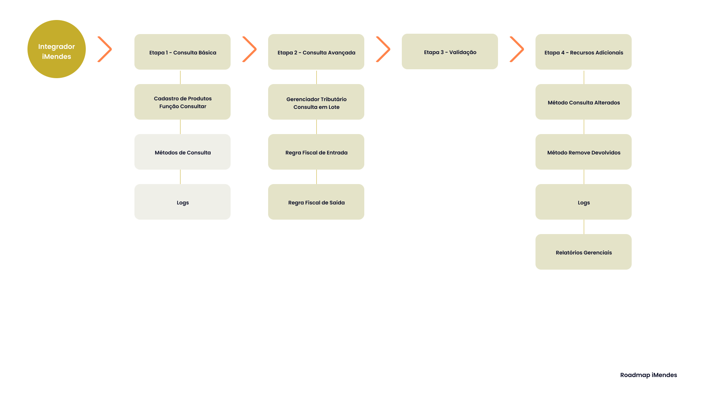
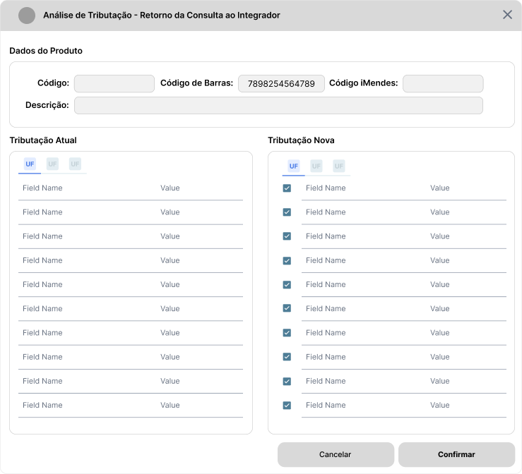
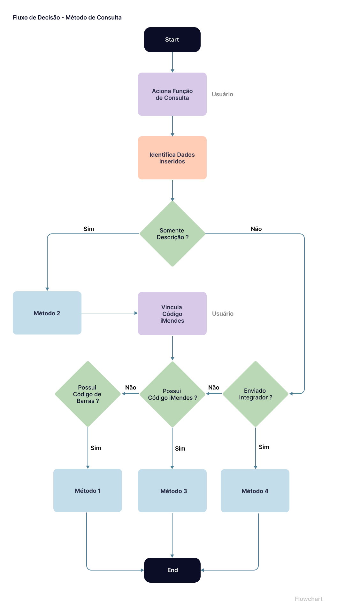
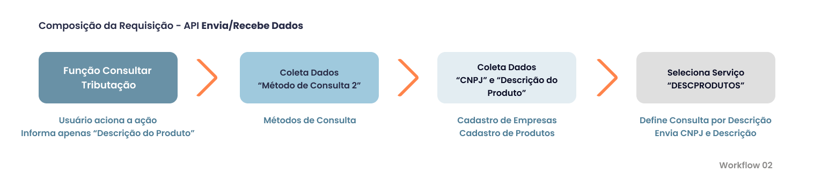
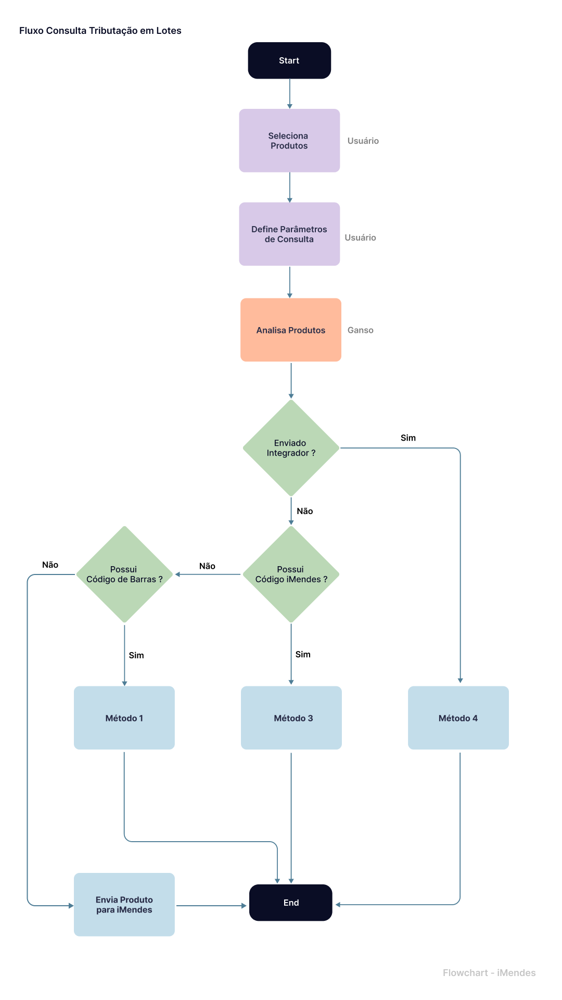

# Documentação de Requisitos - Integrações Fiscais

---

- [Documentação de Requisitos - Integrações Fiscais](#documentação-de-requisitos---integrações-fiscais)
- [Introdução](#introdução)
- [Roadmap](#roadmap)
  - [Recursos Globais](#recursos-globais)
  - [Integrador Fiscal iMendes](#integrador-fiscal-imendes)
  - [Integrador Fiscal FGF](#integrador-fiscal-fgf)
  - [Integrador Fiscal Mix Fiscal](#integrador-fiscal-mix-fiscal)
- [Requisitos Globais](#requisitos-globais)
  - [Cadastro de Empresas](#cadastro-de-empresas)
  - [Parâmetros do Sistema - Autenticação e Regras de Negócio](#parâmetros-do-sistema---autenticação-e-regras-de-negócio)
    - [Parâmetros iMendes](#parâmetros-imendes)
    - [Parâmetros FGF](#parâmetros-fgf)
    - [Parâmetros Mix Fiscal](#parâmetros-mix-fiscal)
  - [Cadastro de Finalidade de Operações](#cadastro-de-finalidade-de-operações)
  - [Cadastro de Perfil Fiscal](#cadastro-de-perfil-fiscal)
  - [Cadastro de Produtos](#cadastro-de-produtos)
    - [Funções](#funções)
    - [Novos Campos](#novos-campos)
  - [Regra Fiscal de Entrada Ganso](#regra-fiscal-de-entrada-ganso)
  - [Nova Tela - Gerenciador Tributário](#nova-tela---gerenciador-tributário)
  - [Nova Tela - Comparativo de Tributos (Antes x Depois)](#nova-tela---comparativo-de-tributos-antes-x-depois)
  - [Nova Tela - Produtos iMendes - Consulta por Descrição](#nova-tela---produtos-imendes---consulta-por-descrição)
- [Requisitos da Integração iMendes](#requisitos-da-integração-imendes)
  - [Métodos de Consulta](#métodos-de-consulta)
  - [Composição da Requisição](#composição-da-requisição)
    - [Exemplo JSON - Requisição API](#exemplo-json---requisição-api)
  - [Consulta Avançada iMendes - Gerenciador Tributário](#consulta-avançada-imendes---gerenciador-tributário)
    - [Regras de Negócio](#regras-de-negócio)
  - [Composição da Requisição em Lotes](#composição-da-requisição-em-lotes)
  - [Captura e Armazenamento dos Dados](#captura-e-armazenamento-dos-dados)
  - [Recursos Adicionais iMendes](#recursos-adicionais-imendes)
    - [Exemplos de Requisição - Métodos Adicionais](#exemplos-de-requisição---métodos-adicionais)
    - [Método Alterados](#método-alterados)
    - [Método Descrição de Produtos](#método-descrição-de-produtos)
    - [Método Remove Devolvidos](#método-remove-devolvidos)
    - [Método Histórico de Acesso](#método-histórico-de-acesso)
    - [Relação de Operações - Ganso x iMendes](#relação-de-operações---ganso-x-imendes)
- [Relação de Campos Ganso x Integrador Fiscal](#relação-de-campos-ganso-x-integrador-fiscal)
  - [Tabela Produto](#tabela-produto)
  - [Tabela Produto Parâmetros](#tabela-produto-parâmetros)
  - [Campos Dependentes](#campos-dependentes)
  - [Regra Fiscal de Entrada x Integrador Fiscal](#regra-fiscal-de-entrada-x-integrador-fiscal)
- [Requisitos da Integração FGF](#requisitos-da-integração-fgf)
- [Requisitos da Integração Mix Fiscal](#requisitos-da-integração-mix-fiscal)
  - [Composição da Requisição - Cenário Fiscal](#composição-da-requisição---cenário-fiscal)
- [Requisitos da Regra Fiscal de Saída Ganso](#requisitos-da-regra-fiscal-de-saída-ganso)
- [Requisitos de Segurança](#requisitos-de-segurança)
  - [Acessos Restritos](#acessos-restritos)
  - [Logs](#logs)
- [Requisitos de Homologação](#requisitos-de-homologação)
  - [Checklist do MVP iMendes](#checklist-do-mvp-imendes)
  - [Checklist do MVP FGF](#checklist-do-mvp-fgf)
  - [Checklist do MVP Mix Fiscal](#checklist-do-mvp-mix-fiscal)
- [Simulações](#simulações)

---

# Introdução

- O presente documento objetiva descrever em detalhes os processos e meios para Integrações Fiscais de Consulta Tributária dos parceiros **iMendes, FGF e Mix Fiscal** no Sistema Ganso.
- No Modelo de Integração escolhido, o Sistema Ganso comunica-se com o portal tributário do Parceiro Integrador através de uma **API**, e realiza a consulta da Tributação dos produtos obtendo os dados para os mesmos.
- A Consulta ocorre de modos distintos conforme o Parceiro Integrador:
  - **Parceiro iMendes**: Permite realizar consulta durante a realização de um **novo cadastro**, consultar a tributação de um ou mais **produto(s) cadastrado(s)** ou **enviar todos os Produtos** para revisão geral. Durante a consulta a resposta da API é imediata, contudo, ao enviar o cadastro completo para revisão, produtos que não possuírem classificação na base iMendes serão classificados e devolvidos em até 45 dias. O usuário pode acatar ou não as alterações através do próprio Sistema Ganso.
  - **Parceiro FGF**: Permite realizar a consulta de um produto cadastrado ou enviar todos os produtos para revisão geral. A resposta da API **não é imediata**, e o usuário precisa realizar o aceite no Portal Virtual do Integrador, **após revisão pela FGF**, para que o Sistema possa consultar as correções tributárias disponibilizadas.
  - **Parceiro Mix Fiscal**: Realiza a revisão geral do cadastros através de Cenários Fiscais. Inicialmente, a resposta da API é imediata, e o usuário pode acatar ou não as alterações através do próprio Sistema Ganso.
- O Integrador **FGF** disponibiliza apenas Informações para a Saída a Consumidor Final, contendo dados para complementação do cadastro com informações de Entrada.
- O Integrador **iMendes** retorna dados suficientes para permitir a criação de Regras Fiscais de Entrada e Saída completas no Sistema Ganso.
- Para a concretização da Integração, todos os parceiros dispoem de Métodos de Homologação obrigatórios, cujas regras são descritas nesta documentação na seção [Requisitos de Homologação](#requisitos-de-homologação)

# Roadmap

O **Roadmap** é um guia que indicará o caminho em uma ordem lógica para a implementação dos Recursos Necessários descritos neste documento. Cada Integrador Fiscal possui uma _rota_ específica que deve ser obedecida para que os objetivos sejam atingidos, contudo, os **Recursos Globais** devem ser implementados antes de cada Integrador. Pode ser observado no esquema abaixo:



## Recursos Globais

1. Etapa 1 - Preparação do Sistema Ganso. Implementar os Requisitos descritos em [Requisitos Globais](#recursos-globais)

## Integrador Fiscal iMendes

1.  Etapa 1 - Implementação do Método de Consulta Básico descrito em [Método de Consulta Básico iMendes](#métodos-de-consulta)
2.  Etapa 2 - Implementação do Método de Consulta Avançado descrito em [Método de Consulta Avançado iMendes](#consulta-avançada-imendes---gerenciador-tributário)
3.  Etapa 3 - Validação das Implementações de acordo com o Checklist descrito em [Checklist MVP iMendes](#checklist-do-mvp-imendes)
4.  Etapa 4 - Implementações de Recursos Adicionais agregados à Regra Fiscal de Entrada e Saída do Sistema Ganso descritas em [Regra Fiscal de Entrada e Saída](#regra-fiscal-de-entrada-e-saída-x-imendes)

- **Roadmap ilustrado**

  

## Integrador Fiscal FGF

## Integrador Fiscal Mix Fiscal

[Voltar ao Sumário](#documentação-de-requisitos---integrações-fiscais) | [Voltar ao Roadmap](#roadmap)

# Requisitos Globais

Nesta Seção, são descritos os **Requisitos Globais** obrigatórios e comuns a todas as Integrações desta documentação. Conforme definido no [Roadmap](#recursos-globais) é necessário adequar determinadas rotinas do Sistema Ganso para permitir integração fiscal, que requer modificações em Cadastros e Inclusão de Recursos específicos.

## Cadastro de Empresas

Os Integradores **iMendes** e **Mix Fiscal** requerem que o cadastro de Empresas contenha novos campos para agregar informações que são utilizadas durante uma requisição à API, que são:

| Nome              | Descritivo                                                                                                                                                                                                              | Validações                                                                                                                                                                                          | Obrigatório |
| :---------------- | :---------------------------------------------------------------------------------------------------------------------------------------------------------------------------------------------------------------------- | :-------------------------------------------------------------------------------------------------------------------------------------------------------------------------------------------------- | :---------: |
| Regime Tributário | Campo para informar a Subclassificação do CRT "Regime Normal", cuja informação pode ser definida entre "**Lucro Real - LR**" ou "**Lucro Presumido - LP**". Este dado é obrigatório para a obtenção de Regras corretas. | Deve ser permitido informá-lo apenas se o CRT selecionado for igual a "3 - Regime Normal".                                                                                                          |   **Sim**   |
| Área da Loja      | Campo para informar o tamanho da área fisica ocupada pelo estabelecimento do cliente em Metros Quadrados                                                                                                                | Informação importante para o Integrador Mix Fiscal, que oferece para o Cliente Integrado insights de organização mercadológica de espaços, proximidade de produtos e composição de mix de produtos. |   **Não**   |

[Voltar ao Sumário](#documentação-de-requisitos---integrações-fiscais) | [Voltar ao Roadmap](#roadmap)

## Parâmetros do Sistema - Autenticação e Regras de Negócio

- Para organizar os Integradores Fiscais de modo claro e objetivo, em **Parâmetros Gerais do Sistema** criar uma Aba "**Integrações Fiscais**" que deve conter uma "**Sub-aba**" para cada Integrador contendo as respectivas configurações individuais, conforme Tabelas a seguir.

### Parâmetros iMendes

| Tipo de Elemento          | Pai                 | Nome/Texto                                                                                                         | Descritivo                                                                                                                                                                                                                                                                                                 | Validações                                                                                                                                                                                                                                                                                                                                           | Obrigatório |
| :------------------------ | :------------------ | :----------------------------------------------------------------------------------------------------------------- | :--------------------------------------------------------------------------------------------------------------------------------------------------------------------------------------------------------------------------------------------------------------------------------------------------------- | :--------------------------------------------------------------------------------------------------------------------------------------------------------------------------------------------------------------------------------------------------------------------------------------------------------------------------------------------------- | :---------: |
| **Caixa de Seleção**      | Sub-aba iMendes     | Ativar Integração de Consulta Tributária iMendes                                                                   | Parâmetro para Ativação das Configurações de Integração e funcionalidade no Sistema Ganso                                                                                                                                                                                                                  | Não permitir ativar se houver outra Integração Fiscal Ativada no Sistema Ganso                                                                                                                                                                                                                                                                       |   **Sim**   |
| **Grupo**                 | Sub-aba iMendes     | **Autenticação**                                                                                                   | Organiza os campos de Configurações para conectividade com os Servidores iMendes                                                                                                                                                                                                                           | Ativar apenas se o Parâmetro Ativar Integração estiver selecionado                                                                                                                                                                                                                                                                                   |   **Sim**   |
| **Campo Texto**           | Grupo Autenticação  | URL da API Saneamento (Consulta Tributação)                                                                        | Campo para informar a URL da API que retorna Dados da Tributação do Produto consultado.                                                                                                                                                                                                                    | Permitir até 255 caracteres.                                                                                                                                                                                                                                                                                                                         |   **Sim**   |
| **Campo Texto**           | Grupo Autenticação  | URL da API Envia/Recebe Dados (Outros Métodos)                                                                     | Campo para informar a URL da API utilizada para os Recursos Adicionais do iMendes descritos em [Recursos Adicionais iMendes](#recursos-adicionais)                                                                                                                                                         | Permitir até 255 caracteres.                                                                                                                                                                                                                                                                                                                         |   **Sim**   |
| **Campo Texto Mascarado** | Grupo Autenticação  | Senha                                                                                                              | Campo para informar a Senha do Cliente Integrado.                                                                                                                                                                                                                                                          | Permitir até 30 caracteres alfanuméricos e símbolos                                                                                                                                                                                                                                                                                                  |   **Sim**   |
| **Caixa de Combinação**   | Grupo Autenticação  | Versão da API                                                                                                      | Seleção da Versão da API contratada. Disponibilizar as versões 2.0 e 3.0 por padrão                                                                                                                                                                                                                        | Permitir selecionar apenas uma das versões                                                                                                                                                                                                                                                                                                           |   **Sim**   |
| **Campo de Texto**        | Grupo Autenticação  | Tempo de Resposta                                                                                                  | Timeout ou Tempo de Resposta máximo da API. Tempo máximo que o Sistema deve aguardar para obter a resposta antes de efetuar uma nova requisição.                                                                                                                                                           | Campo Numérico, interpretado em segundos, com valor padrão definido em 15 segundos.                                                                                                                                                                                                                                                                  |   **Sim**   |
| **Botão de Ação**         | Grupo Autenticação  | Verificar Status                                                                                                   | Botão para acionar um comando de teste de conectividade com as APIs utilizando os dados de Autenticação e URLs informadas.                                                                                                                                                                                 | Deve retornar uma Mensagem amigável de Sucesso ou Falha, informando quais APIs foram testadas.                                                                                                                                                                                                                                                       |   **Não**   |
| **Caixa de Combinação**   | Grupo Autenticação  | Ambiente Ativo                                                                                                     | Campo para selecionar o Ambiente de Comunicação Ativado, que pode ser definido entre "**1 - Homologação ou 2 - Produção**". Este código é enviado na Requisição durante uma consulta.                                                                                                                      | Permitir selecionar apenas um dos Ambientes.                                                                                                                                                                                                                                                                                                         |   **Sim**   |
| **Grupo**                 | Sub-aba iMendes     | **Comportamento**                                                                                                  | Organiza os Parâmetros de Regra de Negócio e automatismos da Integração.                                                                                                                                                                                                                                   | Ativar apenas se o Parâmetro Ativar Integração estiver selecionado                                                                                                                                                                                                                                                                                   |   **Sim**   |
| **Caixa de Seleção**      | Grupo Comportamento | Permitir Consultar Tributação de Produtos através do Cadastro de Produtos                                          | Permite ao Usuário efetuar a Consulta Tributária durante o Cadastramento de um Novo Produto ou de um Produto Cadastrado através de uma ação no próprio Cadastro de Produtos.                                                                                                                               | Observar os Métodos de Consulta ([Ver Seção Métodos de Consulta](#método-de-consulta-básico)) e Acesso Restrito ([Ver Seção Acessos Restritos](#acessos-restritos)) da Operação.                                                                                                                                                                     |   **Sim**   |
| **Caixa de Seleção**      | Grupo Comportamento | Permitir Atualização Parcial das Informações Tributárias do Produto                                                | Permite ao Usuário decidir quais impostos serão atualizados no Produto através de uma Tela de Aceite                                                                                                                                                                                                       | Se este parâmetro for selecionado, gravar **Log** ([Ver Seção Logs](#logs)) dos campos que foram ignorados pelo Usuário e solicitar **Acesso Restrito** ([Ver Seção Acessos Restritos](#acessos-restritos)). <br><br> O parâmetro "Permitir Atualização Automática de Tributos" deve ser desativado e não aplicado se este parâmetro for selecionado |   **Sim**   |
| **Caixa de Seleção**      | Grupo Comportamento | Permitir Atualização Automática de Tributos dos Produtos                                                           | Permite atualização automatizada dos tributos de produtos ao consultar um Produto ou Receber atualizações em lote. Quando habilitado, não será exibida a tela comparativa de tributos "(Antes x Depois)" e o Usuário não poderá decidir quais impostos serão atualizados.                                  | Exibir uma mensagem informando o usuário que quando selecionada esta opção o Sistema acata toda e qualquer alteração tributária do Integrador.                                                                                                                                                                                                       |   **Não**   |
| **Caixa de Seleção**      | Grupo Comportamento | Permitir Vincular Consultar Tributação por Descrição do Produto                                                    | Permite ao Usuário consultar Tributação por Descrição e vincular um Produto Cadastrado que não possua Código de Barras Padronizado a um produto semelhante da Base de Dados iMendes, quando a consulta ocorrer por Descrição.                                                                              | Solicitar Acesso Restrito durante o procedimento no Cadastro de Produtos [Ver Seção Acessos Restritos](#acessos-restritos)                                                                                                                                                                                                                           |   **Sim**   |
| **Caixa de Seleção**      | Grupo Comportamento | Permitir atualização/criação de Regras Fiscais Ganso através das informações das Consultas Tributárias realizadas. | Permite que Regras Fiscais completas sejam criadas com base nos dados que as Consultas às APIs iMendes retornaram. Regras Fiscais com estas características não podem ser alteradas.                                                                                                                       | Exibir uma mensagem informando o usuário que as Regras Fiscais criadas não poderão ser alteradas manualmente, e são atualizadas automaticamente de acordo com as consultas realizadas pelo Usuário.                                                                                                                                                  |   **Não**   |
| **Caixa de Seleção**      | Grupo Comportamento | Permitir consultar mais de uma UF durante uma Consulta em Lotes                                                    | Permite informar mais de uma UF em uma única requisição para consulta em Lotes através de um _Gerenciador Tributário_. Necessário para atender à recomendação da iMendes, quanto ao tempo de resposta que pode ser exponencial ao número de UFs informadas.                                                | Se permitido, limitar a 5 UFs. Havendo a UF da(s) Empresa(s) Filial(is) a Requisição deverá ser gerada uma requisição especifica para a UF da Filial e uma para as demais. [Ver Método de Consulta Avançado](#método-de-consulta-avançado).                                                                                                          |   **Sim**   |
| **Caixa de Seleção**      | Grupo Comportamento | Permitir consultar mais de uma Característica Tributária durante uma Consulta em Lotes                             | Permite informar mais de uma Característica Tributária em uma única requisição para consulta em Lotes através de um _Gerenciador Tributário_. Necessário para atender à recomendação da iMendes, quanto ao tempo de resposta que pode ser exponencial ao número de Características Tributárias informadas. | Se permitido, limitar a 3. Requer tratamento específico para o Retorno. [Ver Método de Consulta Avançado](#método-de-consulta-avançado).                                                                                                                                                                                                             |   **Sim**   |
| **Campo de Texto**        | Grupo Comportamento | Limite de Produtos por Consulta em Lotes                                                                           | Permite definir o Limite Máximo de Produtos a enviar em um Lote por Requisição. Recomendado para atender clientes com limitações de conexão de internet                                                                                                                                                    | Limitar ao valor máximo de 1000 e mínimo de 100. Valor Padrão: 100                                                                                                                                                                                                                                                                                   |   **Sim**   |
| **Caixa de Seleção**      | Grupo Comportamento | Verificar Alterações Tributárias de Produtos Automaticamente a cada n dias                                         | Permite ao Sistema Ganso executar uma varredura automática na Base iMendes a fim de localizar atualizações de Tributações de Produtos, utilizando método específico da API Envia/Recebe dados.                                                                                                             | Informar um número inteiro de dias. Valor padrão: 15 dias                                                                                                                                                                                                                                                                                            |   **Não**   |

### Parâmetros FGF

### Parâmetros Mix Fiscal

[Voltar ao Sumário](#documentação-de-requisitos---integrações-fiscais) | [Voltar ao Roadmap](#roadmap)

## Cadastro de Finalidade de Operações

Os Integradores **iMendes** e **Mix Fiscal** requerem que uma **Operação** seja definida durante a Composição de uma Consulta Tributária, e estas possuem dados específicos de envio para que o Retorno de dados tributários sejam coerentes com o **Cenário** informado.

- A **iMendes** requer que um Código **CFOP** seja enviado (correto ou não, mas válido e coerente com a operação de Entrada ou Saída desejada) para consultar Regras para a operação e demais características informadas. Mesmo que o CFOP não seja o correto, é necessário haver um Código padrão de envio para obter o correto da operação.
- A **Mix Fiscal** requer que um **Cenário** Tributário pré-definido seja informado para consultar Regras e retornar os respectivos dados.

Deste modo, os novos campos necessários neste Cadastro são:
| Tipo de Elemento | Posicionamento | Nome/Texto | Descritivo | Regras de Negócio | Integrador |
|:---|:---|:---|:---|:---|:---:|
| **Botão de Seleção** | Grupo de Dados da Finalidade | Tipo de Movimentação | Seleção para indicar se a Finalidade de Operação cadastrada é uma Movimentação do Tipo **Entrada** ou **Saída**. Utilizado em conjunto com os demais campos para complementar dados da Requisição. Esta informação também será utilizada para composição de Regras Fiscais de Entrada ou Saída | Preenchimento Obrigatório. | **Todos** |
| **Campo** | Grupo Integradores Fiscais | CFOP Padrão Estadual | Campo para informar o Código do CFOP padrão para a Operação Estadual Cadastrada. Utilizado em conjunto com os demais campos para complementar dados da requisição à API **iMendes**. | Preenchimento Obrigatório. Validar se o CFOP existe na Tabela de CFOPs do Sistema Ganso conforme a definição do Tipo de Movimentação de **Entrada** ou **Saída**, e se o primeiro dígito é compatível com o Tipo de Movimentação: 1 para **Entrada** e 5 para **Saída**. | **iMendes** |
| **Campo** | Grupo Integradores Fiscais | CFOP Padrão Interestadual | Campo para informar o Código do CFOP padrão para a Operação Interestadual Cadastrada. Utilizado em conjunto com os demais campos para complementar dados da requisição à API **iMendes**. | Preenchimento Obrigatório. Validar se o CFOP existe na Tabela de CFOPs do Sistema Ganso conforme a definição do Tipo de Movimentação de **Entrada** ou **Saída**, e se o primeiro dígito é compatível com o Tipo de Movimentação: 2 para **Entrada** e 6 para **Saída**. | **iMendes** |
| **Caixa de Combinação** | Grupo Integradores Fiscais | Finalidade do Produto | Campo para definir a Finalidade do Produto. A API **iMendes** requer que seja informado o Código referente à finalidade do produto para retornar a regra correta. Deve existir por padrão as seguintes opções:<br> 0 = Revenda <br> 1 = Insumo <br> 2 = Uso e Consumo ou Ativo Imobilizado | Preenchimento obrigatório. Deve retornar o Código relacionado à opção definida. | **iMendes** |
| **Grupo de Dados** | Grupo Integradores Fiscais | Cenário Fiscal (Mix Fiscal) | Grupo para organizar dados específicos do Cenário Fiscal da Mix Fiscal. Isto é requerido para realizar uma Consulta Tributária. | Exibir apenas quando o Integrador Ativo for igual a **Mix Fiscal** | **Mix Fiscal** |
| **Caixa de Combinação** | Cenário Fiscal (Mix Fiscal) | Origem | Caixa de Combinação para definir o Parâmetro "Origem" exigido para Criação de um Cenário Fiscal na API Mix Fiscal. | Preenchimento Obrigatório quando o Integrador ativado é igual a **Mix Fiscal**. Deve existir por padrão as seguintes opções: <br> EI - Entrada Indústria <br> ED - Entrada Distribuidor <br> ES - Entrada Simples Nacional <br> BO - Bonificação <br> TR - Transferência. <br> A sigla referente à opção definida é utilizada na Requisição à API. | **Mix Fiscal** |
| **Caixa de Combinação** | Cenário Fiscal (Mix Fiscal) | Destino | Campo para definir o Cenário Fiscal vinculado à finalidade da operação para aprimorar o envio de requisição à API **Mix Fiscal** | Preenchimento Obrigatório quando o Integrador ativado é igual a **Mix Fiscal**. A sigla referente à opção definida é utilizada na Requisição à API. Deve existir por padrão as seguintes opções: <br> SAC - Saída Atacado Contribuinte <br> SAS - Saída Atacado Simples Nacional <br> SVC - Saída Varejo Contribuinte <br> SNC - Saída Não Contribuinte <br> IND - Industrialização <br> TRA - Transferência | **Mix Fiscal** |
| **Caixa de Combinação** | Cenário Fiscal (Mix Fiscal) | UF Destino | Campo para definir a UF de destino requerida para criação de um Cenário Fiscal. Esta UF determina a UF que da Operação e influencia nas informações tributárias que serão retornadas pela API. | Permitir selecionar apenas uma UF para o Cenário. Exibir todas as UFs. | **Mix Fiscal** |
| **Campo de Texto** | Cenário Fiscal (Mix Fiscal) | Id Cenário | Campo para exibir o _hash_ do Cenário cadastrado na API da Mix Fiscal. [Ver Requisitos para Integração Mix Fiscal](#requisitos-da-integração-mix-fiscal) | Somente leitura. | **Mix Fiscal** |
| **Texto** | Cenário Fiscal (Mix Fiscal) | Criado em DD/MM/AAAA - HH:MM - Usuário | Texto para exibir a Data/Hora e Usuário que efetuou o Cadastro do Cenário Fiscal na API. | Somente Leitura. | **Mix Fiscal** |
| **Texto** | Cenário Fiscal (Mix Fiscal) | Modificado em DD/MM/AAAA - HH:MM - Usuário | Texto para exibir a Data/Hora e Usuário de modificação do Cadastro do Cenário Fiscal na API. | Somente Leitura. | **Mix Fiscal** |
| **Botão** | Cenário Fiscal (Mix Fiscal) | Atualizar Cenário Fiscal | Botão de ação para Atualizar o Cenário Fiscal cadastrado. | Deve existir um "ID Cenário" vinculado à finalidade cadastrada para que seja possível atualizar o Cenário na API Mix Fiscal. Usuário deve possuir permissão. [Ver Seção Acessos Restritos](#acessos-restritos) | **Mix Fiscal** |
| **Botão** | Cenário Fiscal (Mix Fiscal) | Criar Cenário Fiscal | Botão de ação para Criar um novo Cenário Fiscal com base nas informações inseridas no Cadastro de Finalidade. | O Usuário deve possuir permissão para executar a função. [Ver Seção Acessos Restritos](#acessos-restritos) | **Mix Fiscal** |

O _Wireframe_ abaixo ilustra os elementos descritos acima para o Cadastro de Finalidade de Operação.


[Voltar ao Sumário](#documentação-de-requisitos---integrações-fiscais) | [Voltar ao Roadmap](#roadmap)

## Cadastro de Perfil Fiscal

Além de uma Operação bem definida, o Integrador **iMendes** requer que seja enviada na requisição uma **Característica Tributária** (Código específico) que no Sistema Ganso é definido como **Perfil Fiscal**. Atualmente, este cadastro é aberto e definido pelo usuário, e não garante que um Código de Característica coerente seja enviado. Desde modo, é necessário criar um campo que contenha esta informação pré-definida que também poderá ser utilizada por outros Integradores Fiscais.

| Tipo de Elemento        | Nome/Texto                | Descritivo                                                                                                                                                                                               | Validações                                                             | Integrador  |
| :---------------------- | :------------------------ | :------------------------------------------------------------------------------------------------------------------------------------------------------------------------------------------------------- | :--------------------------------------------------------------------- | :---------: |
| **Caixa de Combinação** | Característica Tributária | Campo para informar a característica tributária vinculada ao Perfil Fiscal criado. O Perfil Fiscal poderá ter uma descrição livre. Apenas o Código vinculado à característica é utilizado na Requisição. | Preenchimento obrigatório se o Integrador **iMendes** estiver ativado. | **iMendes** |

Abaixo a tabela de Códigos e Descrição padrão que o Sistema deverá oferecer:

| Código | Descritivo                               |
| :----- | :--------------------------------------- |
| 0      | Industrial                               |
| 1      | Distribuidor                             |
| 2      | Atacadista                               |
| 3      | Varejista                                |
| 4      | Produtor Rural Pessoa Jurídica           |
| 6      | Produtor Rural Pessoa Física             |
| 7      | Pessoa Jurídica não Contribuinte do ICMS |
| 8      | Pessoa Física não Contribuinte do ICMS   |

**Observação:** _O Código 5 não existe na Tabela de Referência do Integrador iMendes._

Esta informação também será necessária para a Atualização/Criação de Regras Fiscais de Entrada e Saída automáticas conforme consultas.

[Voltar ao Sumário](#documentação-de-requisitos---integrações-fiscais) | [Voltar ao Roadmap](#roadmap)

## Cadastro de Produtos

Para disponibilizar ao Usuário um Método de Consulta de Tributos através do Cadastro de um Produto, é necessário incluir **Funções Específicas** e **Campos Específicos**, descritos a seguir:

### Funções

| Nome                                          | Descritivo                                                                                                                                                                                     | Validações                                                                                   | Integrador  |
| :-------------------------------------------- | :--------------------------------------------------------------------------------------------------------------------------------------------------------------------------------------------- | :------------------------------------------------------------------------------------------- | :---------: |
| Consultar Tributação                          | Aciona a Consulta Tributária conforme Integrador ativado                                                                                                                                       | Solicitar Acesso Restrito para a Operação [Ver Seção Acessos Restritos](#acessos-restritos)  |  **Todos**  |
| Consultar Histórico de Alterações Tributárias | Aciona a visualização do Histórico de Alterações do Produto                                                                                                                                    | Solicitar Acesso Restrito para a Operação [Ver Seção Acessos Restritos](#acessos-restritos)  | **iMendes** |
| Desfazer Alterações Tributárias               | Aciona a Função contida no Histórico de Alterações para que o Usuário possa reverter dados Tributários atualizados pelo Integrador com possibilidade de escolha do ponto de reversão desejado. | Solicitar Acesso Restrito para a Operação. [Ver Seção Acessos Restritos](#acessos-restritos) | **iMendes** |

### Novos Campos

| Tipo                 | Posicionamento                | Nome/Texto                             | Descritivo                                                                                                                                                                                                                                                                                                                                                       | Validações                                                                                                                                                                                                                       |   Integrador    |
| :------------------- | :---------------------------- | :------------------------------------- | :--------------------------------------------------------------------------------------------------------------------------------------------------------------------------------------------------------------------------------------------------------------------------------------------------------------------------------------------------------------- | :------------------------------------------------------------------------------------------------------------------------------------------------------------------------------------------------------------------------------- | :-------------: |
| **Campo**            | **Grupo de Dados do Produto** | Código iMendes                         | Campo para armazenar e exibir o Código iMendes, quando ocorrer o vínculo efetuado pelo Usuário durante a Consulta por Descrição                                                                                                                                                                                                                                  | Tipo Numérico Inteiro e Somente Leitura                                                                                                                                                                                          |   **iMendes**   |
| **Campo**            | A definir                     | Auditado por (Integrador Fiscal)       | Campo para armazenar e exibir a informação de que o Produto teve a tributação auditada/atualizada pelo Integrador Fiscal. Complementar esta informação com a Data/Hora da última atualização tributária.                                                                                                                                                         | Somente leitura e visualmente destacado.                                                                                                                                                                                         |   **iMendes**   |
| **Campo**            | A definir                     | Enviado para Integrador Fiscal         | Campo para armazenar e exibir a informação de que o Produto foi enviado para Revisão Tributária para o Integrador Fiscal. Será utilizado para identificar quais Produtos estão pendentes de recepção da Tributação do Integrador **iMendes**, e como _flag_ para indicar que precisa receber atualização. Complementar esta informação com a Data/Hora do envio. | Somente leitura e visualmente destacado.                                                                                                                                                                                         |    **Todos**    |
| **Caixa de Seleção** | A definir                     | **Não Tributar por Integrador Fiscal** | Parâmetro para restringir a atualização de Tributos do Produto pelo Integrador Fiscal (_exceto Mix Fiscal_) ativo. Por decisão do Usuário, alguns produtos podem ser tributados seguindo a sua própria interpretação ou por orientação de sua contabilidade, e não irão receber atualizações do Integrador.                                                      | Solicitar Acesso Restrito. [Ver Seção Acessos Restritos](#acessos-restritos). <br><br>O Integrador Mix Fiscal requer formalização via e-mail esta decisão, portanto, esta opção deve ser desativado para o Integrador Mix Fiscal | **iMendes/FGF** |

## Regra Fiscal de Entrada Ganso

Nesta Seção são descritos os Novos Campos necessários para que as Integrações Fiscais sejam aprimoradas.

| Tipo de Elemento | Nome/Texto                   | Descritivo                                                                                                                                                                                                                                                                                           | Regra de Negócio                                                                                                                                                                                                              | Integrador  |
| :--------------- | :--------------------------- | :--------------------------------------------------------------------------------------------------------------------------------------------------------------------------------------------------------------------------------------------------------------------------------------------------- | :---------------------------------------------------------------------------------------------------------------------------------------------------------------------------------------------------------------------------- | :---------: |
| Flag             | Criado por Integrador Fiscal | Campo para sinalizar que a Regra Fiscal foi criada por um Integrador Fiscal através de um retorno de Consulta Tributária                                                                                                                                                                             | Deve ser apenas uma Flag indicativa. Ativar apenas se o Parâmetro "Permitir Criar Regras Fiscais" estiver ativado. [Ver Seção Parâmetros](#parâmetros-imendes). <br><br> Bloquear a Edição de Regras criadas pelo Integrador. | **iMendes** |
| Campo Numérico   | Código Regra iMendes         | Campo para armazenar o Código da Regra Fiscal da Base do Integrador, quando devolvido pela API. Esta informação será utilizada para eventuais atualizações da Própria Regra do Integrador, para evitar que Regras Fiscais em duplicidade possam ser criadas, e para eventuais soluções de problemas. | Armazenar o Código da Regra retornado pela API no campo especificado.                                                                                                                                                         |  **Todos**  |
| Campo Texto      | Amparo Legal                 | Campo para informar dados sobre a Legislação Vigente que impõe as informações tributárias da Regra Fiscal criada.                                                                                                                                                                                    | Deve conter espaço para informar textos de até 255 caracteres.                                                                                                                                                                |  **Todos**  |

## Nova Tela - Gerenciador Tributário

O Integrador **iMendes** oferece opção para Usuário consultar a Tributação de vários produtos em uma única Requisição (em Lote), obtendo retorno imediato conforme as configurações da Operação solicitada. Além disso, permite o envio do Cadastro Completo para revisão. Os integradores **FGF** e **Mix Fiscal** permitem apenas o envio do Cadastro Completo para Revisão Tributária (em Lote). Deste modo é necessário criar uma Nova Tela para o recurso ao Usuário. A seguir, estão descritos os Recursos que esta Nova Tela deve disponibilizar.

| Elemento            | Posicionamento                               | Nome/Texto                                 | Descritivo                                                                                                                                                                        | Conjunto de Dados e Opções                                                                                                                                                                                                                                                                                 | Regras de Negócio                                                                                                                                                                                                                                                                                                                                                                                                                                                                          |
| :------------------ | :------------------------------------------- | :----------------------------------------- | :-------------------------------------------------------------------------------------------------------------------------------------------------------------------------------- | :--------------------------------------------------------------------------------------------------------------------------------------------------------------------------------------------------------------------------------------------------------------------------------------------------------- | :----------------------------------------------------------------------------------------------------------------------------------------------------------------------------------------------------------------------------------------------------------------------------------------------------------------------------------------------------------------------------------------------------------------------------------------------------------------------------------------- |
| Grupo de Filtros    | Posição 1                                    | Segmentação                                | Grupo que organiza os campos para pesquisa de Produtos por Segmentação do Sistema Ganso.                                                                                          | Filtros de Marca, Seção, Grupo, Subgrupo, Ambiente de Utilização, Fornecedor Padrão e Agrupamento de Preços.                                                                                                                                                                                               | Validar Hierarquia de Segmentação                                                                                                                                                                                                                                                                                                                                                                                                                                                          |
| Grupo de Filtros    | Posição 2                                    | Produto                                    | Grupo que organiza os campos para pesquisa de Produtos por Características.                                                                                                       | Filtros "Contém, Começa Com, Igual a" para os campos **Descrição, Referência do Fabricante, Referência Auxiliar e Localização**, Status do Produto, Empresas (Filiais), Caixas de Seleção para as opções **Produtos com EAN/GTIN, Produtos Enviados para Integrador Fiscal, Produtos com Código iMendes**. | A opção **"Produtos com EAN/GTIN"** deve retornar apenas produtos cujo Código de Barras seja maior ou igual a 8 dígitos. <br><br> A opção **"Produtos Enviados para Integrador Fiscal"** refere-se ao itens que foram enviados uma vez em Lote para Revisão Tributária. <br><br> A opção **"Produtos com Código iMendes"** deverá ser exibida apenas se o Integrador ativo for igual a **iMendes** e listar apenas produtos que possuírem a informação preenchida no Cadastro de Produtos. |
| Botão               | Grupo de Filtros do Produto                  | Limpar filtros                             | Botão que aciona o comando para limpar todos os filtros, inclusive os do Grupo Segmentação                                                                                        | Todos os filtros                                                                                                                                                                                                                                                                                           | Exibir uma Mensagem de Confirmação e decisão do Usuário.                                                                                                                                                                                                                                                                                                                                                                                                                                   |
| Botão               | Grupo de Filtros do Produto                  | Pesquisar                                  | Botão que aciona a pesquisa considerando os filtros informados, inclusive os do Grupo Segmentação.                                                                                | Todos os filtros                                                                                                                                                                                                                                                                                           | Verificar se nenhum filtro foi preenchido, se sim, informar ao Usuário que a Consulta retornará **todos os produtos**. <br><br> Se Integrador Ativo igual a **iMendes**, informar que mesmo listando todos os Produtos, apenas os X Produtos serão enviados por lote devido a limitação da API. [Ver Seção Parâmetros iMendes](#parâmetros-imendes)                                                                                                                                        |
| Grade de Dados      | Posição 3                                    | Resultado dos Filtros                      | Tabela de Dados contendo os Produtos resultantes dos filtros informandos pelo usuário.                                                                                            | Caixa de Seleção, Código, Código de Barras, Descrição, NCM, CEST, Marca, Seção, Grupo, Subgrupo, Código iMendes, Enviado para Integrador Fiscal ([Ver Seção Cadastro de Produtos](#cadastro-de-produtos))                                                                                                  | Permitir selecionar um ou mais Produtos do Resultado. <br><br>Permitir configurar as colunas a exibir na Grade de Dados. Exibir um "_hint_" quando o usuário passar o mouse sobre um Produto, que exibe os dados Tributários **Antes e Depois**. <br><br> Observar a Limitação de Produtos do Integrador **iMendes** ([Ver Seção Parâmetros iMendes](#parâmetros-imendes))                                                                                                                 |
| Texto               | Abaixo da Grade de Resultado - lado esquerdo | [F4] - Selecionar Todos/Inverter Seleção   | Ação para permitir selecionar Todos os Produtos da Grade de Resultado ou Inverter a Seleção atual                                                                                 | Todos os dados da Grade de Resultado                                                                                                                                                                                                                                                                       | Permitir selecionar o inverter a seleção dos Produtos do Resultado usando a Tecla de Atalho. <br><br> Observar o Limite de Seleção do Integrador **iMendes** ([Ver Seção Parâmetros iMendes](#parâmetros-imendes))                                                                                                                                                                                                                                                                         |
| Texto               | Abaixo da Grade de Resultado - lado esquerdo | [F5] - Limpar Seleção                      | Ação para permitir limpar a Seleção atual da Grade de Resultado dos Filtros                                                                                                       | Todos os dados da Grade de Resultado                                                                                                                                                                                                                                                                       | -                                                                                                                                                                                                                                                                                                                                                                                                                                                                                          |
| Texto               | Abaixo Grade de Resultado - lado direito     | Produtos Listados                          | Texto informativo que exibe o contador total de Produtos que a pesquisa retornou.                                                                                                 | Produtos da Grade de Resultado                                                                                                                                                                                                                                                                             | -                                                                                                                                                                                                                                                                                                                                                                                                                                                                                          |
| Texto               | Abaixo Grade de Resultado - lado direito     | Produtos Selecionados                      | Texto informativo que exibe o contador de Produtos selecionados pelo Usuário.                                                                                                     | Produtos da Grade de Resultado                                                                                                                                                                                                                                                                             | -                                                                                                                                                                                                                                                                                                                                                                                                                                                                                          |
| Grupo de Parâmetros | Posição 4                                    | Parâmetros para Consulta Tributária        | Grupo que organiza os filtros específicos e as funções que estarão disponíveis conforme Integrador Ativo.                                                                         | Finalidade de Operação e Cenário Fiscal. Característica Tributária e Perfil Fiscal. UF de Origem e Destino.                                                                                                                                                                                                | Habilitar componentes conforme o Integrador Ativo. Ver definições dos próximos elementos.                                                                                                                                                                                                                                                                                                                                                                                                  |
| Caixa de Combinação | Grupo de Parâmetros para Consulta Tributária | Finalidade da Operação ou Cenário Fiscal   | Campo para definir a Finalidade da Operação (quando Integrador igual a **iMendes**) ou Cenário Fiscal (quando Integrador igual a **Mix Fiscal**)                                  | **Cadastro de Finalidade de Operação** ([Ver Seção Cadastro de Finalidade de Operações](#cadastro-de-finalidade-de-operações))                                                                                                                                                                             | Deve existir uma Finalidade de Operação vinculada a uma Finalidade de Produto ou Cenário Fiscal. <br><br> Se Integrador igual a **iMendes** exibir a lista de **Finalidades de Produto**. <br><br> Se Integrador igual a **Mix Fiscal** exibir a lista de **Cenários Fiscal**. Se Integrador igual a **FGF** desabilitar este campo.                                                                                                                                                       |
| Caixa de Combinação | Grupo de Parâmetros para Consulta Tributária | Característica Tributária ou Perfil Fiscal | Campo para definir a Característica Tributária a enviar na Requisição                                                                                                             | **Cadastro de Perfil Fiscal** ([Ver Seção Cadastro de Perfil Fiscal](#cadastro-de-perfil-fiscal))                                                                                                                                                                                                          | Deve existir um Perfil Fiscal vinculado a uma Característica Tributária. <br><br> Campo exclusivo do Integrador **iMendes**. <br><br> Desabilitar para os Integradores **FGF e Mix Fiscal**.                                                                                                                                                                                                                                                                                               |
| Campo de Texto      | Grupo de Parâmetros para Consulta Tributária | UFs de Origem/Destino                      | Campo para definir as UFs para as quais o usuário deseja obter as Tributações.                                                                                                    | Unidades Federadas Brasileiras                                                                                                                                                                                                                                                                             | Permitir a digitação de mais de uma UF, separadas por vírgula, limitada até 5 UFs. <br><br>Validar se a UF digitada é válida, e não permitir a digitação de UFs repetidas.                                                                                                                                                                                                                                                                                                                 |
| Botão               | Grupo de Parâmetros para Consulta Tributária | Enviar Lote para Revisão                   | Botão para acionar o Envio dos Produtos selecionados para Revisão Tributária pelo Integrador Fiscal.                                                                              | Todos os Produtos Selecionados                                                                                                                                                                                                                                                                             | Verificar Integrador Ativo. Se Integrador igual a **iMendes** [Ver Seção Consulta Avançada iMendes - Gerenciador Tributário](#consulta-avançada-imendes---gerenciador-tributário).<br><br> Se Integrador igual a **FGF** [Ver Seção Requisitos para Integração FGF](#requisitos-da-integração-fgf). <br><br>Se Integrador igual a **Mix Fiscal** [Ver Seção Requisitos para Integração Mix Fiscal](#requisitos-da-integração-mix-fiscal).                                                  |
| Botão               | Grupo de Parâmetros para Consulta Tributária | Consultar Tributação                       | Botão para acionar o comando de Consultar Tributação para os produtos selecionados na Grade de Dados.                                                                             | Produtos Selecionados                                                                                                                                                                                                                                                                                      | Se Integrador igual a **iMendes** verificar cada Produto da Seleção para definir o Método de Consulta ([Ver Seção Métodos de Consulta](#métodos-de-consulta)) e combinar com os demais Parâmetros deste grupo (Finalidade de Operação, Característica Tributária e UFs).<br><br> Se Integrador igual a **FGF e Mix Fiscal** desabilitar esta função.                                                                                                                                       |
| Botão               | Grupo de Parâmetros para Consulta Tributária | Consultar Alterações                       | Botão para acionar o comando para Consultar Alterações de Tributação para os produtos selecionados na Grade de Dados (depende do Integrador)                                      | Todos os dados                                                                                                                                                                                                                                                                                             | Se Integrador igual a **iMendes** utilizar o **Método Consulta Alterados** [Ver Seção Recursos Adicionais iMendes](#recursos-adicionais-imendes).<br><br> Se Integrador igual a **FGF ou Mix Fiscal** utilizar o **Método de Recepção** [Ver Seção Requisitos para Integração FGF](#requisitos-da-integração-fgf) e [Ver Seção Requisitos para Integração Mix Fiscal](#requisitos-da-integração-mix-fiscal), respectivamente.                                                              |
| Botão               | Grupo de Parâmetros para Consulta Tributária | Pendentes/Devolvidos                       | Botão para acionar o Recurso Específico do Integrador **iMendes** para remover os produtos da Base iMendes [Ver Seção Recursos Adicionais iMendes](#recursos-adicionais-imendes). | Produtos na Base iMendes                                                                                                                                                                                                                                                                                   | Desabilitar para os demais Integradores.                                                                                                                                                                                                                                                                                                                                                                                                                                                   |

O _Wireframe_ abaixo ilustra os elementos descritos acima para a Nova Tela.


[Voltar ao Sumário](#documentação-de-requisitos---integrações-fiscais) | [Voltar ao Roadmap](#roadmap)

## Nova Tela - Comparativo de Tributos (Antes x Depois)

Os Integradores Fiscais **iMendes e Mix Fiscal** relacionados nesta documentação sugerem que o Usuário Final visualize quais informações Tributárias estão sendo atualizadas através de uma Tela Comparativa, e especificamente o **iMendes**, sugere que seja oferecida opção para aceitar parcialmente as informações. Deste modo é necessário criar uma Tela Genérica que contempla a Relação de campos elegíveis para atualização, contendo os recursos descritos abaixo:

| Tipo de Elemento   | Posicionamento        | Nome/Texto           | Descritivo                                                                                                                                                                                                                   | Regras de Negócio                                                                                                                                                                                                                                                                                                                                                                                                                                                                      |
| :----------------- | :-------------------- | :------------------- | :--------------------------------------------------------------------------------------------------------------------------------------------------------------------------------------------------------------------------- | :------------------------------------------------------------------------------------------------------------------------------------------------------------------------------------------------------------------------------------------------------------------------------------------------------------------------------------------------------------------------------------------------------------------------------------------------------------------------------------- |
| **Grupo**          | -                     | Dados do Produto     | Organiza as informações básicas do Produto                                                                                                                                                                                   | Somente Leitura                                                                                                                                                                                                                                                                                                                                                                                                                                                                        |
| **Campo**          | **Dados do Produto**  | Código Interno       | Código do Produto Ganso                                                                                                                                                                                                      | Somente Leitura                                                                                                                                                                                                                                                                                                                                                                                                                                                                        |
| **Campo**          | **Dados do Produto**  | Código de Barras     | Código de Barras Padrão EAN/GTIN                                                                                                                                                                                             | Somente Leitura                                                                                                                                                                                                                                                                                                                                                                                                                                                                        |
| **Campo**          | **Dados do Produto**  | Descrição            | Descrição do Produto Ganso                                                                                                                                                                                                   | Somente Leitura                                                                                                                                                                                                                                                                                                                                                                                                                                                                        |
| **Campo**          | **Dados do Produto**  | Código iMendes       | Código iMendes vinculado ao Produto Consultado                                                                                                                                                                               | Somente Leitura. Exibir somente se o Integrador **iMendes** estiver ativo                                                                                                                                                                                                                                                                                                                                                                                                              |
| **Grade de Dados** | Lado esquerdo da Tela | **Tributação Atual** | Grade de dados para exibir todos os campos relacionados à Tributação Atual Gravada no Produto (antes da atualização). [Ver Seção Relação de Campos Ganso x Integrador Fiscal](#-relação-de-campos-ganso-x-integrador-fiscal) | Sempre exibir os dados atuais do Produto Cadastrado no Sistema Ganso. Somente leitura.                                                                                                                                                                                                                                                                                                                                                                                                 |
| **Grade de Dados** | Lado direito da Tela  | **Tributação Nova**  | Grade de dados para exibir todos os campos relacionados à Tributação Nova **retornados pela API do Integrador**. [Ver Seção Relação de Campos Ganso x Integrador Fiscal](#-relação-de-campos-ganso-x-integrador-fiscal)      | Se Integrador **iMendes** ativado, exibir uma **Caixa de Seleção** que permita o Usuário aceitar parcialmente a tributação de um Produto, ou seja, selecionar quais tributos serão atualizados. [Ver Seção Relação de Campos Ganso x Integrador Fiscal](#-relação-de-campos-ganso-x-integrador-fiscal) que aponta quais informações são dependentes. Não exibir a Caixa de Seleção para o Integrador **Mix Fiscal**. <br><br>O Integrador FGF possui portal próprio para visualização. |
| **Botão**          | -                     | **Confirmar**        | Botão para confirmar a atualização dos Tributos                                                                                                                                                                              | Solicitar Acesso Restrito [Ver Seção Acessos Restritos](#acessos-restritos) e Gravar em Log ([Ver Seção Logs em Requisitos de Segurança](#logs)) os campos não selecionados (quando ocorrer).                                                                                                                                                                                                                                                                                          |

A seguir, o _Wireframe_ ilustra os elementos descritos na Tabela acima:



[Voltar ao Sumário](#documentação-de-requisitos---integrações-fiscais) | [Voltar ao Roadmap](#roadmap)

## Nova Tela - Produtos iMendes - Consulta por Descrição

O Integrador **iMendes** possui um recurso importante para garantir que o Usuário consiga informações Tributárias de todos os seus Produtos, mesmo os que não possuírem **Código de Barras** padronizado. Trata-se da **Pesquisa por Descrição**, em que é oferecida a Base de Dados **iMendes** para que o Usuário relacione o seu Produto e efetue a Consulta Tributária conforme desejado. Este recurso deve ser disponibilizado apenas na **Consulta Básica através do Cadastro de Produtos** e deve ser acionada conforme as Regras de Negócio abaixo:

|                       Ação do Usuário                        | Dados Inseridos                                                        | Mensagem ao Usuário                                                                                                                                                                           | Decisão                                                                                                                                                                                                                                                                                                                                                                                                      | Validações                                                                                                                                                                             |
| :----------------------------------------------------------: | :--------------------------------------------------------------------- | :-------------------------------------------------------------------------------------------------------------------------------------------------------------------------------------------- | :----------------------------------------------------------------------------------------------------------------------------------------------------------------------------------------------------------------------------------------------------------------------------------------------------------------------------------------------------------------------------------------------------------- | :------------------------------------------------------------------------------------------------------------------------------------------------------------------------------------- |
|                   Cadastrando Novo Produto                   | Apenas Descrição do Produto                                            | Informar que a Consulta Tributária ocorrerá através da Descrição e que o Usuário deverá tomar a decisão em vincular um **Código iMendes** para futuras consultas.                             | Utilizar o [**Método de Consulta 2**](#métodos-de-consulta) e exibir os Produtos encontrados                                                                                                                                                                                                                                                                                                                 | Solicitar Chave de Acesso Restrito para vincular Código iMendes. [Ver Seção Acessos Restritos](#acessos-restritos)                                                                     |
| Cadastrando Novo Produto ou Utilizando um Produto Cadastrado | Descrição e Código de Barras inválido, mas com 8, 12, 13 ou 14 dígitos | Informar que o Código de Barras é inválido e solicitar que o usuário verifique o Código. Disponibilizar as opções para **"Continuar por Descrição"** e **"Continuar pelo Código de Barras"**. | Se Usuário **"Continuar por Descrição"**, exibir mensagem informando que a consulta ocorrerá através da Descrição, e utilizar o [**Método de Consulta 2**](#métodos-de-consulta) e exibir os Produtos encontrados.<br><br> Se Usuário **"Continuar pelo Código de Barras"**, utilizar o [**Método de Consulta 1**](#métodos-de-consulta) e exibir mensagem informando que o Produto pode não ser encontrado. | Aplicar método de validação do Código de Barras pelo dígito verificador. <br><br> Exibir mensagem clara e objetiva sobre possível falha do Processo "Continuar pelo Código de Barras". |


# Requisitos da Integração iMendes

Nesta Seção são descritos os Requisitos da Integração iMendes, que atende à Homologação e abrange os principais recursos do Integrador. Para um Produto, existem 4 (quatro) Métodos de Consulta e cada um utiliza dados específicos para gerar a Requisição e obter os dados. A seguir serão descritos os Métodos e informações.

## Métodos de Consulta

Os Métodos de Consulta são necessários para a tomada de decisão durante a consulta tributária de um Produto, pois, _depende de quais informações serão fornecidas pelo Usuário ao Sistema_. Cada Método possui uma API de consulta específica e requer dados específicos. A seguir a definição de cada Método:

|    Método    |                   Tipo de Consulta                   | Descritivo                                                                                                                                                            | Regras de Negócio                                                                                                                                                                                                                                                                                                                                                                                                                                                |     API a Consumir     | Tags de Envio Principais                                                     |
| :----------: | :--------------------------------------------------: | :-------------------------------------------------------------------------------------------------------------------------------------------------------------------- | :--------------------------------------------------------------------------------------------------------------------------------------------------------------------------------------------------------------------------------------------------------------------------------------------------------------------------------------------------------------------------------------------------------------------------------------------------------------- | :--------------------: | :--------------------------------------------------------------------------- |
| **Método 1** | **Código de Barras EAN/GTIN e Descrição do Produto** | Consultar a Tributação do Produto utilizando o Código de Barras EAN/GTIN e a Descrição do Produto                                                                     | Identificar se o Código é um EAN válido, considerando tamanho de 8, 12, 13 ou 14 dígitos. Durante envio da Consulta, considerar sempre 14 dígitos para envio, preenchendo com Zeros à esquerda caso EAN diferente de tamanho 14. Se EAN válido, identificar se o Prefixo do Código de Barras inicia em "789" ou "790", ou "1789" ou "1790" e enviar origem igual a 0, caso contrário enviar origem igual a 8. Capturar o retorno dos dados pela Tag `"prodEAN"`. |     **Saneamento**     | `"codigo":"EAN", "codInterno":"N", "codIMendes":"", "descricao":"DESCRICAO"` |
| **Método 2** |                 **Apenas Descrição**                 | Consultar a Tributação de um Produto utilizando a Descrição. Capturar a lista de Produtos semelhantes, e permitir vincular um Produto iMendes com o Produto corrente. | Permitir vincular apenas **um** Produto iMendes com **um** Produto cadastrado. Solicitar Acesso Restrito para esta operação. Permitir vincular se o Produto está sem Código de Barras Padronizado e não está vinculado a um Código iMendes. [Ver Seção Acessos Restritos](#acessos-restritos)                                                                                                                                                                    | **Envia/Recebe Dados** | `"nomeservico":"DESCPRODUTOS", "dados":"CNPJ\|DESCRICAO" `                   |
| **Método 3** |            **Código iMendes e Descrição**            | Consultar a Tributação do Produto utilizando o Código iMendes previamente vinculado.                                                                                  | Verificar se o Produto possui um Código iMendes, se sim, utilizar esta informação para localizar a tributação.                                                                                                                                                                                                                                                                                                                                                   |     **Saneamento**     | `"codIMendes":"CODIGOVINCULADO", "descricao":"DESCRICAO"`                    |
| **Método 4** |                  **Código Interno**                  | Consultar a Tributação do Produto utilizando o **Código Interno** do Produto Ganso previamente classificado pela iMendes                                              | Verificar se o Produto possui o campo **Enviado para Integrador Fiscal** preenchido para definir utilização deste método. [Ver definição do Campo no Cadastro de Produto](#cadastro-de-produtos)                                                                                                                                                                                                                                                                 |     **Saneamento**     | `"codInterno":"CODIGOINTERNO"`                                               |

Para ilustrar a tomada de decisão que o Sistema Ganso deverá realizar conforme o _Input de dados_ do Usuário no Cadastro do Produto, o **Fluxo de Decisão** define as decisões necessárias.



[Voltar ao Sumário](#documentação-de-requisitos---integrações-fiscais) | [Voltar ao Roadmap](#roadmap)

## Composição da Requisição

Conforme **Manual de Integração iMendes**, uma Consulta a **API de Saneamento** requer um padrão `JSON`, e a Função de Consulta Básica através do **Cadastro de Produtos** possui o seguinte _Workflow_:

1. Usuário aciona a **Função de Consulta** ([Ver Seção Cadastro de Produtos / Funções](#cadastro-de-produtos))
2. O Sistema deverá identificar **que dados foram inseridos pelo Usuário** (executando o **Fluxo de Decisão de Método de Consulta**) para definir o [**Método de Consulta**](#métodos-de-consulta), Tags principais e _endpoint_ de consulta.
3. Se o **Método de Consulta** definido for igual a **"Método 2 - Apenas Descrição"**, executar o **Passo 8**, senão, continuar a partir do **Passo 4**
4. Coleta dados do Emitente e gera a Tag `"emit"` do `JSON`
5. Coleta dados do Perfil do Destinatário da Operação e gera a Tag `"perfil"` do `JSON`
6. Coleta dados do Produto e gera a Tag `"produtos"`
7. Constrói a estrutura JSON obedecendo a ordem: `emit` > `perfil` > `produtos` e executa o **Passo 9**
8. Utilizar a **API Envia/Recebe Dados** e exibir a [**Nova Tela - Produtos iMendes - Consulta por Descrição**](#nova-tela---produtos-imendes---consulta-por-descrição) para Usuário vincular o Produto e retornar ao **Passo 2**.
9. Envia requisição ao _endpoint_ indicado. [Ver Seção Parâmetros iMendes](#parâmetros-imendes)
10. Obtém retorno.

A ilustração abaixo, demonstra os passos que compoem a Consulta a **API Saneamento**


A ilustração abaixo, demonstra os passos que compoem a Consulta a **API Envia/Recebe Dados**



A Tag `emit` que deve conter os dados da Empresa, possui a seguinte relação de dados abaixo:
| Dado | Tag | Tipo | Descritivo | Origem dos Dados | Preenchimento Obrigatório |
|:---|:---|:---|:---|:---|:---:|
| Ambiente | `"amb"` | Código | Tipo de Ambiente de Envio da Requisição, sendo 1 = Homologação e 2 = Produção. | [Ver Seção Parâmetros do Sistema / Aba Integrações Fiscais / Sub-aba iMendes](#parâmetros-do-sistema---autenticação-e-regras-de-negócio) campo "Ambiente Ativo" | **Sim** |
| CNPJ | `"cnpj"` | Caractere | CNPJ do Emitente da Consulta (Cliente) | **Cadastro de Empresas** campo "CNPJ" | **Sim** |
| CRT | `"crt"` | Código | Código do CRT da Empresa. 1 = Simples Nacional, 2 = Simples Nacional com excesso de sublimite ou 3 = Regime Normal | **Cadastro de Empresas** campo "CRT"| **Sim** |
| Regime Tributário | `"regimeTrib"` | Caractere | Regime Tributário da Empresa. Complemento do CRT 3. Pode ser definido entre 'LR' (Lucro Real) e 'LP' (Lucro Presumido) | **Cadastro de Empresas** campo novo "Regime Tributário". [Ver Seção Cadastro de Empresas](#cadastro-de-empresas) | **Sim** |
| UF | `"uf"` | Caractere | UF do Emitente | **Cadastro de Empresas** campo "UF" do Endereço | **Sim** |
| CNAE | `"cnae"` | Caractere | CNAE do Emitente | **Cadastro de Empresas** campo "CNAE" | **Não** |
| Substuto Tributário | `"substICMS"` | Caractere | Indicativo de Emitente Substituto Tributário. Se houver uma Inscrição Estadual de Substituto Tributário informada no Cadastro de Empresas, deve ser enviado esta informação tanto na tag `"emit"` quando na Tag `"produtos"` | **Cadastro de Empresas** grid de dados "Inscrição Substituto Tributário" | **Não** |
| Dia | `"Dia"` | Número | Dia da Vigência combinada com Mês e Ano para consultas específicas por Data | - | **Não** |
| Mês | `"Mês"` | Número | Mês da Vigência combinada com Dia e Ano para consultas específicas por Data | - | **Não** |
| Ano | `"Ano"` | Número | Ano da Vigência combinada com Dia e Mês para consultas específicas por Data | - | **Não** |
| Interdependente | `"interdependente"` | Caractere | Informação específica. Enviar sempre como "N" | - | **Sim** |

Além das informações da **Empresa**, são necessárias informações para compor o **Perfil** do Destinatário da Operação em que se deseja obter a Tributação. Deste modo, em uma **Consulta Básica** através do **Cadastro de Produtos**, obtém-se apenas dados para a operação específica de **Saída na Operação de Venda ao Consumidor Final (NFC-e)**. Para as demais operações, estes dados serão necessários, contudo serão tratados de maneira distinta nesta documentação na [Seção Consulta Avançada - Gerenciador Tributário](#consulta-avançada---gerenciador-tributário). Os dados necessários para a Tag do `"perfil"` são:

| Dado                      | Tag            | Tipo                          | Descritivo                                                                                                                                                                                                                                                  |                                                               Regra de Negócio                                                               | Preenchimento Obrigatório |
| :------------------------ | :------------- | :---------------------------- | :---------------------------------------------------------------------------------------------------------------------------------------------------------------------------------------------------------------------------------------------------------- | :------------------------------------------------------------------------------------------------------------------------------------------: | :-----------------------: |
| UF                        | `"uf"`         | **Lista de Dados**            | Lista de UFs para Consulta de Regras.                                                                                                                                                                                                                       |                                                         UF da Empresa Filial Logada                                                          |          **Sim**          |
| CFOP                      | `"cfop"`       | **Código da Operação**        | Código da Operação a ser Realizada. Deve ser enviada uma operação coerente com os dados desejados, por exemplo, uma Operação de Venda deve conter um CFOP que indique operação de Venda, mesmo que este não seja o correto (a iMendes retornará o correto). |                                                      Preencher com o Código **"5102"**                                                       |          **Sim**          |
| Característica Tributária | `"caracTrib"`  | **Lista de Códigos Inteiros** | Indica o Tipo de Destinatário da Operação                                                                                                                                                                                                                   |                                           Preencher com o Código "8" que indica "Consumidor Final"                                           |          **Sim**          |
| Finalidade                | `"finalidade"` | Código                        | Indica a Destinação do Produto para a Operação informada. É importante para especificar a operação. [Ver Seção Cadastro de Perfil Fiscal](#cadastro-de-perfil-fiscal)                                                                                       |                                                          Preencher com o Código "0"                                                          |          **Sim**          |
| Simples Nacional          | `"simplesN"`   | Caractere                     | Indica se o Destinatário da Operação é Simples Nacional ou Não. Preenchido com "S" ou "N".                                                                                                                                                                  |                                      Se CRT da Empresa é igual a 1 ou 2, enviar "S", senão, enviar "N".                                      |          **Sim**          |
| Origem                    | `"origem"`     | Código                        | Indica a Origem da Mercadoria.                                                                                                                                                                                                                              |                 Se Tipo de Consulta igual a **Método 1**, e **Código de Barras** não iniciar em 789 ou 790, enviar Código 8.                 |          **Sim**          |
| Substituição Tributária   | `"substICMS"`  | Caractere                     | Indica se o destinatário é Substituto Tributário.                                                                                                                                                                                                           | Se houver uma Inscrição Estadual de Substituto Tributário informada no Cadastro de Empresas, deve ser enviado "S", caso contrário enviar "N" |          **Sim**          |

Obtidos os dados do Perfil, a Tag de `"produtos"` é um _array_ de Produtos e deve ser composta conforme dados e Regras de Negócio abaixo:

| Dado           | Tag            | Tipo      | Descritivo                                                                                                                               | Origem dos Dados                                                                                            | Regras de Negócio                                                                                                                                                                                                                            | Preenchimento Obrigatório |
| :------------- | :------------- | :-------- | :--------------------------------------------------------------------------------------------------------------------------------------- | :---------------------------------------------------------------------------------------------------------- | :------------------------------------------------------------------------------------------------------------------------------------------------------------------------------------------------------------------------------------------- | :-----------------------: |
| Código         | `"codigo"`     | Código    | Código de Barras EAN/GTIN ou Código Interno do Produto quando o mesmo foi enviado previamente para Saneamento pela iMendes               | **Cadastro de Produtos** campo Código de Barras Padrão ou Código Interno                                    | Verificar o Método de Consulta apropriado para preenchimento deste campo, observando a Regra de Negócio. [Ver Seção Métodos de Consulta](#métodos-de-consulta)                                                                               |          **Sim**          |
| Código Interno | `"codInterno"` | Caractere | Indicativo de "Sim" ou "Não" para consulta via Código Interno, quando o Produto foi enviado previamente para Saneamento pela iMendes     | Preencher com "S" ou "N" de acordo com a Regra de Negócio                                                   | Se o Produto está sinalizado como **"Enviado para Integrador Fiscal"**, enviar "S" e utilizar o **Método de Consulta 4** informando Código Interno do Produto na Tag `codigo` do JSON. [Ver Seção Métodos de Consulta](#métodos-de-consulta) |          **Sim**          |
| Descrição      | `"descricao"`  | Caractere | Descrição Completa do Produto                                                                                                            | **Cadastro de Produtos** campo "Descrição"                                                                  | Sempre enviar a Descrição Completa do Produto.                                                                                                                                                                                               |          **Sim**          |
| Código iMendes | `"codImendes"` | Código    | Código _Único_ fornecido pela iMendes. Quando um produto é vinculado ao código iMendes esta informação deve ser utilizada para consulta. | **Cadastro de Produtos** campo **"Codigo iMendes"** [Ver Seção Cadastro de Produtos](#cadastro-de-produtos) | Verificar se o Código iMendes está preenchido, se sim, enviar o este Código, senão enviar em branco. Utilizar o **Método de Consulta 3** [Ver Seção Métodos de Consulta](#métodos-de-consulta)                                               |          **Não**          |
| NCM            | `"ncm"`        | Caractere | Nomenclatura Comum do Mercosul                                                                                                           | **Cadastro de Produtos** campo "NCM"                                                                        | Verificar se NCM está preenchido no Cadastro do Produto. Esta informação é importante para o comparativo de tributos "(Antes x Depois)"                                                                                                      |          **Não**          |

### Exemplo JSON - Requisição API

A Estrutura abaixo exemplifica uma Consulta do Produto **Água Mineral** através do **Cadastro de Produtos** para **Operação de Saída a Consumidor Final** para o Estado de **MS** (Operação Interna). Na Tag `perfil/uf` é enviada apenas a UF correspondente à UF da Empresa Filial, ou seja, da Tag `emit/uf`.

```JSON
{
  "emit": {
    "amb": 1,
    "cnpj": "04391715000173",
    "crt": 3,
    "regimeTrib": "LR",
    "uf": "MS",
    "cnae": "",
    "substICMS": "N",
    "interdependente": "N"
  },
  "perfil": {
    "uf": ["MS"],
    "cfop": "5102",
    "caracTrib": [8],
    "finalidade": 0,
    "simplesN": "N",
    "origem": "0",
    "substICMS": "N"
  },
  "produtos": [
    {
      "codigo": "7894900531008",
      "codInterno": "N",
      "codIMendes": "",
      "descricao": "AGUA MINERAL CRYSTAL C/GAS 500ML",
      "ncm": "22011000"
    }
  ]
}
```

A requisição acima, retorna a seguinte Estrutura de Dados:

```JSON
  "Cabecalho": {
        "sugestao": "Se a comunicação estiver lenta, reduza o número de UF's, Caract. Tributárias e produtos. Nessa ordem.",
        "amb": 1,
        "cnpj": "04391715000173",
        "dthr": "2022-08-18T11:37:34.7495236-03:00",
        "transacao": "48773646",
        "mensagem": "OK",
        "prodEnv": 1,
        "prodRet": 1,
        "prodNaoRet": 0,
        "comportamentosParceiro": "104;106;108",
        "comportamentosCliente": "",
        "versao": "2.3.5.0"
    },
    "Grupos": [
        {
            "codigo": "7408",
            "nCM": "22011000",
            "cEST": "03.005.04",
            "lista": "",
            "tipo": "",
            "codAnp": "",
            "passivelPMC": "S",
            "impostoImportacao": 20.00,
            "pisCofins": {
                "cstEnt": "73",
                "cstSai": "06",
                "aliqPis": 0.00,
                "aliqCofins": 0.00,
                "nri": "918",
                "ampLegal": "'Lei n 13.097/2015, Art. 28'",
                "redPis": 0,
                "redCofins": 0
            },
            "iPI": {
                "cstEnt": "03",
                "cstSai": "53",
                "aliqipi": 0.00,
                "codenq": "999",
                "ex": "00"
            },
            "Regras": [
                {
                    "uFs": [
                        {
                            "uF": "MS",
                            "CFOP": {
                                "cFOP": "5102",
                                "CaracTrib": [
                                    {
                                        "codigo": "8",
                                        "finalidade": "0",
                                        "codRegra": "1473",
                                        "codExcecao": 0,
                                        "cFOP": "5405",
                                        "cST": "60",
                                        "cSOSN": "",
                                        "aliqIcmsInterna": 17.00,
                                        "aliqIcmsInterestadual": 0.00,
                                        "reducaoBcIcms": 0.00,
                                        "reducaoBcIcmsSt": 0,
                                        "redBcICMsInterestadual": 0,
                                        "aliqIcmsSt": 0,
                                        "iVA": 0,
                                        "iVAAjust": 0,
                                        "fCP": 0.00,
                                        "codBenef": "",
                                        "pDifer": 0,
                                        "pIsencao": 0.00,
                                        "antecipado": "N",
                                        "desonerado": "N",
                                        "isento": "N",
                                        "tpCalcDifal": 0,
                                        "ampLegal": "'BASE LEGAL DA SUBSTITUICAO TRIBUTARIA - RICMS/MS, ANEXO III, SUBANEXO I, TABELAS IV-A E IV-B, ITEM 5.4'",
                                        "InfPDV": {
                                            "pICMSPDV": 0,
                                            "simbPDV": "F",
                                            "cstICMS": "60",
                                            "csosn": "",
                                            "cstSai": "06",
                                            "aliqPis": 0.00,
                                            "aliqCofins": 0.00
                                        },
                                        "Protocolo": {},
                                        "Convenio": {}
                                    }
                                ]
                            },
                            "mensagem": "OK"
                        }
                    ]
                }
            ],
            "prodEan": [
                "07894900531008"
            ],
            "Mensagem": "OK"
        }
    ],
    "SemRetorno": []
}
```

Após Processo de Envio e Captura de Retorno, os seguintes passos devem ocorrer:

1. Os dados devem ser Interpretados e Relacionados com seus respectivos campos, conforme descrito em [**Relação de Campos Ganso x Integrador Fiscal / Coluna "Ganso" e "Retorno iMendes"**](#relação-de-campos-ganso-x-integrador-fiscal).
2. O Usuário precisa visualizar os dados relacionados utilizando a [**Nova Tela - Comprativo de Tributos (Antes x Depois)**](#nova-tela---comparativo-de-tributos-antes-x-depois) e decidir quais **Tributos** deverão ser atualizados. O Sistema Ganso deve considerar os [Parâmetros do Sistema](#parâmetros-imendes) e [Acessos Restritos](#acessos-restritos) nesta operação.
3. Após confirmação, os dados Tributários devem ser **efetivados** para o Produto, e os [**Logs**](#logs) gerados e gravados corretamente.

[Voltar ao Sumário](#documentação-de-requisitos---integrações-fiscais) | [Voltar ao Roadmap](#roadmap)

## Consulta Avançada iMendes - Gerenciador Tributário

A Consulta Avançada do Integrador iMendes utilizará a [**Nova Tela do Gerenciador Tributário**](#nova-tela---gerenciador-tributário), contudo, **Regras de Negócio** devem ser observadas, conforme ação do Usuário definidas a seguir.

### Regras de Negócio

| Ação do Usuário                                                                                                                                 | Validação                                                                                                                                               | Resposta ao Usuário                                                                                                                                                                                                                                                                                              | Dados da Composição                                                                                                                                                                                                                                                                                                                                                                                                                            | Tags de Envio Principais                                        |
| :---------------------------------------------------------------------------------------------------------------------------------------------- | :------------------------------------------------------------------------------------------------------------------------------------------------------ | :--------------------------------------------------------------------------------------------------------------------------------------------------------------------------------------------------------------------------------------------------------------------------------------------------------------- | :--------------------------------------------------------------------------------------------------------------------------------------------------------------------------------------------------------------------------------------------------------------------------------------------------------------------------------------------------------------------------------------------------------------------------------------------- | :-------------------------------------------------------------- |
| Informar uma **Finalidade de Operação** do tipo **Entrada** ou **Saída** e no campo UFs, informar a UF da Empresa Filial e Outras UFs           | Gerar uma **Requisição** específica para a UF da Empresa Filial e outra **Requisição** para as demais UFs.                                              | Informar que serão geradas duas Requisições distintas para API, e que os dados Recebidos serão agrupados por UF.                                                                                                                                                                                                 | Utilizar o **Código CFOP Padrão Estadual** da **Finalidade de Operação** informada para gerar a **Requisição** da UF da Empresa Filial, e o **Código CFOP Padrão Interestadual** da **Finalidade de Operação** informada para as demais UFs. Utilizar a **Finalidade do Produto** contida na **Finalidade da Operação** informada para compor a Consulta. [Ver Seção Cadastro de Finalidade de Operação](#cadastro-de-finalidade-de-operações) | `perfil/uf`, `perfil/cfop`, `perfil/finalidade`                 |
| Filtrar e Selecionar Produtos que requerem **Métodos de Consulta** distintos. [**Ver Seção Métodos de Consulta iMendes**](#métodos-de-consulta) | Tratar cada situação de modo distinto (conforme o Método de Consulta) para assegurar que a consulta seja realizada utilizando a API correta do iMendes. | Informar ao Usuário que determinados Produtos poderão ser consultados por meios distintos e que alguns deverão ser processados individualmente, como por exemplo, Produtos que precisam ser **Consultados na Base iMendes por Descrição**. [Ver Seção Métodos de Consulta - Métodos 2 e 3](#métodos-de-consulta) | Código iMendes, Enviado para Integrador Fiscal [Ver Seção Cadastro de Produtos](#cadastro-de-produtos)                                                                                                                                                                                                                                                                                                                                         | `produtos/codigo`, `produtos/codInterno`, `produtos/codImendes` |

[Voltar ao Sumário](#documentação-de-requisitos---integrações-fiscais) | [Voltar ao Roadmap](#roadmap)

## Composição da Requisição em Lotes

O _Fluxograma_ abaixo, ilustra a tomada de decisão durante o disparo de consulta em Lotes.



[Voltar ao Sumário](#documentação-de-requisitos---integrações-fiscais) | [Voltar ao Roadmap](#roadmap)

## Captura e Armazenamento dos Dados

[Voltar ao Sumário](#documentação-de-requisitos---integrações-fiscais) | [Voltar ao Roadmap](#roadmap)

## Recursos Adicionais iMendes

O Integrador iMendes oferece métodos adicionais através da **API Envia/Recebe Dados** que retorna dados específicos como **Histórico de Acesso, Produtos Alterados, Consulta por Descrição e Remoção de Produtos da Base iMendes**. Os métodos interessantes para o usuário são: **Produtos Alterados, Consulta por Descrição e Remoção de Produtos**, que estão descritos a seguir.

| Serviço              | Descritivo                                                                                                                                                                      | Composição da Requisição                                                                                                                                                                | Retorno                                              | Tratamento                                                                                                                                                                                                      |
| :------------------- | :------------------------------------------------------------------------------------------------------------------------------------------------------------------------------ | :-------------------------------------------------------------------------------------------------------------------------------------------------------------------------------------- | :--------------------------------------------------- | :-------------------------------------------------------------------------------------------------------------------------------------------------------------------------------------------------------------- |
| **ALTERADOS**        | Retorna a Lista de Produtos cuja revisão tributária foi finalizada pela iMendes ou que tiveram algum tipo de alteração desde a última consulta do produto para o CNPJ indicado. | - Nome do Serviço = 'ALTERADOS' <br> - Dados (CNPJ, UF, Limite de Produtos) [Ver Seção Exemplos Requisição - Métodos Adicionais](#método-alterados)                                     | Cabeçalho e Lista de Produtos                        | \*Criar método de verificação e processamento de atualização dos Produtos, utilizando a data de revisão.                                                                                                        |
| **DESCRPRODUTOS**    | Retorna a Lista de Produtos compatível com a descrição informada para pesquisa, com limite máximo de 100 Produtos.                                                              | - Nome do Serviço = 'DESCRPRODUTOS' <br> - Dados = CNPJ, DESCRIÇÃO, Tipo [Ver Seção Exemplos Requisição - Métodos Adicionais](#método-descrição-de-produtos)                            | Cabeçalho e Produtos                                 | Exibir o ID, Descrição e EAN na [**Nova Tela - Consulta por Descrição**](#nova-tela---produtos-imendes---consulta-por-descrição).                                                                               |
| **REMOVEDEVOLVIDOS** | Envia uma Lista de IDs para remoção da Base de Dados iMendes, quando o Usuário desejar eliminar seus Produtos classificados pela iMendes.                                       | - Nome do Serviço = 'REMOVEDEVOLVIDOS' <br> - Dados (CNPJ, Produtos) em um padrão distinto do comum. [Ver Seção Exemplos de Requisição - Métodos Adicionais](#método-remove-devolvidos) | Mensagem de Sucesso e Quantidade de Itens Removidos. | Enviar os Produtos selecionados na [**Nova Tela - Gerenciador Tributário**](#nova-tela---gerenciador-tributário) resultantes de uma pesquisa selecionando a opção **Produtos Enviados para Integrador Fiscal**. |

### Exemplos de Requisição - Métodos Adicionais

### Método Alterados

```JSON
/* Envio */
{
  "nomeServico": "ALTERADOS",
  "dados": "04391715000173|MS|100"
}

/* Retorno */
{
  "cabecalho": {
        "CNPJ": "04391715000173",
        "UF": "MS",
        "produtosRetornados": 4,
        "mensagem": "OK"
  },
  "produto": [{
        "codigo": "1602",
        "dtultcons": "2017-12-22",
        "dtrev": "2018-02-15"
  },
  {
    "codigo": "27153",
    "dtultcons": "2017-12-22",
    "dtrev": "2018-02-15"
  },
  {
    "codigo": "1696",
    "dtultcons": "2017-12-22",
    "dtrev": "2018-02-15"
  },
  {
    "codigo": "8903855062822",
    "dtultcons": "2017-12-22",
    "dtrev": "2018-02-15"
  }]
}
```

O método "ALTERADOS" permite verificar se há atualizações ocorridas para os produtos, que permite criar automatismos com base na "Data de Revisão" retornada pelo método.

### Método Descrição de Produtos

```JSON

/* Envio */
{
  "nomeServico": "DESCRPRODUTOS",
  "dados": "04391715000173|ARROZ|0"
}

/* Retorno*/
{
  "cabecalho": {
    "CNPJ": "71xxxxxx000160",
    "produtosRetornados": 100,
    "mensagem": "OK"
  },
  "produto": [{
    "id": "245197",
    "descricao": "*ARROZ CAMIL 1KG PARBOILIZADO EM SAQUINHOS C/8UN",
    "ean": ""
  },
  {
    "id": "114389",
    "descricao": "*ARROZ CAMIL PRETO 250G",
    "ean": ""
  },
  {
    "id": "248654",
    "descricao": "*ARROZ MOMIJI 1KG LONGO ORIENTAL",
    "ean": ""
  },
  {
    "id": "248655",
    "descricao": "*ARROZ MOMIJI 5KG CURTO ORIENTAL",
    "ean": ""
  },
  {
    "id": "1523329",
    "descricao": "ARROZ ROSALITO 5 KG",
    "ean": ""
  }]
}
```

O método "DESCRPRODUTOS" é utilizado quando o usuário deseja consultar a Base de dados **iMendes** para relacionar um Produto semelhante ao seu Produto Cadastrado, para que seja possível obter a tributação dos mesmos. [Ver Seção Métodos de Consulta / Método 2](#métodos-de-consulta).

Neste processo, o usuário envia uma descrição sujestiva, e o Sistema deve enviar o CNPJ e o parâmetro **"Contém"** (conforme Manual de Integração) para que a API devolva os Produtos que correspondem à pesquisa.

A **API** retornará um **"Código iMendes"**, **"Descrição Completa"** e um **"EAN"**. Se o usuário optar por relacionar este Produto, o **Código iMendes** deve ser gravado no campo específico do Cadastro de Produtos ([Ver Seção Cadastro de Produtos / Novos Campos](#cadastro-de-produtos)), para que possa ser utilizado em novas consultas.

### Método Remove Devolvidos

O método "REMOVEDEVOLVIDOS" é utilizado quando o usuário deseja remover os Produtos que enviou para revisão pela **iMendes**. Possui estrutura distinta dos demais métodos, além disso, permite que sejam removidos produtos "Devolvidos" que não foram possível classificar devido à falta de informações. Abaixo exemplos de envio e retorno:

```JSON

  /* Envio */
  {
    "nomeServico": "REMOVEDEVOLVIDOS",
    "dados": "{ \"cnpj\": \"04391715000173\",
    \"produtos\": [
      { \"id\": 131375998 },
      { \"id\": 19550061 },
      { \"id\": 19555364 }
    ]}"
  }

  /* Retorno */
  {
    "sucesso": true,
    "mensagem": "3 removido(s) com sucesso."
  }
```

Apenas os IDs dos Produtos a serem removidos são necessários. A API retornará mensagem de Sucesso ou Falha, e a quantidade de Produtos removidos.

Produtos que não foram classificados pela **iMendes** são devolvidos pelo método "HISTORICOACESSO" descrito abaixo:

### Método Histórico de Acesso

O Método Histórico de Acesso retorna dados como:

- **Número de Produtos Pendentes de Classificação por Código Interno** | Campo `produtosPendentes_Interno`
- **Número de Produtos Pendentes de Classificação por EAN** | Campo `produtosPendentes_EAN`
- **Número de Produtos que não serão Classificados de acordo com Motivo Específico** | Campo `produtosPendentes_Devolvidos`, o Motivo é disponibilizado por Produto na Tag `prodDevolvidos` campo `motivodevolucao` conforme relação abaixo:
  - DI - Descrição Insuficiente.
  - SC - Produto sem Código.
  - CV - Código de Barras com dígito verificador inválido.
- **Data de Pendência do Produto mais antigo não Classificado** | Campo `produtosPendentes_DataInicio`

Além dos dados mencionados, retorna na Tag `detalhes`, o **Número de Requisições à API, Número de Produtos Enviados e Retornados** e na Tag `prodDevolvidos`

Exemplo de Requisição JSON

```JSON
  /* Envio */
  {
    "nomeServico": "HISTORICOACESSO",
    "dados": "04391715000173"
  }

  /* Retorno */
    {
      "resumo": {
        "dataPrimeiroConsumo": "null",
        "dataUltimoConsumo": "2018-02-23",
        "produtosPendentes_Interno": 4406,
        "produtosPendentes_EAN": 0,
        "produtosPendentes_Devolvidos": 4013,
        "produtosPendentes_DataInicio": "2017-11-21"
      },
      "detalhes": [{
        "data": "2018-01-15",
        "metodo": "ViaAPI_tpConsulta_2 ConfigTrib",
        "msg": "OK",
        "requisicoes": 13,
        "enviados": 25775,
        "retornados": 22131
      },
      {
        "data": "2018-02-23",
        "metodo": "ViaAPI_tpConsulta_2 Federal",
        "msg": "OK",
        "requisicoes": 14,
        "enviados": 26132,
        "retornados": 22778
      }],
        "prodDevolvidos": [{
          "id": 131375998,
          "codigo": "0000011128014",
          "descricao": "*****************************",
          "dtinclusao": "2018-02-14",
          "dtdevolucao": "2018-02-26",
          "motivodevolucao": "DI"
          },
          {
          "id": 19550061,
          "codigo": "6931654820369",
          "descricao": "CARREGADOR SUPER RAPIDO AAX4",
          "dtinclusao": "2017-11-21",
          "dtdevolucao": "2018-02-26",
          "motivodevolucao": "CV"
          },
          {
          "id": 19555364,
          "codigo": "0077648210009",
          "descricao": "FORMULA 648210 ALCIDES REIS HERNANDES",
          "dtinclusao": "2017-11-21",
          "dtdevolucao": "2017-12-27",
          "motivodevolucao": "DI"
          }]
  }
```

[Voltar ao Sumário](#documentação-de-requisitos---integrações-fiscais) | [Voltar ao Roadmap](#roadmap)

### Relação de Operações - Ganso x iMendes

---

[Voltar ao Sumário](#documentação-de-requisitos---integrações-fiscais) | [Voltar ao Roadmap](#roadmap)

# Relação de Campos Ganso x Integrador Fiscal

Nesta Seção são descritos os **Relacionamentos das Informações** que são retornadas pelas APIs dos Integradores Fiscais, e os respectivos Campos de Informações do Sistema Ganso que deverão receber os dados. A relação está divida em 2 tabelas: **Produto e Produto Parâmetros** quando as informações tributárias compõe apenas dados do **Cadastro do Produto**. Nas Seções envolvendo a Regra Fiscal terão uma nova relação por tratar-se de Estruturas distintas.

## Tabela Produto

| Campo do Ganso          | Descritivo                                   | Retorno iMendes | Retorno FGF | Retorno Mix Fiscal | Regra de Negócio                                                                                                                   |
| :---------------------- | :------------------------------------------- | :-------------: | :---------: | :----------------: | :--------------------------------------------------------------------------------------------------------------------------------- |
| NCM                     | NCM do Produto                               |      `nCM`      |  `codNcm`   |       `ncm`        | -                                                                                                                                  |
| CEST                    | Código CEST do Produto                       |     `cEST`      |  `codCest`  |       `cest`       | Se Integrador igual a **iMendes** remover a máscara do retorno e gravar apenas os dígitos.                                         |
| prod_esp_com_codigo_anp | Código ANP do Produto Específico Combustível |    `codAnp`     |      -      |         -          | Se existir retorno para esta informação, gravar o Código ANP no Produto e preencher o campo "PRODUTO_ESPECIFICO" com a sigla 'COM' |
| ex_tipi                 | Exclusão da TIPI                             |      `ex`       |  `exTipi`   |      `ex_ipi`      | -                                                                                                                                  |

## Tabela Produto Parâmetros

| Campo do Ganso                                  | Descritivo                                                                    |                       Retorno iMendes                        |                           Retorno FGF                           |   Retorno Mix Fiscal   | Regra de Negócio                                                                                                                                                                                                                                                                                                                                                                                                                                                                                                                                                                                                                                 |
| :---------------------------------------------- | :---------------------------------------------------------------------------- | :----------------------------------------------------------: | :-------------------------------------------------------------: | :--------------------: | :----------------------------------------------------------------------------------------------------------------------------------------------------------------------------------------------------------------------------------------------------------------------------------------------------------------------------------------------------------------------------------------------------------------------------------------------------------------------------------------------------------------------------------------------------------------------------------------------------------------------------------------------- |
| cst_pis_entrada                                 | CST de PIS de Entrada                                                         |                      `pisCofins/cstEnt`                      |                      `cstPisCofinsEntrada`                      |   `cst_entrada_pis`    | O CST de PIS de Entrada deve ser igual ao CST de Cofins de Entrada. Somente o Integrador Mix Fiscal diferencia os campos de Entrada                                                                                                                                                                                                                                                                                                                                                                                                                                                                                                              |
| cst_cofins_entrada                              | CST de Cofins de Entrada                                                      |                      `pisCofins/cstEnt`                      |                      `cstPisCofinsEntrada`                      |  `cst_entrada_cofins`  | O CST de Cofins de Entrada deve ser igual ao CST de PIS de Entrada. Somente o Integrador Mix Fiscal diferencia os campos de Entrada                                                                                                                                                                                                                                                                                                                                                                                                                                                                                                              |
| cst_pis                                         | CST de PIS de Saída                                                           |                      `pisCofins/cstSai`                      |                       `cstPisCofinsSaida`                       |    `cst_saida_pis`     | O CST de PIS de Saída deve ser igual ao CST de Cofins de Saída. Somente o Integrador Mix Fiscal diferencia os campos de Saída                                                                                                                                                                                                                                                                                                                                                                                                                                                                                                                    |
| cst_cofins                                      | CST de Cofins de Saída                                                        |                      `pisCofins/cstSai`                      |                       `cstPisCofinsSaida`                       |   `cst_saida_cofins`   | O CST de PIS de Saída deve ser igual ao CST de Cofins de Saída. Somente o Integrador Mix Fiscal diferencia os campos de Saída                                                                                                                                                                                                                                                                                                                                                                                                                                                                                                                    |
| codigo_tributo_pis_entrada / f_pis_compra       | Alíquota de PIS de Entrada                                                    |                     `pisCofins/aliqPis`                      |                           `al_pis_in`                           |   `aliq_entrada_pis`   | Gravar o Código do Tributo do PIS que consta na Tabela "TRIBUTOS" do Sistema Ganso, que corresponde à Alíquota retornada pelo parceiro. Gravar a Alíquota no campo f_pis_compra.                                                                                                                                                                                                                                                                                                                                                                                                                                                                 |
| codigo_tributo_cofins_entrada / f_cofins_compra | Alíquota de Cofins de Entrada                                                 |                    `pisCofins/aliqCofins`                    |                         `al_cofins_in`                          | `aliq_entrada_cofins`  | Gravar o Código do Tributo do Cofins que consta na Tabela "TRIBUTOS" do Sistema Ganso, que corresponde à Alíquota retornada pelo parceiro. Gravar a Alíquota no campo f_cofins_compra.                                                                                                                                                                                                                                                                                                                                                                                                                                                           |
| codigo_tributo_pis_saida / f_pis_venda          | Alíquota de PIS de Saída                                                      |                     `pisCofins/aliqPis`                      |                          `al_pis_out`                           |    `aliq_saida_pis`    | Gravar o Código do Tributo do PIS que consta na Tabela "TRIBUTOS" do Sistema Ganso, que corresponde à Alíquota retornada pelo parceiro. Gravar a Alíquota no campo f_pis_venda.                                                                                                                                                                                                                                                                                                                                                                                                                                                                  |
| codigo_tributo_cofins_saida / f_cofins_venda    | Alíquota de Cofins de Saída                                                   |                    `pisCofins/aliqCofins`                    |                         `al_cofins_out`                         |  `aliq_saida_cofins`   | Gravar o Código do Tributo do Cofins que consta na Tabela "TRIBUTOS" do Sistema Ganso, que corresponde à Alíquota retornada pelo parceiro. Gravar a Alíquota no campo f_cofins_venda.                                                                                                                                                                                                                                                                                                                                                                                                                                                            |
| cst_natureza_receita_piscofins                  | CST da Natureza da Receita de PIS e Cofins                                    |                       `pisCofins/nri`                        |                        `naturezaReceita`                        |       `nat_rec`        | Verificar a existência do Código de Natureza da Receita (campo "codigo_natureza_receita" da tabela "NATUREZA_RECEITA") onde os campos "cst_pis" e "cst_cofins" correspondem ao CST de PIS e Cofins retornados pelo Integrador. Se existir, gravar no Campo do Ganso. Se não existir, criar um Registro Genérico na Tabela "NATUREZA_RECEITA" preenchendo os campos: <br> CODIGO_NATUREZA_RECEITA: Código Retornado pelo Integrador <br> NATUREZA_RECEITA: 'Natureza criada pelo Integrador (x)' <br> CST_PIS e CST_COFINS: CST de PIS e Cofins Retornados pelo Integrador, tanto de entrada quanto de saída, separados por vírgula. Ex.: '70,06' |
| cst_ipi_entrada                                 | CST de IPI de Entrada                                                         |                         `iPI/cstEnt`                         |                                -                                |           -            | Informar o Código de Retorno no Campo de destino. Somente o Integrador iMendes fornece retorno para este campo.                                                                                                                                                                                                                                                                                                                                                                                                                                                                                                                                  |
| cst_ipi                                         | CST de IPI de Saída                                                           |                         `iPI/cstSai`                         |                                -                                |           -            | Informar o Código de Retorno no Campo de destino. Somente o Integrador iMendes fornece retorno para este campo.                                                                                                                                                                                                                                                                                                                                                                                                                                                                                                                                  |
| codigo_tributo_ipi                              | Alíquota de IPI de Saída                                                      |                        `iPI/aliqipi`                         |                                -                                |           -            | Gravar o Código do Tributo que consta na Tabela "PRODUTO_TRIBUTO" onde o campo "SITUACAO" seja igual a 1, "SITUACAO_TRIBUTARIA" seja igua a 'T' e o campo "CST" corresponda ao valor retornado pelo Integrador.                                                                                                                                                                                                                                                                                                                                                                                                                                  |
| codigo_cfop_nfc                                 | Código Fiscal de Operação ou Prestação (CFOP) de Saída                        |                       `CaracTrib/cFOP`                       |                                -                                |           -            | Somente o Integrador **iMendes** retorna esta informação, contudo é obrigatória para o Sistema Ganso. Para os demais parceiros, preencher com '5102' se "CST de ICMS de Saída" diferente de '60' e preencher com '5405' se "CST de ICMS de Saída" igual a '60'.                                                                                                                                                                                                                                                                                                                                                                                  |
| cst                                             | CST de ICMS de Saída                                                          |                       `CaracTrib/cST`                        |                         `cstIcmsSaida`                          |       `cst_icms`       | Concatenar o dígito '0' como prefixo quando o Integrador for igual a **iMendes ou Mix Fiscal**. O Integrador **FGF** retornará os 3 dígitos requeridos pelo Sistema Ganso.                                                                                                                                                                                                                                                                                                                                                                                                                                                                       |
| cst_nfc                                         | CST de ICMS de Saída (NFC-e/SAT)                                              |                       `CaracTrib/cST`                        |                         `cstIcmsSaida`                          |       `cst_icms`       | Concatenar o dígito '0' como prefixo quando o Integrador for igual a **iMendes ou Mix Fiscal**. O Integrador **FGF** retornará os 3 dígitos requeridos pelo Sistema Ganso.                                                                                                                                                                                                                                                                                                                                                                                                                                                                       |
| csosn                                           | CSOSN de ICMS de Saída - Se CRT = 1 ou 2                                      |                      `CaracTrib/cSOSN`                       |                         `cstIcmsSaida`                          |       `cst_icms`       | Concatenar o dígito '0' como prefixo quando o Integrador for igual a **iMendes ou Mix Fiscal**. O Integrador **FGF** retornará os 4 dígitos requeridos pelo Sistema Ganso.                                                                                                                                                                                                                                                                                                                                                                                                                                                                       |
| csosn_nfc                                       | CSOSN de ICMS de Saída (NFC-e/SAT)                                            |                      `CaracTrib/cSOSN`                       |                         `cstIcmsSaida`                          |       `cst_icms`       | Concatenar o dígito '0' como prefixo quando o Integrador for igual a **iMendes ou Mix Fiscal**. O Integrador **FGF** retornará os 4 dígitos requeridos pelo Sistema Ganso. Gravar somente se CRT da Empresa igual 1 ou 2.                                                                                                                                                                                                                                                                                                                                                                                                                        |
| f_rbc_icms_sai_estadual                         | Percentual de Redução de Base de Cálculo do ICMS Estadual                     |                  `CaracTrib/reducaoBcIcms`                   |                        `perReducaoSaida`                        |    `redbase_saida`     | Informar no campo de destino o valor retornado pelo Integrador.                                                                                                                                                                                                                                                                                                                                                                                                                                                                                                                                                                                  |
| f_st_rbc_icms_sai_estadual                      | `CaracTrib/reducaoBcIcmsSt`                                                   | Percentual de Redução de Base de Cálculo do ICMS ST Estadual | Informar no campo de destino o valor retornado pelo Integrador. |
| f_rbc_icms_sai_interestadual                    | Percenutal de Redução de Base de Cálculo do ICMS Interestadual                |              `CaracTrib/redBcIcmsInterestadual`              |                                -                                |           -            | \* Verificar com FGF e Mix Fiscal este retorno.                                                                                                                                                                                                                                                                                                                                                                                                                                                                                                                                                                                                  |
| f_st_mva_saida                                  | Percentual de Margem de Valor Agregado ou Índice de Valor Agregado de Saída   |                       `CaracTrib/iVA`                        |                  `perMva/perMvaInterestadual`                   |         `mva`          | \* Verificar FGF qual campo utilizar.                                                                                                                                                                                                                                                                                                                                                                                                                                                                                                                                                                                                            |
| f_st_mva                                        | Percentual de Margem de Valor Agregado ou Índice de Valor Agregado de Entrada |                     `CaracTrib/iVAAjust`                     |                  `perMva/perMvaInterestadual`                   |         `mva`          | \* Verificar FGF qual campo utilizar.                                                                                                                                                                                                                                                                                                                                                                                                                                                                                                                                                                                                            |
| percentual_fcp                                  | Percentual de Entrada do Fundo de Combate a Pobreza                           |                       `CaracTrib/fCP`                        |                            `perFcp`                             |         `fecp`         | Informar no campo de destino o valor retornado pelo Integrador.                                                                                                                                                                                                                                                                                                                                                                                                                                                                                                                                                                                  |
| cod_beneficio_fiscal                            | Código do Benefício Fiscal de Saída                                           |                     `CaracTrib/codBenef`                     |                  `CodBenefAjusteIncentivoCST`                   |        `cBenef`        | Informar no campo de destino o valor retornado pelo Integrador.                                                                                                                                                                                                                                                                                                                                                                                                                                                                                                                                                                                  |
| percentual_diferimento                          | Percentual de Diferimento de Entrada                                          |                      `CaracTrib/pDifer`                      |                   `AliqIcmsDesoneradoEntrada`                   |           -            | \* Verificar com FGF e Mix Fiscal qual campo utilizar.                                                                                                                                                                                                                                                                                                                                                                                                                                                                                                                                                                                           |
| codigo_tributo                                  | Código do Tributo de ICMS de Saída Estadual para NFC-e/SAT-CF-e               |                      `infPDV/pICMSPDV`                       |                        `perAliqPDVSaida`                        | `aliq_icms/aliq_saida` | Gravar o Código do Tributo que consta na Tabela "PRODUTO_TRIBUTO" onde o campo "SITUACAO" seja igual a 0, "SITUACAO_TRIBUTARIA" seja igua a 'T' e o campo "CST" corresponda ao valor retornado pelo Integrador. Se valor retornado igual a 0, verificar se campo o "SITUACAO_TRIBUTARIA" é igual a:<br> **iMendes:** `infPDV/simbPDV`<br> **FGF**: `tipoTributacaoPDV`<br> **Mix Fiscal**: dependerá do cenário\*.                                                                                                                                                                                                                               |
| f_icms_venda                                    | Alíquota de ICMS de Saída Estadual para NFC-e/SAT-CF-e                        |                      `infPDV/pICMSPDV`                       |                        `perAliqPDVSaida`                        | `aliq_icms/aliq_saida` | Gravar o valor retornado pelo Integrador.                                                                                                                                                                                                                                                                                                                                                                                                                                                                                                                                                                                                        |

[Voltar ao Sumário](#documentação-de-requisitos---integrações-fiscais) | [Voltar ao Roadmap](#roadmap)

## Campos Dependentes

O Integrador **iMendes** disponibiliza recurso para o Usuário decidir quais tributos poderão ser Atualizados durante a Consulta através do Cadastro do Produto. Contudo, determinadas informações tributárias são dependentes, e não podem ser ignoradas individualmente. Portanto, abaixo estão elencados os campos dependentes por Grupo de Impostos.

| Grupo de Impostos    | Campos Dependentes                                               |  Tabela Referenciada   | Regra de Negócio                                                                                                                 |
| :------------------- | :--------------------------------------------------------------- | :--------------------: | :------------------------------------------------------------------------------------------------------------------------------- |
| ICMS                 | **codigo_tributo, cst, cst_nfc, csosn, csosn_nfc, f_icms_venda** | **Produto Parâmetros** | Se usuário desmarcar um dos campos, todos os demais relacionados deverão ser desmarcados também.                                 |
| PIS e COFINS Entrada | **cst_pis_entrada e cst_cofins_entrada**                         | **Produto Parâmetros** | Ambos CSTs devem ser iguais, trata-se de impostos "gêmeos". O usuário não pode desmarcar apenas um CST de PIS/COFINS de Entrada. |
| PIS e COFINS Saída   | **cst_pis e cst_cofins**                                         | **Produto Parâmetros** | Ambos CSTs devem ser iguais, trata-se de impostos "gêmeos". O usuário não pode desmarcar apenas um CST de PIS/COFINS de Saída.   |
| IPI                  | **codigo_tributo_ipi e cst_ipi**                                 | **Produto Parâmetros** | Se usuário desmarcar um dos campos, o outro deve ser desmarcado também.                                                          |

---

[Voltar ao Sumário](#documentação-de-requisitos---integrações-fiscais) | [Voltar ao Roadmap](#roadmap)

## Regra Fiscal de Entrada x Integrador Fiscal

Os Integradores Fiscais possuem dados para alimentar a Regra Fiscal de Entrada e Saída do Sistema Ganso. A Tabela a seguir aponta quais campos obrigatórios da **Regra Fiscal Ganso** devem ser alimentados pelo Retorno da **Consulta Avançada** para cada Integrador.

| Campo do Ganso              | Tabela              | Descritivo                                                 |                         Retorno iMendes                          | Retorno FGF | Retorno Mix Fiscal | Regra de Negócio                                                                                                                                                                                                                                                                                                                                                                                                                                                                                                                                                                                                      |
| :-------------------------- | :------------------ | :--------------------------------------------------------- | :--------------------------------------------------------------: | :---------: | :----------------: | :-------------------------------------------------------------------------------------------------------------------------------------------------------------------------------------------------------------------------------------------------------------------------------------------------------------------------------------------------------------------------------------------------------------------------------------------------------------------------------------------------------------------------------------------------------------------------------------------------------------------- |
| descricao                   | produto_prf         | Descrição da Regra Fiscal                                  |                                -                                 |      -      |         -          | Criar uma descrição padronizada utilizando dados das informações tributárias de retorno. Sugestão: "RF IMENDES - [Tipo] NCM [NCM] - [CARACTERÍSTICA TRIBUTÁRIA] - [UF]"                                                                                                                                                                                                                                                                                                                                                                                                                                               |
| codigo_filial               | produto_prf         | Código da Filial de Consulta                               |                                -                                 |      -      |         -          | Preencher com o Código da Filial que realizou a Consulta                                                                                                                                                                                                                                                                                                                                                                                                                                                                                                                                                              |
| data_inicial                | produto_prf         | Data de Vigência Inicial                                   |                                -                                 |      -      |         -          | Preencher com a Data Atual da Criação da Regra                                                                                                                                                                                                                                                                                                                                                                                                                                                                                                                                                                        |
| data_final                  | produto_prf         | Data de Vigência Final                                     |                                -                                 |      -      |         -          | Deixar em branco                                                                                                                                                                                                                                                                                                                                                                                                                                                                                                                                                                                                      |
| status                      | produto_prf         | Status da Regra                                            |                                -                                 |      -      |         -          | Marcar como "Ativa"                                                                                                                                                                                                                                                                                                                                                                                                                                                                                                                                                                                                   |
| tipo_operacao               | produto_prf         | Tipo de Regra Fiscal (Entrada ou Saída)                    |                                -                                 |      -      |         -          | Preencher com 'E'                                                                                                                                                                                                                                                                                                                                                                                                                                                                                                                                                                                                     |
| orig_finalidoperacao        | produto_prf         | Código da Finalidade da Operação consultada                |                      `CaracTrib/finalidade`                      |      -      |         -          | Preencher com o Código da **Finalidade do Produto** relacionado à Finalidade de Operação cadastrada que foi enviada para Consulta à API. [Ver Seção Cadastro de Finalidade de Operação](#cadastro-de-finalidade-de-operações)                                                                                                                                                                                                                                                                                                                                                                                         |
| orig_perfil_fiscal          | produto_prf         | Código do Perfil Fiscal consultado                         |                        `CaracTrib/codigo`                        |      -      |         -          | Preencher com o Código da Característica Tributária relacionada ao **Perfil Fiscal** ([Ver Seção Cadastro de Perfil Fiscal](#cadastro-de-perfil-fiscal)) enviado para consulta à API.                                                                                                                                                                                                                                                                                                                                                                                                                                 |
| orig_uf                     | produto_prf         | UFs de Origem consultadas                                  |                         `Regras/uFs/uF`                          |      -      |         -          | Preencher com as UFs retornadas na Tag correspondente                                                                                                                                                                                                                                                                                                                                                                                                                                                                                                                                                                 |
| ncm                         | produto_prf         | NCM do Produto                                             |                           `Grupos/nCM`                           |      -      |         -          | Preencher com o NCM retornado na Tag correspondente                                                                                                                                                                                                                                                                                                                                                                                                                                                                                                                                                                   |
| cest                        | produto_prf         | CEST do Produto                                            |                          `Grupos/cEST`                           |      -      |         -          | Preencher com o CEST retornado na Tag correspondente. Eliminar a máscara do retorno deste campo.                                                                                                                                                                                                                                                                                                                                                                                                                                                                                                                      |
| orig_cfop                   | produto_prf         | CFOP de Origem                                             |                         `CaracTrib/cFOP`                         |      -      |         -          | Preencher com o CFOP retornado na Tag correspondente                                                                                                                                                                                                                                                                                                                                                                                                                                                                                                                                                                  |
| orig_cst                    | produto_prf         | CST/CSOSN de Origem                                        |                         `CaracTrib/cST`                          |      -      |         -          | Preencher com o CST ou CSOSN retornado pela Tag correspondente, complementando o primeiro dígito com o dígito informado no campo **origem** da Tag de Envio `perfil` [Ver Seção Composição da Requisição](#composição-da-requisição)                                                                                                                                                                                                                                                                                                                                                                                  |
| sugere_cfop_sn              | produto_prf         | Definir o CFOP                                             |                                -                                 |      -      |         -          | Preencher com 'S' para que o campo de CFOP seja preenchido com a informação retornada da Tag correspondente                                                                                                                                                                                                                                                                                                                                                                                                                                                                                                           |
| sugere_cfop                 | produto_prf         | CFOP a aplicar                                             |                         `CaracTrib/cFOP`                         |      -      |         -          | Preencher com o CFOP retornado pela Tag correspondente                                                                                                                                                                                                                                                                                                                                                                                                                                                                                                                                                                |
| sugere_icms_cstcsosn_sn     | produto_prf         | Definir CST/CSOSN                                          |                                -                                 |      -      |         -          | Preencher com 'S' para que o CST/CSOSN seja preenchido com a informação retornada da Tag correspondente                                                                                                                                                                                                                                                                                                                                                                                                                                                                                                               |
| sugere_icms_cstcsosn        | produto_prf         | CST/CSOSN a aplicar                                        |               `CaracTrib/cST` ou `CaracTrib/cSOSN`               |      -      |         -          | Preencher com o CST ou CSOSN retornado pela Tag correspondente, adicionando como prefixo o dígito enviado no campo `perfil/origem`                                                                                                                                                                                                                                                                                                                                                                                                                                                                                    |
| zerar_icms                  | produto_prf         | Zerar ICMS do Produto                                      |                                -                                 |      -      |         -          | Se `CaracTrib/cST` = '60' e `CaracTrib/cFOP` = 'x403' ou 'x405' definir como 'S', caso contrário, definir como 'N'                                                                                                                                                                                                                                                                                                                                                                                                                                                                                                    |
| sugere_icms_aliq_sn         | produto_prf         | Definir Alíquota ICMS                                      |                                -                                 |      -      |         -          | Preencher com 'S' se `CaracTrib/cST` diferente de '60' e `CaracTrib/cFOP` diferente de 'x403' ou 'x405'                                                                                                                                                                                                                                                                                                                                                                                                                                                                                                               |
| codigo_produto_tributo      | produto_prf         | Alíquota de ICMS a Aplicar                                 | `CaracTrib/aliqIcmsInterestadual` ou `CaracTrib/aliqIcmsInterna` |      -      |         -          | **Regra 1** - Se UF igual a UF da Empresa Filial e o campo `CaracTrib/cST` igual a '60', preencher com o Código do Tributo da tabela "PRODUTO_TRIBUTO" onde a "SITUACAO_TRIBUTARIA" seja igual a 'F'. <br><br>**Regra 2** - Se UF igual a UF da Empresa Filial, `CaracTrib/cST` diferente de '60', e campo `CaracTrib/aliqIcmsInterna` maior que "zero", preencher com o Código do Tributo da tabela "PRODUTO_TRIBUTO" onde a "SITUACAO_TRIBUTARIA" igual a 'T' e campo "CST" seja igual ao campo `CaracTrib/aliqIcmsInterna`.                                                                                        |
| sugere_icms_rbc_sn          | produto_prf         | Definir Redução de Base de Cálculo do ICMS                 |                                -                                 |      -      |         -          | Preencher com 'S' para que o campo Redução de Base seja preenchido                                                                                                                                                                                                                                                                                                                                                                                                                                                                                                                                                    |
| sugere_icms_rbc             | produto_prf         | Percentual da Redução de Base de Cálculo do ICMS a Aplicar |                    `CaracTrib/reducaoBcIcms`                     |      -      |         -          | Preencher com a informação do campo retornado.                                                                                                                                                                                                                                                                                                                                                                                                                                                                                                                                                                        |
| sugere_icms_pdiferimento_sn | produto_prf         | Definir Diferimento                                        |                                -                                 |      -      |         -          | Preencher com 'S' se o campo `CaracTrib/pDifer` for maior que zero.                                                                                                                                                                                                                                                                                                                                                                                                                                                                                                                                                   |
| sugere_icms_pdiferimento    | produto_prf         | Percentual de Diferimento do ICMS                          |                        `CaracTrib/pDifer`                        |      -      |         -          | Preencher com a informação do campo retornado.                                                                                                                                                                                                                                                                                                                                                                                                                                                                                                                                                                        |
| sugere_fcp_aliq_sn          | produto_prf         | Definir FCP                                                |                                -                                 |      -      |         -          | Preencher com 'S' se o campo `CaracTrib/fCP` for maior que zero.                                                                                                                                                                                                                                                                                                                                                                                                                                                                                                                                                      |
| sugere_fcp_aliq             | produto_prf         | Percenutal de FCP                                          |                         `CaracTrib/fCP`                          |      -      |         -          | Preencher com a informação do campo retornado.                                                                                                                                                                                                                                                                                                                                                                                                                                                                                                                                                                        |
| icmsst_lancamento           | produto_prf         | Lançamento do ICMS ST                                      |                                -                                 |      -      |         -          | **Regra 1** - Se `CaracTrib/cST` = '60' e `CaracTrib/cFOP` = '1403' ou '1401', e UF igual a UF da Empresa Filial, definir como 'O' (Original). <br><br> **Regra 2** - Se `CaracTrib/cST` = '10' e `CaracTrib/cFOP` = '2401' ou '2403', `CaracTrib/aliqIcmsInterestadual` diferente de zero, e UF diferente da UF da Empresa Filial, definir como 'D' (Dentro da NF). <br><br>**Regra 3** - Se `CaracTrib/cST` = '60' e `CaracTrib/cFOP` = '2403', `CaracTrib/aliqIcmsInterestadual` diferente de zero, `CaracTrib/iVAAjust` diferente de zero, e UF diferente da UF da Empresa Filial, definir como 'F' (Fora da NF). |
| mod_bc_icms_st              | produto_prf         | Modalidade da Base de Cálculo do ICMS ST                   |                                -                                 |      -      |         -          | Se icmsst_lancamento igual a 'D' ou 'F', preencher este campo com o código 4.                                                                                                                                                                                                                                                                                                                                                                                                                                                                                                                                         |
| sugere_icmsst_rbc_sn        | produto_prf         | Definir Redução de Base de Cálculo do ICMS ST              |                                -                                 |      -      |         -          | Se `CaracTrib/reducaoBcIcmsSt` maior que zero, preencher este campo com 'S', caso contrário, definir como 'N'.                                                                                                                                                                                                                                                                                                                                                                                                                                                                                                        |
| sugere_icmsst_rbc           | produto_prf         | Percentual de Redução de Base de Cálculo do ICMS ST        |                   `CaracTrib/reducaoBcIcmsSt`                    |      -      |         -          | Preencher com a informação do campo retornado.                                                                                                                                                                                                                                                                                                                                                                                                                                                                                                                                                                        |
| icms_st_aliq                | produto_prf         | Alíquota de ICMS ST                                        |                      `CaracTrib/aliqIcmsSt`                      |      -      |         -          | Preencher com a informação do campo retornado.                                                                                                                                                                                                                                                                                                                                                                                                                                                                                                                                                                        |
| sugere_icmsst_fcp_aliq_sn   | produto_prf         | Definir Percentual de FCP                                  |                                -                                 |      -      |         -          | Se `CaracTrib/fCP` maior que zero, preencher este campo com 'S'.                                                                                                                                                                                                                                                                                                                                                                                                                                                                                                                                                      |
| sugere_icmsst_fcp_aliq      | produto_prf         | Percentual de FCP ST                                       |                         `CaracTrib/fCP`                          |      -      |         -          | Preencher com a informação do campo retornado.                                                                                                                                                                                                                                                                                                                                                                                                                                                                                                                                                                        |
| sugere_ipi_cst_sn           | produto_prf         | Definir CST de IPI                                         |                                -                                 |      -      |         -          | Definir como 'S' para que o campo do CST seja preenchido                                                                                                                                                                                                                                                                                                                                                                                                                                                                                                                                                              |
| sugere_ipi_cst              | produto_prf         | CST de IPI de Entrada                                      |                       `Grupos/iPI/cstEnt`                        |      -      |         -          | Preencher com a informação do campo retornado.                                                                                                                                                                                                                                                                                                                                                                                                                                                                                                                                                                        |
| sugere_ipi_aliq_sn          | produto_prf         | Definir Alíquota de IPI                                    |                                -                                 |      -      |         -          | Definir como 'S' para que o campo da alíquota seja preenchido.                                                                                                                                                                                                                                                                                                                                                                                                                                                                                                                                                        |
| sugere_ipi_aliq             | produto_prf         | Alíquota de IPI de Entrada                                 |                       `Grupos/iPI/aliqipi`                       |      -      |         -          | Preencher com a informação do campo retornado.                                                                                                                                                                                                                                                                                                                                                                                                                                                                                                                                                                        |
| origem_aliquota_icms        | **produto_prf_mva** | Alíquota de Origem do MVA                                  |                `CaracTrib/aliqIcmsInterestadual`                 |      -      |         -          | Preencher com a informação do campo retornado apenas se maior que Zero, e se o campo **icmsst_lancamento** for definido como 'D' ou 'F'.                                                                                                                                                                                                                                                                                                                                                                                                                                                                              |
| mva                         | **produto_prf_mva** | MVA - Margem de Valor Agregado Ajustada                    |                       `CaracTrib/iVAAjust`                       |      -      |         -          | Preencher com a informação do campo retornado apenas se o maior que Zero, e se o campo **icmsst_lancamento** for definido como 'D' ou 'F'.                                                                                                                                                                                                                                                                                                                                                                                                                                                                            |

[Voltar ao Sumário](#documentação-de-requisitos---integrações-fiscais) | [Voltar ao Roadmap](#roadmap)

# Requisitos da Integração FGF

---

[Voltar ao Sumário](#documentação-de-requisitos---integrações-fiscais) | [Voltar ao Roadmap](#roadmap)

# Requisitos da Integração Mix Fiscal

[Voltar ao Sumário](#documentação-de-requisitos---integrações-fiscais) | [Voltar ao Roadmap](#roadmap)

## Composição da Requisição - Cenário Fiscal

---

[Voltar ao Sumário](#documentação-de-requisitos---integrações-fiscais) | [Voltar ao Roadmap](#roadmap)

# Requisitos da Regra Fiscal de Saída Ganso

[Voltar ao Sumário](#documentação-de-requisitos---integrações-fiscais) | [Voltar ao Roadmap](#roadmap)

# Requisitos de Segurança

## Acessos Restritos

A seguir a Tabela de Acessos Restritos essenciais para Controle da Integração Fiscal
| Grupo | Descritivo | Regra de Negócio | Dependendência | Integrador |
|:---|:---|:---|:---|:---:|
| Produto | Consultar Tributação de Produtos através do Integrador Fiscal (x) | Impedir que o usuário execute consulta à tributação via função de consulta no Cadastro. | Parâmetro **Permitir Consultar Tributação através do Cadastro de Produtos** [Ver Seção Parâmetros iMendes](#parâmetros-imendes) | **iMendes** |
| Produto | Atualizar Tributação de Produtos através do Integrador Fiscal (x) parcialmente | Impedir que o usuário atualize parcialmente a tributação dos produtos, desmarcando campos no retorno da consulta exibido na [Nova Tela - Comparativo de Tributos Antes x Depois](#nova-tela---comparativo-de-tributos-antes-x-depois) | Parâmetro **Permitir Atualização Parcial das Informações Tributárias do Produto** [Ver Seção Parâmetros iMendes](#parâmetros-imendes) | **iMendes** |
| Produto | Vincular Código iMendes a um Produto Cadastrado | Impedir que o usuário vincule um Código iMendes a um Produto durante a Inserção ou Atualização de Cadastro. | Parâmetro **Permitir Consultar Tributação por Descrição do Produto** [Ver Seção Parâmetros iMendes](#parâmetros-imendes) <br><br>**Nova Tela: Produtos iMendes - Consulta por Descrição** <br><br> **Método de Consulta 2** [Ver Seção Métodos de Consulta iMendes](#métodos-de-consulta) | **iMendes** |
| Produto | Visualizar Histórico de Alterações Tributárias do Produto | Impedir que o Usuário visualize o histórico de atualizações tributárias do Produto | - | **iMendes** |
| Produto | Restaurar Tributação do Produto para o ponto de atualização selecionado no histórico | Impedir que o usuário reverta alterações tributárias ocorridas em qualquer ponto da história do produto | **Logs** [Ver Seção Logs](#logs) | **iMendes** |
| Produto | Ativar parâmetro para Não Tributar o Produto por Integradores Fiscais | Impedir que o Usuário ative o parâmetro do produto que impede o mesmo de ser enviado para Classificação Tributária e de Consultar e atualizar a Tributação (Manualmente ou Automáticamente). <br><br> Não se aplica se o Integrador ativo for igual a **Mix Fiscal** | - | **iMendes e FGF** |
| Cadastro de Finalidade da Operação | Atualizar Cenário Fiscal na API Mix Fiscal | Impedir que o Usuário efetue atualização das informações do Cenário Fiscal criado anteriormente. | - | **Mix Fiscal** |
| Cadastro de Finalidade de Operação | Criar Cenário Fiscal na API Mix Fiscal | Impedir que o Usuário crie Cenário Fiscal com base nas informações inseridas no Cadastro. | - | **Mix Fiscal** |

## Logs

A tabela a seguir, relaciona os Logs necessários por Integrador Fiscal, Regras de Negócio e Dados envolvidos.

| Nome do Log                          | Descritivo                                                               | Regras de Negócio                                                                                                                                                             | Dados                                                                                                                                                                 |   Integrador   |
| :----------------------------------- | :----------------------------------------------------------------------- | :---------------------------------------------------------------------------------------------------------------------------------------------------------------------------- | :-------------------------------------------------------------------------------------------------------------------------------------------------------------------- | :------------: |
| Consumo da API                       | Histórico de Acesso ou Consumo da API do Integrador Fiscal               | Armazenar dados da Consulta a cada nova Requisição à API do Integrador.                                                                                                       | Código da Filial, Data, Hora, Usuário de Consulta, Nome do Integrador, Nome da API Consumida, Método de Consulta, Número de Produtos enviados, Resposta da API        |   **Todos**    |
| Produto Log Consulta Tributária      | Histórico de Consultas por Produto                                       | Armazenar dados da Consulta Tributária realizada pelo Produto à API do Integrador.                                                                                            | Código do Produto, Código da Filial, Data, Hora, Usuário de Consulta, Nome do Integrador, Nome da API, Método de Consulta, Resposta da API, Dados de Retorno          |   **Todos**    |
| Produto Log Atualização Tributos     | Histórico de Tributos alterados por Produto                              | Armazenar dados dos Tributos que foram **alterados** e os **não alterados** e vincular a um Produto Log Consulta Tributária.                                                  | Código do Produto, Código da Filial, Todos os Campos de Tributos do Produto que foram atualizados, Todos os Campos de Tributos não atualizados, Data, Hora e Usuário. |   **Todos**    |
| Produto Log Envio Revisão Tributária | Histórico de Produtos enviados para Revisão Tributária para o Integrador | Armazenar os Produtos que foram enviados para Revisão Tributária, e quando houver retorno de atualização, sinalizar o Status como Revisado e gravar a Data e Hora do revisão. | Código Filial, Código do Produto, Data, Hora, Usuário de Envio, Status da Revisão, Integrador Fiscal                                                                  |   **Todos**    |
| Cenário Fiscal                       | Histórico de Alterações de Cenário Fiscal                                | Armazenar dados da atualização do Cenário Fiscal, quando o integrador for igual a **Mix Fiscal**                                                                              | ID do Cenário Fiscal, Data, Hora, Usuário e Histórico (descritivo da alteração realizada)                                                                             | **Mix Fiscal** |

# Requisitos de Homologação

## Checklist do MVP iMendes

| Item  | Requisito iMendes                                                                                                                                                                                                          | Requisito Ganso                                                                                                                                                         | Grau de Importância | Implementado |
| :---: | :------------------------------------------------------------------------------------------------------------------------------------------------------------------------------------------------------------------------- | :---------------------------------------------------------------------------------------------------------------------------------------------------------------------- | :-----------------: | :----------: |
| MVP 1 | Opção para Usuário definir que o Produto Cadastrado não deve ser enviado à iMendes                                                                                                                                         | [Ver Seção Cadastro de Produtos](#cadastro-de-produtos)                                                                                                                 |      **Alto**       |      -       |
| MVP 2 | Opção para Usuário enviar informações manualmente                                                                                                                                                                          | [Ver Seção Consulta Avançada - iMendes](#consulta-avançada-imendes---gerenciador-tributário) (Consulta em Lote)                                                         |      **Alto**       |      -       |
| MVP 3 | Captura de Retorno controlado por Log e **Reversão** de tributação atualizada de qualquer Produto em qualquer ponto do histórico                                                                                           | [Ver Seção Requisitos de Segurança](#requisitos-de-segurança) para os **Logs** e [Ver Seção Cadastro de Produtos](#cadastro-de-produtos) para o recurso de **Reversão** |      **Alto**       |      -       |
| MVP 4 | Consultar a Tributação de um único produto através do Cadastro do Produto e receber as atualizações após consulta                                                                                                          | [Ver Seção Cadastro de Produtos / Funções Necessárias](#cadastro-de-produtos)                                                                                           |      **Alto**       |      -       |
| VF 1  | Opção para Usuário vincular um Produto próprio com o Código iMendes                                                                                                                                                        | [Ver Seção Métodos de Consulta - Método 2](#métodos-de-consulta)                                                                                                        |      **Alto**       |      -       |
| VF 2  | Gravar e exibir no Cadastro do Produto um selo indicativo de auditoria da tributação pela IMendes                                                                                                                          | [Ver Seção Cadastro de Produtos / Auditado por Integrador Fiscal](#cadastro-de-produtos)                                                                                |      **Alto**       |      -       |
| VF 3  | Gravar e exibir o Retorno da Consulta por Produto contendo todos os campos retornados pela API e permitir a seleção de campos individuais para atualização. Apresentar a relação **Antes e Depois** e um Aceite do Usuário | [Ver Seção Nova Tela - Comparativo de Tributos Antes x Depois](#nova-tela---comparativo-de-tributos-antes-x-depois)                                                     |      **Alto**       |      -       |
| VF 4  | Efetuar verificação períodica de Atualizações Tributárias dos Produtos auditados por iMendes através do Método **Alterados**                                                                                               | [Ver Seção Parâmetros iMendes / Verificação Periódica](#parâmetros-imendes)                                                                                             |      **Alto**       |      -       |
| VF 5  | Criar um Relatório Gerencial para acompanhamento do Histórico de Mudanças Tributárias ocorridas em determinado período                                                                                                     | [Ver Seção Requisitos de Segurança / Relatórios](#requisitos-de-segurança)                                                                                              |      **Alto**       |      -       |
| VF 6  | Implementar o **Simulador Tributário** que efetua uma verificação no Cadastro de Produtos e aponta os problemas tributários em Clientes ainda não integrados                                                               | -                                                                                                                                                                       |      **Médio**      |      -       |
| VF 7  | Implementar mensagem de **Sugestão de Contratação da iMendes** para captura de novos clientes                                                                                                                              | -                                                                                                                                                                       |      **Baixo**      |      -       |

**Legenda**: MVP - Implementação Mínima | VF - Versão Final (Recursos Adicionais)

## Checklist do MVP FGF

## Checklist do MVP Mix Fiscal

# Simulações
