# Documentação de Requisitos - Integrações Fiscais

---

- [Documentação de Requisitos - Integrações Fiscais](#documentação-de-requisitos---integrações-fiscais)
- [Introdução](#introdução)
- [Resumo](#resumo)
- [Relação de Rotinas Afetadas](#relação-de-rotinas-afetadas)
- [Roadmap](#roadmap)
- [Requisitos](#requisitos)
  - [Cadastro de Empresas](#cadastro-de-empresas)
  - [Parâmetros do Sistema](#parâmetros-do-sistema)
  - [Cadastro de Clientes](#cadastro-de-clientes)
  - [Cadastro de Fornecedores](#cadastro-de-fornecedores)
  - [Cadastro de Finalidade de Operações](#cadastro-de-finalidade-de-operações)
    - [Regra de Negócio da Rotina](#regra-de-negócio-da-rotina)
  - [Cadastro de Perfil Fiscal](#cadastro-de-perfil-fiscal)
    - [Regra de Negócio da Rotina](#regra-de-negócio-da-rotina-1)
  - [Cadastro de Regra Fiscal](#cadastro-de-regra-fiscal)
    - [Regras de Negócio Gerais da Rotina](#regras-de-negócio-gerais-da-rotina)
  - [Cadastro de Produtos](#cadastro-de-produtos)
    - [Funções](#funções)
    - [Novos Campos](#novos-campos)
    - [Alterações de Campos](#alterações-de-campos)
    - [Alterações da Aba Grade Fiscal](#alterações-da-aba-grade-fiscal)
  - [Manutenção de Produtos](#manutenção-de-produtos)
  - [Cadastro de Espelhamento de Produtos](#cadastro-de-espelhamento-de-produtos)
  - [Fórmulas de Preço de Custo, Preço de Venda e Preço de Venda Mínimo](#fórmulas-de-preço-de-custo-preço-de-venda-e-preço-de-venda-mínimo)
  - [Venda Retaguarda e Vendas PDV](#venda-retaguarda-e-vendas-pdv)
  - [Devolução de Vendas](#devolução-de-vendas)
  - [Recebimento Fiscal](#recebimento-fiscal)
  - [Documentos Fiscais - DF-e](#documentos-fiscais---df-e)
    - [Tela de Decisão de Regras Fiscais a Aplicar](#tela-de-decisão-de-regras-fiscais-a-aplicar)
    - [Fluxo - Emissão de Documento Fiscal com a Nova Estrutura](#fluxo---emissão-de-documento-fiscal-com-a-nova-estrutura)
  - [Relatórios](#relatórios)
  - [Gerador de Etiquetas](#gerador-de-etiquetas)
  - [Nova Tela - Gerenciador Tributário](#nova-tela---gerenciador-tributário)
  - [Nova Tela - Consulta por Descrição de Produto](#nova-tela---consulta-por-descrição-de-produto)
- [Relação de Campos Ganso x Integrador Fiscal](#relação-de-campos-ganso-x-integrador-fiscal)
  - [Tabela Produto](#tabela-produto)
  - [Tabela Produto Parâmetros](#tabela-produto-parâmetros)
  - [Campos Dependentes](#campos-dependentes)
  - [Regra Fiscal x Integrador Fiscal](#regra-fiscal-x-integrador-fiscal)
- [Camada de Tratamento de Dados](#camada-de-tratamento-de-dados)
  - [Regras de Negócio Padrão](#regras-de-negócio-padrão)
- [Requisitos de Segurança](#requisitos-de-segurança)
  - [Acessos Restritos](#acessos-restritos)
  - [Logs](#logs)
- [Simulações](#simulações)
  - [Processo de Atualização do Sistema após implementações](#processo-de-atualização-do-sistema-após-implementações)

---

# Introdução

- O presente documento objetiva descrever em detalhes a Estrutura necessária para Integrações Fiscais de Consulta Tributária de qualquer parceiro no Sistema Ganso.
- No Modelo de Integração adotado, o Sistema Ganso comunica-se com o portal tributário do Parceiro Integrador através de uma **API**, e realiza a consulta da Tributação dos produtos, e obtém dados para a **Formação de Base de Dados de Regras Fiscais** que serão consumidas pelas Rotinas do Sistema Ganso.
- A partir das Implementações deste modelo, o Sistema Ganso concentrará as informações Tributárias em **Regras Fiscais** de Entrada e Saída, em todos os cenários (Integrado ou não).

# Resumo

1. Adaptações no Sistema Independentes de Integrações
   1. Analisar todas as [Rotinas Afetadas](#relação-de-rotinas-afetadas)
   2. Implementar os Requisitos do [Cadastro de Empresas](#cadastro-de-empresas)
   3. Implementar os Requisitos dos [Parâmetros do Sistema](#parâmetros-do-sistema)
   4. Implementar os Requisitos do [Cadastro de Clientes](#cadastro-de-clientes)
   5. Implementar os Requisitos do [Cadastro de Fornecedores](#cadastro-de-fornecedores)
   6. Implementar os Requisitos do [Cadastro de Finalidade de Operação](#cadastro-de-finalidade-de-operações)
   7. Implementar os Requisitos do [Cadastro de Perfil Fiscal](#cadastro-de-perfil-fiscal)
   8. Implementar os Requisitos do [Cadastro de Regra Fiscal](#cadastro-de-regra-fiscal)
   9. Implementar os Requisitos do [Cadastro de Produtos](#cadastro-de-produtos)
   10. Implementar os Requisitos da [Manutenção de Produtos](#manutenção-de-produtos)
   11. Implementar os Requisitos do [Espelhamento de Produtos](#cadastro-de-espelhamento-de-produtos)
   12. Implementar os Requisitos das [Fórmulas de Custo e Venda](#fórmulas-de-preço-de-custo-preço-de-venda-e-preço-de-venda-mínimo)
   13. Implementar os Requisitos da [Venda Retaguarda e Venda PDV](#venda-retaguarda-e-vendas-pdv)
   14. Implementar os Requisitos da [Devolução de Vendas](#devolução-de-vendas)
   15. Implementar os Requisitos do [Recebimento Fiscal](#recebimento-fiscal)
   16. Implementar os Requisitos dos [Documentos Fiscais](#documentos-fiscais---df-e)
   17. Implementar os Requisitos dos [Relatórios](#relatórios)
   18. Implementar os Requisitos do [Gerador de Etiquetas](#gerador-de-etiquetas)
2. Adaptações de Novos Recursos para Integrações
   1. Implementar os Requisitos da [Nova Tela de Gerenciador Tributário](#nova-tela---gerenciador-tributário)
   2. Implementar os Requisitos da [Nova Tela de Comparativo de Tributos](#nova-tela---comparativo-de-tributos-antes-x-depois)
   3. Implementar os Requisitos da [Nova Tela de Consulta por Descrição de Produto](#nova-tela---consulta-por-descrição-de-produto)
   4. Implementar os Requisitos da [Camada de Tratamento de Dados](#camada-de-tratamento-de-dados)
   5. Implementar os Requisitos de [Segurança](#requisitos-de-segurança)
3. Analisar Documentações Individuais para cada **Integrador Fiscal** e realizar as Implementações.

# Relação de Rotinas Afetadas

A Integração com Parceiro Fiscal afeta a estrutura base do Sistema Ganso, que deverá ser adaptada às novas Regras de Negócio descritas nesta documentação. Abaixo a relação completa das Rotinas afetadas e os dados envolvidos.

| Nome da Rotina                       | Descritivo                                       | Dados Envolvidos                                                   | Alterações                                                                                                                                  |
| :----------------------------------- | :----------------------------------------------- | :----------------------------------------------------------------- | :------------------------------------------------------------------------------------------------------------------------------------------ |
| Cadastro de Empresas                 | Dados da Empresa Filial                          | Novos Campos e Alteração de Campos                                 | Criar o complemento do CRT e Mover os dados do PIS e Cofins para a Regra Fiscal                                                             |
| Parâmetros do Sistema                | Parâmetros existentes e Novos Parâmetros         | Valores Padrão para Cadastro de Produto. Valores Padrão para NFC-e | Mover campos de tributação Padrão para Regra Fiscal                                                                                         |
| Cadastro de Clientes                 | Adição e Remoção de Dados no Cadastro do Cliente | Perfil Fiscal e Informação "Contribuinte ICMS"                     | Vincular o Perfil Fiscal e Mover a informação "Contribuinte ICMS para Perfil Fiscal"                                                        |
| Cadastro de Fornecedores             | Mover dados para Cadastro de Perfil Fiscal       | "Contribuinte ICMS" e "Destaque de Impostos"                       | Mover Dados de "Contribuinte ICMS" e "Destaques de Impostos" para o Perfil Fiscal                                                           |
| Cadastro de Produtos                 | Dados do Produto                                 | Guia Tributação e dados internos                                   | Remover Dados da Guia de Tributação. Mover campos para Regra Fiscal                                                                         |
| Manutenção de Produtos               | Rotina de Atualização em Massa                   | Todos os Filtros e Dados da Grid                                   | Remover os Filtros relativos à impostos, remover as colunas de tributos relativos da Grid, adicionar novas Regras de Negócio para segurança |
| Cadastro de Espelhamento de Produtos | Rotina de Replicação de Dados entre filiais      | Todos os Tributos                                                  | A replicação de dados de custo deve permanecer. A regra fiscal pode aplicar-se à mais de uma filial                                         |
| Cadastro de Finalidade de Operações  | Operações do Usuário                             | Novos campos                                                       | Criar novos campos para aprimorar a integração e regra fiscal                                                                               |
| Cadastro de Perfil                   | Perfil Fiscal Cliente/Fornecedor                 | Novos campos                                                       | Criar novos campos para aprimorar a integração e regra fiscal                                                                               |
| Cadastro de Regra Fiscal             | Regras Fiscais de Entrada e Saída                | Todos os dados tributários                                         | Adicionar campos inexistentes. Criar regras de negócio e validações                                                                         |
| Fórmulas de Custo e Venda            | Fórmulas de Cálculo                              | Todos os dados tributários                                         | Implementar Regras de Negócio para busca de regra específica de "Venda a consumidor final"                                                  |
| Venda Retaguarda                     | Rotina de Vendas                                 | Campos de Tributos do Item                                         | Revisar os campos de tributos existentes no item                                                                                            |
| Venda PDV                            | Rotina de Venda PDV/NFC-e                        | Dados Tributários                                                  | Revisar os campos de tributos existentes na rotina                                                                                          |
| Devolução de Vendas                  | Rotina de Devoluções                             | Campos de Tributos do Item                                         | Revisar os campos de Tributos do Item Devolvido                                                                                             |
| Recebimento Fiscal                   | Entrada de Produtos                              | Itens do Documento Fiscal e Derivação de Item                      | Alterar dados do Cadastro de Produtos exibidos em tela                                                                                      |
| Documentos Fiscais DF-e              | Rotina de Emissão de Documentos                  | Todos os dados tributários, finalidade de operação e perfil fiscal | Revisar Fórmulas de Processamento de Cálculo, criar novas Regras de Negócio                                                                 |
| Relatórios                           | Relatórios Personalizados e Padrões              | Campos de Tributos mencionados em relatórios                       | Identificar individualmente cada caso                                                                                                       |
| Gerador de Etiquetas                 | Geração de Etiquetas e Cartazes do Produto       | Dados Tributários disponibilizados para utilização                 | Remover os campos dos dados disponibilizados                                                                                                |

# Roadmap

O **Roadmap** abaixo organiza em tópicos principais a implementação dos Recursos Necessários descritos neste documento.

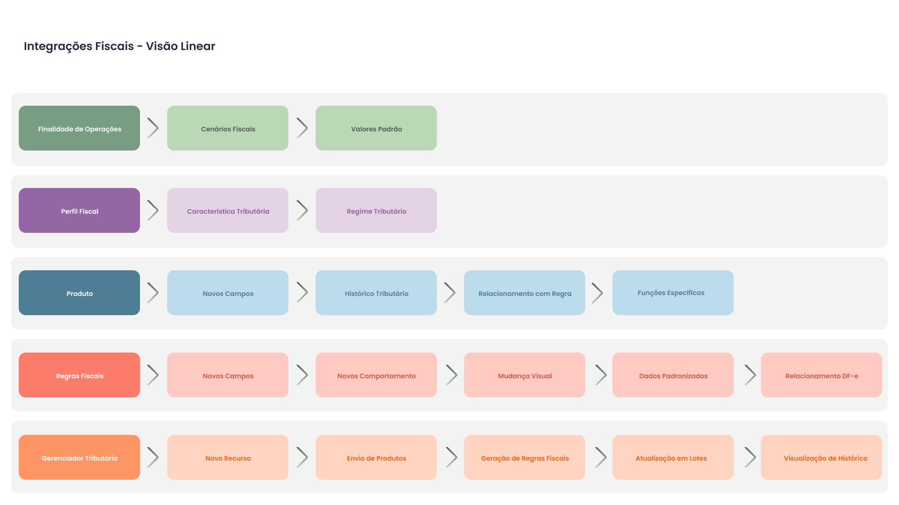

De modo simplificado, o Fluxo Operacional após implementações desta documentação e Integração com Parceiro Fiscal pode ser visualizado através da imagem abaixo:

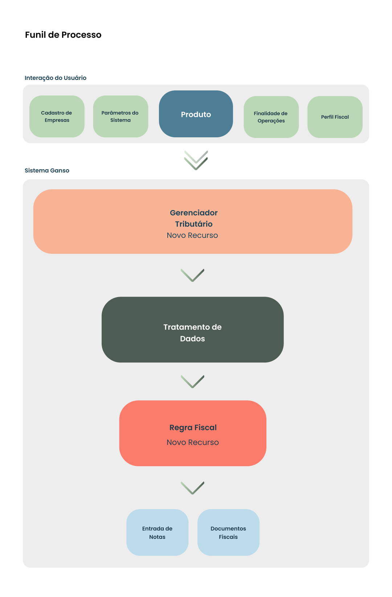

# Requisitos

Nesta Seção, são descritos os **Requisitos Globais** obrigatórios e comuns a todas as Integrações. Conforme [Roadmap](#recursos-globais) e [Resumo](#resumo), o **primeiro passo** é adequação das Rotinas do Sistema Ganso para permitir Integrações Fiscais, que serão descritas organizadas em **Seções** específicas para cada recurso a partir deste ponto, que segue:

## Cadastro de Empresas

Determinados Integradores requerem informações específicas da Empresa Integrada que serão utilizadas durante uma requisição à API, deste modo, novos campos são necessários e estão relacionados abaixo:

| Nome              | Descritivo                                                                                                                                                                                                                    | Validações                                                                                                                                                                                          | Obrigatório |
| :---------------- | :---------------------------------------------------------------------------------------------------------------------------------------------------------------------------------------------------------------------------- | :-------------------------------------------------------------------------------------------------------------------------------------------------------------------------------------------------- | :---------: |
| Regime Tributário | Criar campo para informar a Subclassificação do CRT "Regime Normal", cuja informação pode ser definida entre "**Lucro Real - LR**" ou "**Lucro Presumido - LP**". Este dado é obrigatório para a obtenção de Regras corretas. | Deve ser permitido informá-lo apenas se o CRT selecionado for igual a "3 - Regime Normal".                                                                                                          |   **Sim**   |
| Área da Loja      | Criar campo para informar o tamanho da área física ocupada pelo estabelecimento do cliente em Metros Quadrados                                                                                                                | Informação importante para o Integrador Mix Fiscal, que oferece para o Cliente Integrado insights de organização mercadológica de espaços, proximidade de produtos e composição de mix de produtos. |   **Não**   |

[Voltar ao Sumário](#documentação-de-requisitos---integrações-fiscais) | [Voltar ao Roadmap](#roadmap) | [Voltar ao Resumo](#resumo)

## Parâmetros do Sistema

Os Parâmetros específicos relativos aos Integradores Fiscais **serão descritos em suas Respectivas Documentações**. No ambito geral, foram levantadas inicialmente, as seguintes alterações e inclusões de Parâmetros do Sistema:

| Tipo          | Elemento                                    | Nome/Texto                                                    | Descritivo                                                                                                                                                                          | Regra de Negócio                                                                                                                                                                                                    |
| :------------ | :------------------------------------------ | :------------------------------------------------------------ | :---------------------------------------------------------------------------------------------------------------------------------------------------------------------------------- | :------------------------------------------------------------------------------------------------------------------------------------------------------------------------------------------------------------------ |
| **Inclusão**  | Aba Organizadora                            | Integrações Fiscais                                           | Aba Para organizar os Integradores Fiscais de modo claro e objetivo contendo as respectivas configurações individuais.                                                              | Consultar a Documentação do Integrador Fiscal para definição dos Parâmetros necessários.                                                                                                                            |
| **Inclusão**  | Parâmetro                                   | Permitir Consultar Tributação através do Cadastro de Produtos | Parâmetro para permitir a Consulta de Tributação de um Produto através de seu Cadastro, durante o Cadastramento de um Novo Produto ou para um Produto Cadastrado.                   | Habilitar se Integrador disponibiliza recurso. Consultar Documentação do Integrador.                                                                                                                                |
| **Inclusão**  | Parâmetro                                   | Permitir Consultar Tributação de um Produto por Descrição     | Parâmetro para permitir a Consulta de Tributação de um Produto através do Método Próprio do Integrador que lista Produtos Semelhantes.                                              | Habilitar se Integrador disponibiliza recurso. Consultar Documentação do Integrador.                                                                                                                                |
| **Alteração** | **Aba Produto/Estoque / Grupo Produto**     | **Valores Padrão para Cadastro**                              | Eliminar os campos contidos em "Valores Padrão" presentes na Aba, **exceto** campos para **Unidade de Compra e Venda**.                                                             | Para um Cadastro de Produtos novo estes dados não terão mais relevância, visto que será necessário criar pelo menos uma **Regra Fiscal Padrão** ou vincular uma Regra existente.                                    |
| **Alteração** | **Aba Documentos Fiscais / NFC-e/SAT-CF-e** | **Valores Padrão para Documento Fiscal**                      | Eliminar os campos relativos ao **CFOP, CST/CSOSN, NCM, CST e Alíquota de PIS e Cofins**. É necessário que exista pelo menos uma Regra Fiscal para o Produto.                       | Para Emissão de Documento Fiscal de Venda a Consumidor Final (NFC-e ou SAT-CF-e) é necessário garantir que haja uma Regra Fiscal desta Natureza de Operação, que seja única, e aplicável aos Produtos corretamente. |
| **Inclusão**  | **Aba Documentos Fiscais**                  | **Valores Padrão para Documento Fiscal**                      | Criar um campo para informar um Tipo de Regra Fiscal Padrão para todas as Operações de Saída, como por exemplo, "Utilizar Regra Fiscal de Venda a Consumidor Final com referência". | Este parâmetro auxiliará usuários que não possuirão Integração Fiscal e que possuem limitadas operações de Saída, não sendo necessário criar Regras Fiscais para as demais operações.                               |

[Voltar ao Sumário](#documentação-de-requisitos---integrações-fiscais) | [Voltar ao Roadmap](#roadmap) | [Voltar ao Resumo](#resumo)

## Cadastro de Clientes

Para que a **Nova Regra de Negócio** para os dados tributários seja aplicada e direcionada da maneira correta para **Movimentações de Saída**, é necessário acrescentar novas informações como **Perfil Fiscal** e **Regime Tributário** ao **Cadastro de Clientes** que são:

| Tipo de Elemento        | Nome/Texto        | Descritivo                                                                                                                                                                                                                                                                                                        | Regras de Negócio                                            |
| :---------------------- | :---------------- | :---------------------------------------------------------------------------------------------------------------------------------------------------------------------------------------------------------------------------------------------------------------------------------------------------------------- | :----------------------------------------------------------- |
| **Campo**               | Perfil Fiscal     | Criar campo para Usuário definir um Perfil Fiscal cadastrado corretamente em [Cadastro de Perfil Fiscal](#cadastro-de-perfil-fiscal). Esta informação é importante para que o Sistema selecione corretamente as Regras Fiscais aplicáveis no momento da Emissão de um Documento Fiscal.                           | Relacionar o Código do Perfil Fiscal ao Cadastro do Cliente. |
| **Caixa de Combinação** | Regime Tributário | Campo para informar o Regime Tributário do Cliente. Esta informação é muito importante para identificação do Destinatário da Operação, para composição de Regras Fiscais e para criação de Cenários Fiscais. Disponibilizar as opções **"Lucro Real", "Lucro Presumido", "Simples Nacional", "Consumidor Final"** | Preenchimento Obrigatório                                    |

[Voltar ao Sumário](#documentação-de-requisitos---integrações-fiscais) | [Voltar ao Roadmap](#roadmap) | [Voltar ao Resumo](#resumo)

## Cadastro de Fornecedores

O Cadastro de Fornecedores possui boa parte das informações que identificam o Perfil Fiscal do mesmo, contudo, é necessário adicionar o campo **Regime Tributário** e remover as informações de **Contribuinte do ICMS e Destaque de Impostos**, estas últimas, farão parte do **[Perfil Fiscal](#cadastro-de-perfil-fiscal)**. Abaixo o descritivo do novo campo:

| Tipo de Elemento        | Nome/Texto        | Descritivo                                                                                                                                                                                                                                                                                                                         | Regras de Negócio         |
| :---------------------- | :---------------- | :--------------------------------------------------------------------------------------------------------------------------------------------------------------------------------------------------------------------------------------------------------------------------------------------------------------------------------- | :------------------------ |
| **Caixa de Combinação** | Regime Tributário | Criar campo para informar o Regime Tributário vinculado ao Perfil Fiscal. Esta informação é muito importante para identificação do Destinatário da Operação, para composição de Regras Fiscais e criação de Cenários Fiscais. Disponibilizar as opções **"Lucro Real", "Lucro Presumido", "Simples Nacional", "Consumidor Final"** | Preenchimento Obrigatório |

[Voltar ao Sumário](#documentação-de-requisitos---integrações-fiscais) | [Voltar ao Roadmap](#roadmap) | [Voltar ao Resumo](#resumo)

## Cadastro de Finalidade de Operações

Alguns Integradores requerem que uma **Operação** seja bem definida durante a composição de uma Consulta Tributária, e estas possuem dados específicos de envio para que o Retorno de dados tributários sejam coerentes com o **Cenário** informado. Em suma, os novos campos são:

| Tipo de Elemento        | Posicionamento               | Nome/Texto                                 | Descritivo                                                                                                                                                                                                                                                                                                                                                                                                     | Regras de Negócio                                                                                                                                                                                                                                                                                                                                                                                                                                                                                                              |
| :---------------------- | :--------------------------- | :----------------------------------------- | :------------------------------------------------------------------------------------------------------------------------------------------------------------------------------------------------------------------------------------------------------------------------------------------------------------------------------------------------------------------------------------------------------------- | :----------------------------------------------------------------------------------------------------------------------------------------------------------------------------------------------------------------------------------------------------------------------------------------------------------------------------------------------------------------------------------------------------------------------------------------------------------------------------------------------------------------------------- |
| **Botão de Seleção**    | Grupo de Dados da Finalidade | Tipo de Movimentação                       | Seleção para indicar se a Finalidade de Operação cadastrada é uma Movimentação do Tipo **Entrada** ou **Saída**. Utilizado em conjunto com os demais campos para complementar dados da Requisição. Esta informação também será utilizada para composição de Regras Fiscais de Entrada ou Saída                                                                                                                 | Preenchimento Obrigatório.                                                                                                                                                                                                                                                                                                                                                                                                                                                                                                     |
| **Caixa de Combinação** | Grupo de Dados da Finalidade | Operação                                   | Seleção para indicar a Espécie de Operação com base nas Movimentações existentes no Sistema, como por exemplo, as Movimentações existentes na Tela de Documentos Fiscais (Venda, Devolução de Venda, Devolução de Compra, Remessa de Entrega Futura, Saída para Consumo...). Esta informação auxiliará a identificar com maior precisão Regra Fiscal a ser aplicada no momento da Emissão do Documento Fiscal. | Preenchimento Obrigatório.   Deve conter por padrão todas as "Operações" padronizadas possíveis que podem ser:    - Entrada de Mercadorias   - Venda a Consumidor Final   - Venda a Contribuinte   - Acompanhamento de Cupom Fiscal   - Devolução de Compra   - Devolução de Venda   - Transferência de Estoque   - Saída para Consumo   - Saída para Produção   - Saída por Perda   - Remessa de Entrega Futura   - Reclassificação de Mercadorias   - Outras Operações (Manual) |
| **Texto**               | Grupo de Dados da Finalidade | Criado em DD/MM/AAAA - HH:MM - Usuário     | Texto para exibir a Data/Hora e Usuário que efetuou o Cadastro.                                                                                                                                                                                                                                                                                                                                                | Somente Leitura.                                                                                                                                                                                                                                                                                                                                                                                                                                                                                                               |
| **Texto**               | Grupo de Dados da Finalidade | Modificado em DD/MM/AAAA - HH:MM - Usuário | Texto para exibir a Data/Hora e Usuário de modificação do Cadastro do Cenário Fiscal.                                                                                                                                                                                                                                                                                                                          | Somente Leitura.                                                                                                                                                                                                                                                                                                                                                                                                                                                                                                               |
| **Grupo de Dados**      | Tela                         | Cenário Fiscal                             | Grupo para organizar dados específicos do Cenário Fiscal da Finalidade de Operação.                                                                                                                                                                                                                                                                                                                            | Preenchimento Obrigatório.                                                                                                                                                                                                                                                                                                                                                                                                                                                                                                     |
| **Campo**               | Cenário Fiscal               | CFOP Padrão                                | Criar campo para informar o Código do CFOP padrão para a Operação Cadastrada. Utilizado em conjunto com os demais campos para complementar dados da requisição a API do Integrador, e para complementar dados da Regra Fiscal quando criada por um Integrador que não retorna esta informação.                                                                                                                 | **Preenchimento Obrigatório, se houver Integrador Fiscal Ativado**. Validar se o CFOP existe na Tabela de CFOPs do Sistema Ganso conforme a definição do Tipo de Movimentação de **Entrada** ou **Saída**                                                                                                                                                                                                                                                                                                                      |
| **Caixa de Combinação** | Cenário Fiscal               | Finalidade do Produto                      | Criar campo para definir a Finalidade do Produto. Alguns Integradores podem requerer este dado que se refere à finalidade do produto (destinação) para retornar a regra correta. Deve existir por padrão as seguintes opções:  - Mercadoria para Revenda   - Insumos de Produção   - Materiais para Uso e Consumo ou Ativo Imobilizado                                                                | **Preenchimento obrigatório, se houver Integrador Fiscal Ativado**.                                                                                                                                                                                                                                                                                                                                                                                                                                                            |
| **Caixa de Combinação** | Cenário Fiscal               | Origem                                     | Caixa de Combinação para definir a "Origem da Operação". Esta informação é exigida por alguns Integradores para criação de um _Cenário Fiscal_ na API.                                                                                                                                                                                                                                                         | Campo Específico para o Integrador **Mix Fiscal**. Deve existir por padrão as seguintes opções:   EI - Entrada Indústria   ED - Entrada Distribuidor   ES - Entrada Simples Nacional   BO - Bonificação   TR - Transferência.   A sigla referente à opção definida é utilizada na Criação de um Cenário Fiscal na API.                                                                                                                                                                                       |
| **Caixa de Combinação** | Cenário Fiscal               | Destino                                    | Criar campo para definir o Parâmetro "Destino da Operação". Esta informação é exigida por alguns Integradores para criação de um _Cenário Fiscal_ na API.                                                                                                                                                                                                                                                      | Campo Específico para o Integrador **Mix Fiscal**. A sigla referente à opção definida é utilizada na Requisição à API. Deve existir por padrão as seguintes opções:   SAC - Saída Atacado Contribuinte   SAS - Saída Atacado Simples Nacional   SVC - Saída Varejo Contribuinte   SNC - Saída Não Contribuinte   IND - Industrialização   TRA - Transferência                                                                                                                                                |
| **Caixa de Combinação** | Cenário Fiscal               | UF Destino                                 | Criar campo para definir a UF de destino da Operação. Esta informação é exigida para criação de um _Cenário Fiscal_ na API. Trata-se da UF da **Operação** que influencia diretamente nas informações tributárias que serão retornadas pela API.                                                                                                                                                               | Campo Específico para o Integrador **Mix Fiscal**. Permitir selecionar apenas uma UF da lista para o Cenário.                                                                                                                                                                                                                                                                                                                                                                                                                  |
| **Campo de Texto**      | Cenário Fiscal               | Código Integrador                          | Criar campo para gravar e exibir o _hash_ do _Cenário Fiscal_ cadastrado na API do Integrador quando o recurso for exigido. Obrigatório existir quando o Integrador ativado é igual a **Mix Fiscal**                                                                                                                                                                                                           | Campo Específico para o Integrador **Mix Fiscal**. Somente leitura.                                                                                                                                                                                                                                                                                                                                                                                                                                                            |
| **Botão**               | Cenário Fiscal               | Atualizar Cenário                          | Botão de ação para Atualizar o Cenário Fiscal cadastrado na API do Integrador, quando o recurso existir.                                                                                                                                                                                                                                                                                                       | Função Específica para o Integrador **Mix Fiscal**. Deve existir um "Código Integrador" vinculado à finalidade cadastrada para que seja possível atualizar o Cenário na API do Integrador, quando o recurso existir. Usuário deve possuir permissão. [Ver Seção Acessos Restritos](#acessos-restritos)                                                                                                                                                                                                                         |
| **Botão**               | Cenário Fiscal               | Criar Cenário Integrador                   | Botão de ação para Criar um novo Cenário Fiscal com base nas informações inseridas no Cadastro de Finalidade.                                                                                                                                                                                                                                                                                                  | Função Específica para o Integrador **Mix Fiscal**. O Usuário deve possuir permissão para executar a função. [Ver Seção Acessos Restritos](#acessos-restritos)                                                                                                                                                                                                                                                                                                                                                                 |

### Regra de Negócio da Rotina

| Regra de Negócio | Descritivo                                                                                                                                                                                                        | Padrões                                                                                                                                                                               |
| :--------------: | :---------------------------------------------------------------------------------------------------------------------------------------------------------------------------------------------------------------- | :------------------------------------------------------------------------------------------------------------------------------------------------------------------------------------ |
|       RN1        | Não permitir a criação de Finalidades de Operação iguais, contendo os mesmos parâmetros.                                                                                                                          | Validar Operação, Tipo de Movimentação, CFOP e Finalidade do Produto para distinguir cadastros.                                                                                       |
|       RN2        | Não habilitar os campos **Origem, Destino, UF de Destino, Código do Integrador e Ações** do **Cenário Fiscal** quando não houver Integração Fiscal ativada ou quando o Integrador for diferente de **Mix Fiscal** | Não exibir os campos ou desabilitar por completo.                                                                                                                                     |
|       RN3        | A Operação do tipo **Outras Operações (Manual)** possibilita a criação de operações não existentes no DF-e, como por exemplo, **"Remessa em Garantia"** que pode ter uma tributação diferente das demais.         | Não vincular esta Operação com o Tipo de Movimentação Manual do DF-e. O Usuário deve informar uma Finalidade de Operação no DF-e que seja compatível com o documento fiscal desejado. |

O Protótipo abaixo ilustra os elementos descritos acima para o Cadastro de Finalidade de Operação.

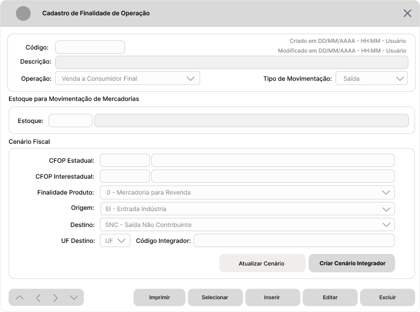

[Voltar ao Sumário](#documentação-de-requisitos---integrações-fiscais) | [Voltar ao Roadmap](#roadmap) | [Voltar ao Resumo](#resumo)

## Cadastro de Perfil Fiscal

Além de uma Operação bem definida, alguns Integradores requerem que seja enviada na requisição uma **Característica Tributária** que no Sistema Ganso é definido como **Perfil Fiscal**. Atualmente, este cadastro é aberto e definido pelo usuário, e não garante coerência com o Real Perfil do Destinatário. Deste modo, é necessário criar campos para vincular informações pré-definidas que complementam corretamente os dados requeridos pelo Integrador. Os campos novos são:

| Tipo de Elemento        | Nome/Texto                                 | Descritivo                                                                                                                                                                                                                                                                                                                      | Regras de Negócio                                                                                                                                                                                                                                                                                                  |
| :---------------------- | :----------------------------------------- | :------------------------------------------------------------------------------------------------------------------------------------------------------------------------------------------------------------------------------------------------------------------------------------------------------------------------------ | :----------------------------------------------------------------------------------------------------------------------------------------------------------------------------------------------------------------------------------------------------------------------------------------------------------------- |
| **Caixa de Combinação** | Característica Tributária                  | Criar campo para informar uma Característica Tributária (tipo de perfil) vinculada ao Perfil Fiscal criado. O Perfil Fiscal poderá ter uma descrição livre, contudo, deve ser vinculado à característica padronizada que é utilizada nas Requisições aos Integradores e influencia no resultado da consulta.                    | Preenchimento obrigatório.   Deve existir as seguintes opções:   - Industrial   - Distribuidor   - Atacadista   - Varejista   - Produtor Rural Pessoa Jurídica   - Produtor Rural Pessoa Física   - Pessoa Jurídica não Contribuinte do ICMS   - Pessoa Física não Contribuinte do ICMS |
| **Caixa de Combinação** | **Contribuinte ICMS**                      | Criar campo para informar se o Perfil Fiscal indica um Contribuinte do ICMS, Não Contribuinte ou Isento. Este Campo é o mesmo existente nos Cadastros de Clientes e Fornecedores, que a partir desta implementação devem receber um Código de Perfil Fiscal, conforme descrito em [Cadastro de Clientes](#cadastro-de-clientes) | Preenchimento Obrigatório.  Deve existir por padrão as opções de **Contribuinte do ICMS, Não Contribuinte e Isento**                                                                                                                                                                                            |
| **Caixa de Seleção**    | **Destacar IPI em Documentos Fiscais**     | Indicativo de Destaque de IPI em Campo Próprio do Documento Fiscal de Saída. Este Campo é o mesmo do Cadastro de Fornecedores, que a partir desta implementação deve ser lido do Perfil Fiscal.                                                                                                                                 | Permitir seleção apenas se **Característica Tributária** for igual a uma das opções:   -Industrial -Distribuidor -Atacadista                                                                                                                                                                           |
| **Caixa de Seleção**    | **Destacar ICMS ST em Documentos Fiscais** | Indicativo de Destaque de ICMS ST em Campo Próprio do Documento Fiscal de Saída. Este Campo é o mesmo do Cadastro de Fornecedores, que a partir desta implementação deve ser lido do Perfil Fiscal.                                                                                                                             | Permitir seleção apenas se **Característica Tributária** for igual a uma das opções:   -Industrial -Distribuidor -Atacadista                                                                                                                                                                           |

### Regra de Negócio da Rotina

| Regra de Negócio | Descritivo                                                                     | Padrões                                                                                                                    |
| :--------------: | :----------------------------------------------------------------------------- | :------------------------------------------------------------------------------------------------------------------------- |
|       RN1        | Não permitir a criação de Perfil Fiscal iguais, contendo os mesmos parâmetros. | Validar Característica Tributária, Contribuinte ICMS, e parâmetros de Destaque de ICMS ST e IPI para distinguir cadastros. |

Estas informações são essenciais para a Atualização/Criação de Regras Fiscais de Entrada e Saída conforme Resultado das Consultas aos Integradores Fiscais, além de fornecer parâmetros aprimorados para a localização de Regras Fiscais durante a Emissão de um Documento Fiscal.

As alterações descritas acima, podem ser visualizadas no exemplo abaixo:

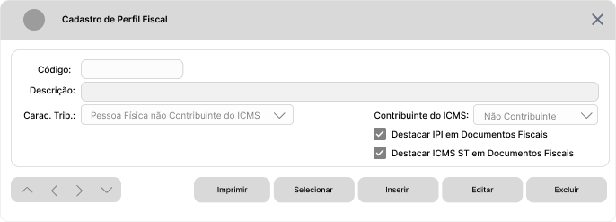

[Voltar ao Sumário](#documentação-de-requisitos---integrações-fiscais) | [Voltar ao Roadmap](#roadmap) | [Voltar ao Resumo](#resumo)

## Cadastro de Regra Fiscal

Nesta Seção são descritos os Ajustes e Novos Campos necessários, e descreve algumas Regras de Negócio quanto aos dados iniciais. Determinadas informações já existem, contudo, requer alterações para melhorar a interpretação. O primeiro passo é reorganizar o Grupo **"Critérios"** integrando o Grupo "Não Obrigatórios" como critérios **Obrigatórios (Com algumas exceções)** a partir desta Implementação.

| Tipo de Recurso                        | Grupo/Texto                                             | Descritivo                                                                                                                                                                                                                                                                                                                     | Regras de Negócio                                                                                                                                                                                                                                                                                                                                                                        |
| :------------------------------------- | :------------------------------------------------------ | :----------------------------------------------------------------------------------------------------------------------------------------------------------------------------------------------------------------------------------------------------------------------------------------------------------------------------- | :--------------------------------------------------------------------------------------------------------------------------------------------------------------------------------------------------------------------------------------------------------------------------------------------------------------------------------------------------------------------------------------- |
| Adicionar **Caixa de Combinação**      | Tipo de Regra Fiscal                                    | Criar campo para identificar e exibir o Tipo de Regra Fiscal (Entrada ou Saída) criada.                                                                                                                                                                                                                                        | O campo existe no Banco de Dados (TIPO_OPERACAO), contudo não é exibido em tela. Deve ser exibido a partir de agora.                                                                                                                                                                                                                                                                     |
| Adicionar Flag/Texto                   | Regra Fiscal criada por Integrador Fiscal               | Criar campo para sinalizar que a Regra Fiscal foi criada por um Integrador Fiscal através de um retorno de Consulta                                                                                                                                                                                                            | Deve ser apenas uma Flag ou Texto indicativo.    Bloquear a Edição de Regras criadas pelo Integrador com este indicativo.                                                                                                                                                                                                                                                          |
| Adicionar Texto                        | Data, Hora e Usuário de Criação da Regra                | Criar campo para exibir a Data, Hora e Usuário de criação da Regra Fiscal. O campo já existe, apenas deve ser identificado o Integrador quando necessário.                                                                                                                                                                     | Apenas Texto somente leitura destacado.                                                                                                                                                                                                                                                                                                                                                  |
| Adicionar Texto                        | Data, Hora e Usuário de Modificação da Regra            | Criar campo para exibir a Data, Hora e Usuário de Modificação da Regra Fiscal. O campo já existe, apenas deve ser identificado o Integrador quando necessário.                                                                                                                                                                 | Apenas Texto somente leitura destacado.                                                                                                                                                                                                                                                                                                                                                  |
| Adicionar **Campo Numérico**           | **Código Regra Integrador**                             | Criar campo para armazenar o Código da Regra Fiscal da Base do Integrador, quando devolvido pela API. Esta informação será utilizada para eventuais atualizações da Própria Regra do Integrador, para evitar que Regras Fiscais em duplicidade possam ser criadas (quando for o caso), e para eventuais soluções de problemas. | Armazenar o Código da Regra retornado pela API no campo especificado na **Documentação do Integrador**.                                                                                                                                                                                                                                                                                  |
| **Ajuste de Campo**                    | Critérios / UFs de Origem                               | Alterar a exibição do Texto conforme o Tipo de Regra (Entrada ou Saída). Se Entrada, exibir **"UFs de Origem"**. Se Saída, exibir **"UFs de Destino"**.                                                                                                                                                                        | Preenchimento Obrigatório.                                                                                                                                                                                                                                                                                                                                                               |
| Adicionar **Botão/Função**             | Critérios / **Produtos da Regra**                       | Adicionar um Botão ou uma Função para visualizar todos os Produtos que utilizarão a Regra Fiscal criada, podendo ser um **Pop-up** que contenha uma Grade com os Produtos e opções para Adicionar ou Remover da Grade.                                                                                                         | Permitir adicionar somente Produtos que não estão em uma outra Regra Fiscal com os mesmos Critérios.                                                                                                                                                                                                                                                                                     |
| **Ajuste de Texto**                    | **Parâmetros Aplicáveis**                               | Alterar o Texto "Parâmetros Aplicáveis" para **"Impostos"**                                                                                                                                                                                                                                                                    | -                                                                                                                                                                                                                                                                                                                                                                                        |
| **Remover**                            | Texto "Selecione abaixo os campos..."                   | Remover o Texto "Selecione abaixo os campos que serão modificados ao utilizar esta regra." do Grupo **"Impostos"**                                                                                                                                                                                                             | -                                                                                                                                                                                                                                                                                                                                                                                        |
| Adicionar **Caixa de Combinação**      | ICMS / Modalidade                                       | Criar campo para seleção da Modalidade da Base de Cálculo do ICMS Normal, como ocorre com o ICMS ST com diferença nas Modalidades.                                                                                                                                                                                             | Deve existir as opções de **Valor da Operação (Padrão) e Pauta Fiscal**. Quando Pauta Fiscal, a Base de Cálculo do ICMS Normal deve ser calculada utilizando o Valor da Pauta Fiscal informada no Cadastro do Produto, multiplicando pela Quantidade Final do Produto, como ocorre com o ICMS ST. Não existindo uma Pauta Fiscal vigente, utilizar o Valor da Operação (cálculo padrão). |
| Adicionar **Caixa de Seleção**         | ICMS / Alíquota Interna do ICMS                         | Criar Seleção para habilitar o preenchimento da Alíquota Interna para a Regra Fiscal.                                                                                                                                                                                                                                          | Quando selecionada, habilita o campo de preenchimento da Alíquota.                                                                                                                                                                                                                                                                                                                       |
| Adicionar **Caixa de Combinação**      | ICMS / Seleção da Alíquota Interna do ICMS              | Criar campo de Preenchimento da Alíquota Interna ou para armazenar a informação retornada pelo Integrador.                                                                                                                                                                                                                     | Listar Alíquotas do Cadastro de Tributos.                                                                                                                                                                                                                                                                                                                                                |
| **Ajuste de Texto**                    | ICMS / Alíquota ICMS                                    | Alterar para **"Alíquota Efetiva"** que descreve a Alíquota Final a aplicar no Produto.                                                                                                                                                                                                                                        | -                                                                                                                                                                                                                                                                                                                                                                                        |
| Adicionar **Caixa de Seleção**         | ICMS / Desoneração do ICMS                              | Criar Seleção para habilitar o Cálculo da Desoneração do ICMS.                                                                                                                                                                                                                                                                 | Quando selecionada, habilita o campo de preenchimento da Alíquota do ICMS Desonerado.                                                                                                                                                                                                                                                                                                    |
| Adicionar **Campo Numérico**           | ICMS / Alíquota do ICMS Desonerado                      | Criar Campo para preenchimento da Alíquota do ICMS Desonerado.                                                                                                                                                                                                                                                                 | Calcular o Valor do ICMS Desonerado para o Item utilizando a Alíquota Informada neste campo e aplicar ao Item da Entrada ou Item da Saída em campo específico.                                                                                                                                                                                                                           |
| Adicionar **Caixa de Seleção**         | ICMS / Calcular Diferencial de Alíquotas DIFAL          | Criar Seleção para habilitar o Cálculo do Valor do Diferencial de Alíquotas considerado como Custo na Entrada de Mercadorias.                                                                                                                                                                                                  | Habilitar somente se as UFs de Origem for diferente da UF da Empresa Filial.                                                                                                                                                                                                                                                                                                             |
| Adicionar **Campo Texto**              | **Amparo Legal**                                        | Criar campo para informar ou receber dados sobre a Legislação Vigente que rege as informações tributárias da Regra Fiscal criada.                                                                                                                                                                                              | Deve conter espaço para informar textos de até 1024 caracteres.                                                                                                                                                                                                                                                                                                                          |
| **Ajuste de Texto**                    | ICMS ST / Lançamento                                    | Alterar a exibição do Texto do Campo para **"Destaque"** e o Texto da Opção **"Manter Original"** para **"Não Alterar"**                                                                                                                                                                                                       | -                                                                                                                                                                                                                                                                                                                                                                                        |
| **Ajuste de Texto**                    | ICMS ST / Modalidade BC. ICMS...                        | Alterar a exibição do Texto para **"Modalidade"**                                                                                                                                                                                                                                                                              | -                                                                                                                                                                                                                                                                                                                                                                                        |
| **Ajuste de Texto**                    | ICMS ST / Alíquota de Crédito do ICMS                   | Criar campo para definir a Alíquota de Crédito do ICMS para Cálculo do ICMS ST. Não trata-se da Alíquota de ICMS ST, e sim, da Alíquota que será utilizada para calcular o Valor do ICMS Normal que é deduzido do Valor do ICMS ST calculado.                                                                                  | Habilitar a seleção apenas se a Alíquota Interna e a Alíquota Efetiva estiverem selecionadas e preenchidas. Oferecer apenas as opções de "Alíquota Interna" e "Alíquota Efetiva".                                                                                                                                                                                                        |
| Adicionar **Campo com Seleção**        | ICMS ST / MVA/IVA de Saída                              | Criar campo para informar o MVA de Saída para Cálculo do ICMS ST, que em diversos casos e operações é distinto de um MVA de Entrada.                                                                                                                                                                                           | Selecionar para habilitar o preenchimento do campo numérico com até 4 casas decimais.                                                                                                                                                                                                                                                                                                    |
| Adicionar **Caixa de Seleção**         | ICMS ST / Frete FOB compõe Base de Cálculo              | Criar Seleção para indicar que o Frete por Fora da NF-e compõe a Base de Cálculo do ICMS ST formada pela **Modadalidade MVA**. Atualmente o Sistema não conta com esta definição, e em determinados casos deve ser considerado no Cálculo.                                                                                     | Se selecionado, somar o valor do Frete FOB na composição da Base de Cálculo do ICMS ST quando a **Modalidade** for igual a **MVA**                                                                                                                                                                                                                                                       |
| Adicionar **Caixa de Seleção**         | ICMS ST / Desconsiderar Fretes Base de Cálculo          | Criar Seleção para indicar que Fretes CIF e FOB não devem compor a Base de Cálculo do ICMS ST. Aplica-se inicialmente ao Cálculo do ICMS ST por Pauta Fiscal, contudo, o usuário criador da Regra Fiscal poderá acionar esta função sempre que desejar.                                                                        | Quando selecionado, o Valores de Frete CIF e FOB não deverão ser considerados na Base de Cálculo do ICMS ST.                                                                                                                                                                                                                                                                             |
| **Ajuste de Campo**                    | PIS/COFINS / **CST de PIS e Cofins de Entrada e Saída** | Utilizar apenas um campo para informar o CST de PIS e Cofins de Entrada e um campo para informar o CST de PIS e Cofins de Saída. **O PIS e Cofins são impostos gêmeos, portanto o CST de PIS e Cofins são sempre iguais, diferenciando-se apenas por operação (Entrada ou Saída)**                                             | -                                                                                                                                                                                                                                                                                                                                                                                        |
| Adicionar **Caixa de Seleção e Campo** | IPI / **CST de Saída**                                  | Criar campo para informar o CST de IPI de Saída                                                                                                                                                                                                                                                                                | -                                                                                                                                                                                                                                                                                                                                                                                        |
| Adicionar **Caixa de Seleção e Campo** | IPI / **Enquadramento**                                 | Criar campo para informar o Código do Enquadramento do IPI                                                                                                                                                                                                                                                                     | -                                                                                                                                                                                                                                                                                                                                                                                        |
| Adicionar **Texto**                    | Regra Fiscal aplicável a (x) Produtos                   | Criar campo que exibe como informação a quantidade de Produtos afetados pela Regra Fiscal criada com base no **NCM do Produto e NCM da Regra Fiscal**.                                                                                                                                                                         | Se Regra definida por **Produto**, não exibir esta informação.                                                                                                                                                                                                                                                                                                                           |

Abaixo o Protótipo de Tela com as definições da tabela anterior:

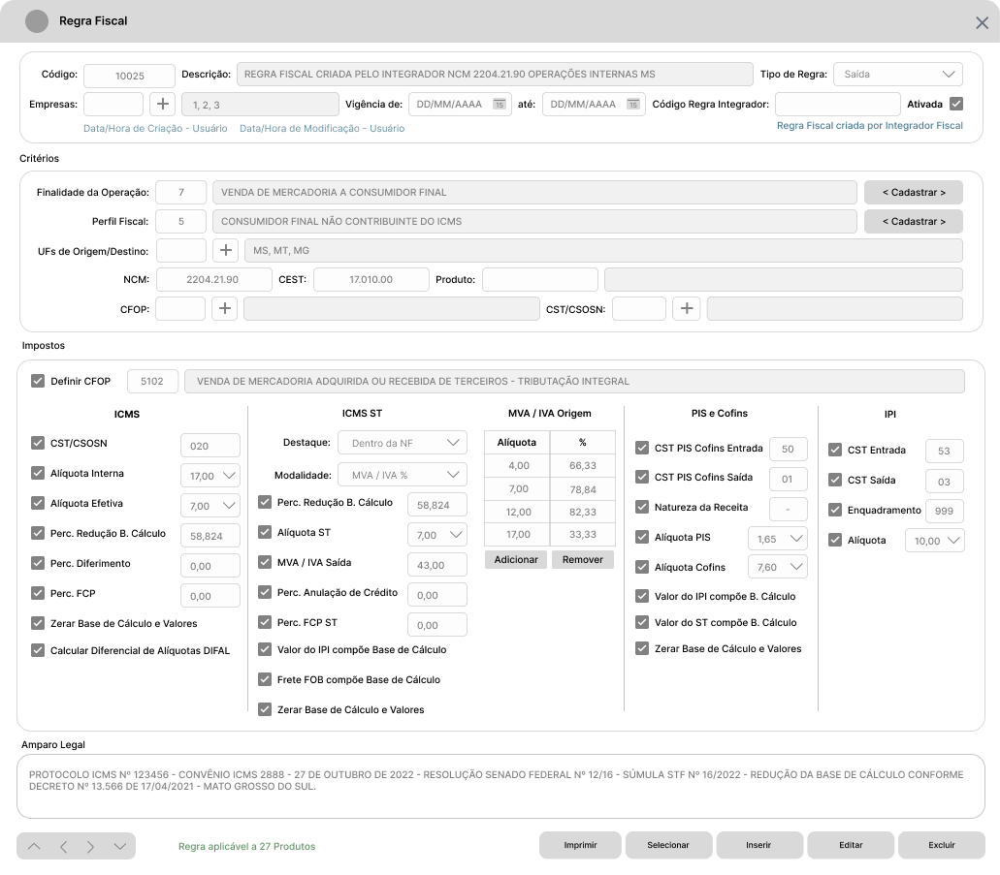

Abaixo o Protótipo de Tela **Pop-up** que exibe os Produtos que estão consumindo a Regra Fiscal, quando usuário clicar no botão/função **Produtos da Regra** presente nos Critérios:

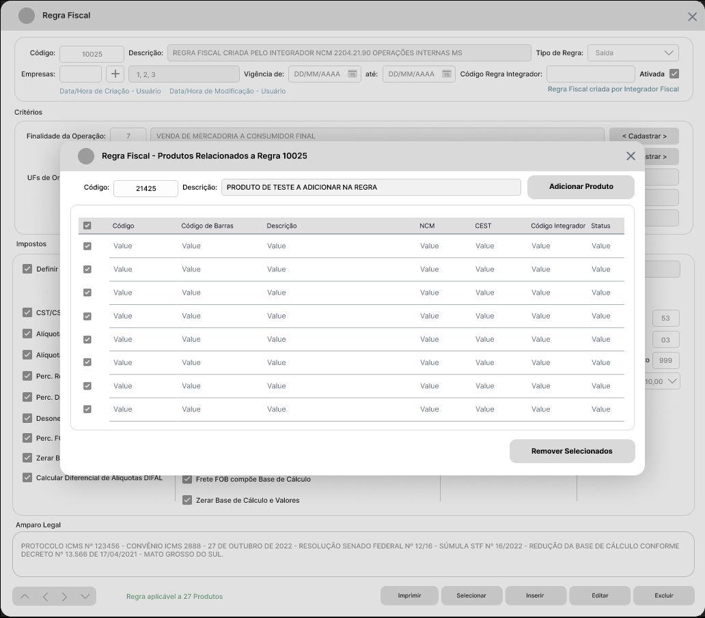

[Voltar ao Sumário](#documentação-de-requisitos---integrações-fiscais) | [Voltar ao Roadmap](#roadmap) | [Voltar ao Resumo](#resumo)

### Regras de Negócio Gerais da Rotina

| Regra de Negócio | Descritivo                                                                                                                                                                                                                                                                                   |
| :--------------: | :------------------------------------------------------------------------------------------------------------------------------------------------------------------------------------------------------------------------------------------------------------------------------------------- |
|     **RN1**      | Incluir todos os **Critérios** da Regra Fiscal como **Chave Única**, exceto o CEST. Criar exceção para Regras de Saída, cujo CFOP e CST não podem ser obrigatórios, e não obrigar o preenchimento do CEST, pois há produtos que não possuem CEST.                                            |
|     **RN2**      | Permitir definir apenas **Finalidade da Operação** cujo **Tipo de Movimentação** seja igual ao informado na Regra (Entrada ou Saída).                                                                                                                                                        |
|     **RN3**      | Se **Tipo de Regra** igual a **Saída** e **Finalidade de Operação** igual a uma **Operação** de **Venda a Consumidor Final** e **UFs de Destino** iguais às UFs das Filiais informadas no campo **Empresas**, não permitir informar um Código CFOP no **Grupo Impostos** não iniciado em 5.  |
|     **RN4**      | Se **Tipo de Regra** igual a **Saída** e **Finalidade de Operação** diferente de uma **Operação** de **Venda a Consumidor Final** e **UFs de Destino** diferentes das UFs das Filiais informadas no campo **Empresas**, não permitir informar um Código CFOP no Grupo Impostos inciado em 5. |
|     **RN5**      | Se **Tipo de Regra** igual a **Entrada** e **UFs de Origem** diferentes das UFs das Filiais informadas no campo **Empresas**, não permitir informar um Código CFOP no Grupo Impostos iniciado em 1.                                                                                          |
|     **RN6**      | Se Habilitado **Integrador Fiscal** e **Tipo de Regra** igual a **Saída** e **CST do ICMS** retornado for igual a **"60"** e **Alíquota do ICMS ST** igual a **"0,00"**, Marcar e Processar o Parâmetro **Zerar Base de Cálculo e Valores do ICMS ST**.                                      |
|     **RN7**      | Se Usuário **Editar e Alterar** o **Tipo de Regra** de **Entrada para Saída ou vice-versa**, limpar os campos **Finalidade de Operação, Perfil Fiscal, e Definir CFOP**                                                                                                                      |
|     **RN8**      | Se Usuário **Replicar** uma Regra Fiscal, exibir uma Mensagem informando que os dados da Nova Regra a criar devem ser diferentes da Regra replicada, para que não haja duplicidade.                                                                                                          |
|     **RN9**      | Se **Tipo de Regra** igual a **Saída**, desativar os campos de Critério: **CFOP** e **CST**                                                                                                                                                                                                  |
|     **RN10**     | Não permitir incluir Produtos em uma Regra se os mesmos já estiverem em uma Regra que possua os mesmos Critérios                                                                                                                                                                             |

[Voltar ao Sumário](#documentação-de-requisitos---integrações-fiscais) | [Voltar ao Roadmap](#roadmap) | [Voltar ao Resumo](#resumo)

## Cadastro de Produtos

Determinados Integradores disponibilizam recurso de Consulta aos Tributos com resposta breve, e para disponibilizar ao Usuário este método através do Cadastro de um Produto, é necessário incluir a **Função** descrita a seguir:

### Funções

| Nome                 | Descritivo                                               | Regras de Negócio                                                                           |
| :------------------- | :------------------------------------------------------- | :------------------------------------------------------------------------------------------ |
| Consultar Tributação | Aciona a Consulta Tributária conforme Integrador ativado | Solicitar Acesso Restrito para a Operação [Ver Seção Acessos Restritos](#acessos-restritos) |

Além de uma função para consulta de tributação, novos campos são necessários para controle, que são:

### Novos Campos

| Tipo                 | Posicionamento                | Nome/Texto                                | Descritivo                                                                                                                                                                                                                                                                                                                                                                         | Regras de Negócio                                                                                                                                                                         |
| :------------------- | :---------------------------- | :---------------------------------------- | :--------------------------------------------------------------------------------------------------------------------------------------------------------------------------------------------------------------------------------------------------------------------------------------------------------------------------------------------------------------------------------- | :---------------------------------------------------------------------------------------------------------------------------------------------------------------------------------------- |
| **Campo**            | **Grupo de Dados do Produto** | Código do Integrador                      | Criar campo para armazenar e exibir o Código do Produto da Base do Integrador, quando ocorrer o vínculo efetuado pelo Usuário durante a Consulta por Descrição, quando o Integrador disponibiliza tal recurso.                                                                                                                                                                     | Tipo Numérico Inteiro e Somente Leitura                                                                                                                                                   |
| **Campo**            | A definir                     | Auditado por Integrador Fiscal            | Criar campo para armazenar e exibir a informação de que o Produto teve a tributação auditada/atualizada pelo Integrador Fiscal. Na exibição, complementar esta informação com a Data/Hora da última atualização tributária.                                                                                                                                                        | Somente leitura e visualmente destacado.                                                                                                                                                  |
| **Campo**            | A definir                     | Enviado para Integrador Fiscal            | Criar campo para armazenar e exibir a informação de que o Produto foi enviado para Revisão Tributária para o Integrador Fiscal. É importante para identificar quais Produtos estão pendentes de recepção da Tributação do Integrador, e como indicativo de que precisa receber atualização. Na exibição, complementar esta informação com a Data/Hora do envio.                    | Criar Siglas específicas, que representem a real situação, como por exemplo **"Aguardando Retorno", "Pendente de Revisão", "Atualizado"**. Campo Somente leitura e visualmente destacado. |
| **Campo**            | A definir e Avaliar           | Código e Descrição da Regra Fiscal Padrão | Criar texto para exibir o Código e Descrição da Regra Fiscal Padrão do Produto para a **Operação** Padrão de **Venda a Consumidor Final**. Existindo esta definição, é possível desempate de informações quando ocorrer uma Consulta em Lotes ao Integrador ou quando o Ganso PDV localizar uma Regra para o Produto durante a Venda NFC-e garantindo todos os dados necessários.  | Somente Leitura em Destaque.                                                                                                                                                              |
| **Caixa de Seleção** | A definir                     | **Não Tributar por Integrador Fiscal**    | Parâmetro para restringir a atualização de Tributos do Produto pelo Integrador Fiscal ativo, quando o Integrador disponibiliza tal recurso. Por decisão do Usuário, alguns produtos podem ser tributados seguindo a sua própria interpretação ou por orientação de sua contabilidade, e não deverão receber atualizações tributárias do Integrador ou serem enviados para revisão. | Solicitar Acesso Restrito. [Ver Seção Acessos Restritos](#acessos-restritos).                                                                                                             |

[Voltar ao Sumário](#documentação-de-requisitos---integrações-fiscais) | [Voltar ao Roadmap](#roadmap) | [Voltar ao Resumo](#resumo)

### Alterações de Campos

Além dos Novos Campos, é necessário Mover os Dados Tributários atuais do Produto para a Regra Fiscal. Nem todos os dados devem ser movidos, inclusive dados da última Entrada de NF-e. Com base na Análise de Impacto, os **dados a mover** são:

| Grupo      | Informação                          | Nome Técnico                                                                                 | Descritivo                                                                                                                                                |   Compõe Fórmula   | Compõe Relatórios  |  Grava por Filial  | Destino                                  |
| :--------- | :---------------------------------- | :------------------------------------------------------------------------------------------- | :-------------------------------------------------------------------------------------------------------------------------------------------------------- | :----------------: | :----------------: | :----------------: | :--------------------------------------- |
| ICMS       | CST / CSOSN Estadual                | **cst / csosn**                                                                              | Código da Situação Tributária de Saída Estadual                                                                                                           |        :x:         | :white_check_mark: | :white_check_mark: | **sugere_icms_cst_csosn**                |
| ICMS       | CST / CSOSN Interestadual           | **cst_interestadual / csosn_interestadual**                                                  | Código da Situação Tributária de Saída Interestadual                                                                                                      |        :x:         | :white_check_mark: | :white_check_mark: | **sugere_icms_cst_csosn**                |
| ICMS       | Redução B.C Estadual                | **f_rbc_icms_sai_estadual**                                                                  | Percentual de Redução da Base de Cálculo do ICMS Estadual                                                                                                 | :white_check_mark: | :white_check_mark: | :white_check_mark: | **sugere_icms_rbc**                      |
| ICMS       | Redução B.C Interestadual           | **f_rbc_icms_sai_intestadual**                                                               | Percentual de Redução da Base de Cálculo do ICMS Interestadual                                                                                            | :white_check_mark: | :white_check_mark: | :white_check_mark: | **sugere_icms_rbc**                      |
| ICMS       | Alíq. ECF                           | **codigo_tributo / f_icms_venda**                                                            | Alíquota do ICMS de Saída Estadual.                                                                                                                       | :white_check_mark: | :white_check_mark: | :white_check_mark: | **codigo_produto_tributo**               |
| ICMS       | % Diferimento                       | **percentual_diferimento**                                                                   | Percentual do Diferimento do ICMS de Saída                                                                                                                |        :x:         | :white_check_mark: | :white_check_mark: | **sugere_icms_pdiferimento**             |
| ICMS       | Alíq. Estadual (NF)                 | **uf_tributo.icms**                                                                          | Alíquota Interna da UF da Empresa Filial, obtida através da Tabela de Alíquotas (UF_TRIBUTO) quando UF_ORIGEM e UF_DESTINO iguais a UF da Empresa Filial. |        :x:         |        :x:         |        :x:         | **sugere_icms_aliq_interna**             |
| ICMS ST    | MVA                                 | **f_st_mva_saida**                                                                           | Percentual de MVA de Saída                                                                                                                                | :white_check_mark: | :white_check_mark: | :white_check_mark: | **sugere_st_mva_saida**                  |
| ICMS ST    | Redução BC. Estadual                | **f_st_rbc_icms_sai_estadual**                                                               | Percentual de Redução de Base de Cálculo do ICMS ST Estadual                                                                                              | :white_check_mark: | :white_check_mark: | :white_check_mark: | **sugere_icmsst_rbc**                    |
| ICMS ST    | Redução BC. Interestadual           | **f_st_rbc_icms_sai_interestadual**                                                          | Percentual de Redução de Base de Cálculo do ICMS ST Interestadual                                                                                         | :white_check_mark: | :white_check_mark: | :white_check_mark: | **sugere_icmsst_rbc**                    |
| PIS/COFINS | Alíquota de Entrada de PIS e Cofins | **codigo_tributo_pis_entrada, codigo_tributo_cofins_entrada, f_pis_compra, f_cofins_compra** | Alíquotas de PIS e Cofins de Entrada                                                                                                                      | :white_check_mark: | :white_check_mark: | :white_check_mark: | **sugere_pis_aliq e sugere_cofins_aliq** |
| PIS/COFINS | CST de Entrada de PIS e Cofins      | cst_pis_entrada e cst_cofins_entrada                                                         | CST de PIS e Cofins de Entrada. Ambos possuem a mesma informação e podem ser agrupados em um único campo                                                  |        :x:         | :white_check_mark: | :white_check_mark: | **sugere_pis_cst e sugere_cofins_cst**   |
| PIS/COFINS | Alíquota de Saída de PIS e Cofins   | codigo_tributo_pis_saida, codigo_tributo_cofins_saida, f_pis_venda, f_cofins_venda           | Alíquotas de PIS e Cofins de Saída                                                                                                                        | :white_check_mark: | :white_check_mark: | :white_check_mark: | **sugere_pis_aliq e sugere_cofins_aliq** |
| PIS/COFINS | CST de Saída de PIS e Cofins        | **cst_pis e cst_cofins**                                                                     | CST de PIS e Cofins de Saída. Ambos possuem a mesma informação e podem ser agrupados em um único campo.                                                   |        :x:         | :white_check_mark: | :white_check_mark: | **sugere_pis_cst / sugere_cofins_cst**   |
| PIS/COFINS | Natureza da Receita                 | **cst_natureza_receita_piscofins**                                                           | CST Natureza da Receita para PIS e COFINS                                                                                                                 |        :x:         | :white_check_mark: | :white_check_mark: | **sugere_piscofins_natrec**              |
| IPI        | Venda                               | **codigo_tributo_ipi**                                                                       | Alíquota de IPI de Saída                                                                                                                                  | :white_check_mark: | :white_check_mark: | :white_check_mark: | **sugere_ipi_aliq**                      |
| IPI        | CST Entrada e Saída                 | **cst_ipi_compra / cst_ipi**                                                                 | CST de Entrada e Saída para IPI                                                                                                                           |        :x:         | :white_check_mark: | :white_check_mark: | **sugere_ipi_cst**                       |
| NFC-e      | CFOP                                | **codigo_cfop_nfc**                                                                          | Código do CFOP para Operação de Venda a Consumidor Final                                                                                                  |        :x:         | :white_check_mark: | :white_check_mark: | **sugere_cfop**                          |
| NFC-e      | CST / CSOSN                         | **cst_nfc / csosn_nfc**                                                                      | CST ou CSOSN para Operação de Venda a Consumidor Final                                                                                                    |        :x:         | :white_check_mark: | :white_check_mark: | **sugere_icms_cstcsosn**                 |

[Voltar ao Sumário](#documentação-de-requisitos---integrações-fiscais) | [Voltar ao Roadmap](#roadmap) | [Voltar ao Resumo](#resumo)

### Alterações da Aba Grade Fiscal

Além das alterações de campos e adição de funções, a aba **Grade Fiscal** do Cadastro de Produtos também precisará de mudanças para adequar a experiência do Usuário. Atualmente esta aba exibe as Regras Fiscais aplicáveis ao Produto, e deverá organizar as informações de uma maneira mais clara, visto que Regras de várias operações serão exibidas, tanto para Entrada quanto para Saída, portanto as alterações são:

| Tipo de Ajuste         | Tipo de Elemento    | Descritivo                                                                                                                                          | Informações a exibir                                                                                                                                                                                                  |
| :--------------------- | :------------------ | :-------------------------------------------------------------------------------------------------------------------------------------------------- | :-------------------------------------------------------------------------------------------------------------------------------------------------------------------------------------------------------------------- |
| **Adicionar Elemento** | Grade de Dados      | Regras de Saída do Produto                                                                                                                          | Código da Regra, Descrição, Especificada por, NCM, CEST, Finalidade da Operação, Tipo de Operação (da Finalidade de Operação), Perfil Fiscal, UFs Destino, Filiais, Vigência, e demais dados exibidos na Grade Atual. |
| **Adicionar Elemento** | Botão de Ação       | Botão para acionar a Tela de Cadastro da Regra Fiscal em modo Inserção                                                                              | Texto "Nova Regra" e Tela de Cadastro da Regra Fiscal                                                                                                                                                                 |
| **Adicionar Elemento** | Atalho duplo clique | Atalho em duplo clique no registro da Grade de Dados que direciona à Tela de Cadastro da Regra Fiscal, com os dados da respectiva regra carregados. | -                                                                                                                                                                                                                     |

[Voltar ao Sumário](#documentação-de-requisitos---integrações-fiscais) | [Voltar ao Roadmap](#roadmap) | [Voltar ao Resumo](#resumo)

## Manutenção de Produtos

A rotina de Manutenção de Produtos permite ao Usuário atualizar dados tributários e outros em massa, contudo, ao mover os campos do Produto para a Regra Fiscal, será necessário remover os campos e filtros da rotina e adicionar outras informações conforme descritas abaixo:

| Tipo de Ajuste | Descritivo                                                                                                                                                                                                                                                                                                                                                                                                                                                                                      |
| :------------- | :---------------------------------------------------------------------------------------------------------------------------------------------------------------------------------------------------------------------------------------------------------------------------------------------------------------------------------------------------------------------------------------------------------------------------------------------------------------------------------------------- |
| **Remover**    | **Filtros** dos grupos **NFC-e/SAT-CF-e, PIS/COFINS, ICMS (exceto CEST), Gen. NCM, IPI**                                                                                                                                                                                                                                                                                                                                                                                                        |
| **Remover**    | **Colunas de Impostos do Resultado:** CST, Trib. Venda, Desc. Tributo Venda, Trib. Compra, Desc. Tributo Compra, Red. BC Est., Red. BC Int., ICMS ST MVA%, ST Red. BC Est., ST Red. BC Int., Cod. PIS Ent., PIS Ent. Aliq., PIS Ent. CST, Cod. PIS Saída, PIS Saída Aliq., PIS Saída CST, Cod. COFINS Ent., COFINS Ent. Aliq., COFINS Ent. CST, Cod. COFINS Saída, COFINS Saída Aliq., COFINS Saída, CST/CSOSN, Nat. da Rec., NFCe CST, NFCe CFOP, FCP%, CST Inter., Aliq. IPI, Desc. Alíq. IPI |
| **Alterar**    | Filtro **CEST**: agrupar com o **NCM**, são informações relacionadas.                                                                                                                                                                                                                                                                                                                                                                                                                           |
| **Alterar**    | Mover as Instruções de Utilização da Tela para um Pop-up que pode ser acionado pela tecla **"[F1] - Ajuda"** ou clicando sobre o Botão.                                                                                                                                                                                                                                                                                                                                                         |
| **Alterar**    | Reposicionar os "botões" de ações do rodapé da tela para que fique em ordem sequencial de atalhos.                                                                                                                                                                                                                                                                                                                                                                                              |
| **Adicionar**  | Criar Novo Filtro: **Caixa de Seleção** para "Produtos sem Regras Fiscais relacionadas". Esta opção ativará o filtro que identifica quais produtos estão sem Regra Fiscal ativa relacionada (tanto por Produto quanto por NCM), de modo que o usuário possa corrigir o NCM do Produto ou Criar Regras para os Produtos.                                                                                                                                                                         |
| **Adicionar**  | **Regra de Negócio** que exiba uma "Mensagem de Aviso ou de Confirmação ao Usuário" quando o mesmo alterar um NCM de Produto. A mensagem deve informar que as Regras Fiscais aplicáveis ao Produto poderão ser distintas, e pode resultar em impactos tributários.                                                                                                                                                                                                                              |

Após ajustes nesta tela, será necessário reposicionar os elementos de filtros em Tela para melhorar a experiência do Usuário. O protótipo abaixo exemplifica o reposicionamento.

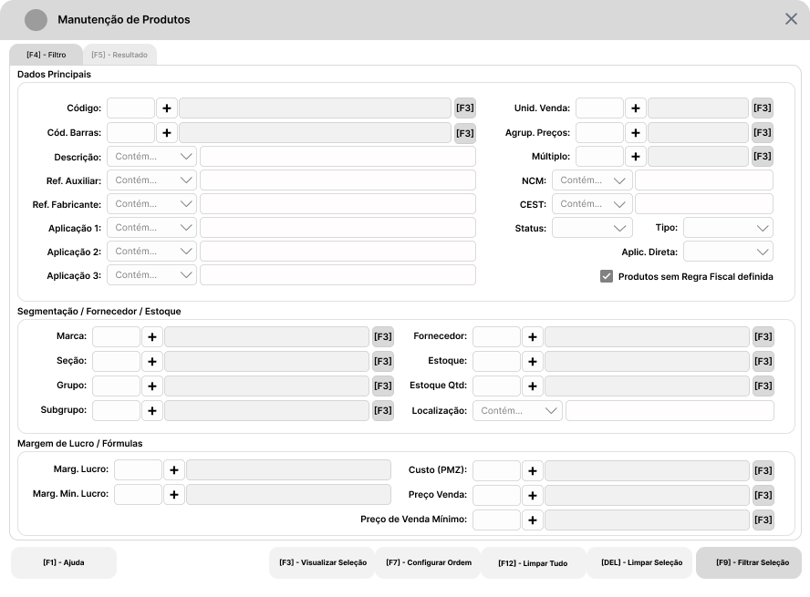

[Voltar ao Sumário](#documentação-de-requisitos---integrações-fiscais) | [Voltar ao Roadmap](#roadmap) | [Voltar ao Resumo](#resumo)

## Cadastro de Espelhamento de Produtos

A Rotina de Espelhamento de Produtos foi criada para que os dados tributários e de custo sejam replicados para as Empresas configuradas quando há alterações em um Produto. Contudo, a Regra Fiscal possui recurso de múltiplas filiais, não sendo necessário manter os dados tributários no E**spelhamento e no Processamento**.

1. Remover todos os campos e Grupos **ICMS, ICMS ST, PIS/COFINS, IPI e NFC-e**.
2. Gerar na Atualização do Sistema, a Inclusão dos Códigos das Filiais que antes eram espelhadas, nas Regras Fiscais de Venda a Consumidor Final.

[Voltar ao Sumário](#documentação-de-requisitos---integrações-fiscais) | [Voltar ao Roadmap](#roadmap) | [Voltar ao Resumo](#resumo)

## Fórmulas de Preço de Custo, Preço de Venda e Preço de Venda Mínimo

A Rotina de Fórmulas do Sistema Ganso, disponibiliza campos para que sejam criados cálculos específicos durante a Entrada de NF-e, e também, para realização de simulações através do Cadastro de Produtos. Conforme descrito em [Cadastro de Produtos/Alterações de Campos](#cadastro-de-produtos), alguns campos serão movidos para a Regra Fiscal, deste modo, os campos relacionados abaixo em **Variável da Fórmula** deverão ser lidos de uma **Regra Fiscal de Venda a Consumidor Final**, dos respectivos campos relacionados em **Variável da Regra Fiscal**:

| Grupo de Dados | Informação                                                        | Variável da Fórmula                 | Variável da Regra Fiscal                 |
| :------------- | :---------------------------------------------------------------- | :---------------------------------- | :--------------------------------------- |
| ICMS           | Percentual de Redução da Base de Cálculo do ICMS Estadual         | **f_rbc_icms_sai_estadual**         | **sugere_icms_rbc**                      |
| ICMS           | Percentual de Redução da Base de Cálculo do ICMS Interestadual    | **f_rbc_icms_sai_intestadual**      | **sugere_icms_rbc**                      |
| ICMS           | Alíquota do ICMS de Saída Estadual                                | **codigo_tributo /f_icms_venda**    | **codigo_produto_tributo**               |
| ICMS ST        | Percentual de MVA de Saída                                        | **f_st_mva_saida**                  | **sugere_st_mva_saida**                  |
| ICMS ST        | Percentual de Redução da Base de Cálculo do ICMS ST Estadual      | **f_st_rbc_icms_sai_estadual**      | **sugere_icmsst_rbc**                    |
| ICMS ST        | Percentual de Redução da Base de Cálculo do ICMS ST Interestadual | **f_st_rbc_icms_sai_interestadual** | **sugere_icmsst_rbc**                    |
| PIS/COFINS     | Alíquota de PIS e COFINS de Entrada                               | **f_pis_compra / f_cofins_compra**  | **sugere_pis_aliq / sugere_cofins_aliq** |
| PIS/COFINS     | Alíquota de PIS e COFINS de Saída                                 | **f_pis_venda / f_cofins_venda**    | **sugere_pis_aliq / sugere_cofins_aliq** |

Os demais campos presentes nas Fórmulas devem ser mantidos, visto que os respectivos dados são provenientes da Última Entrada de Mercadorias e devem permanecer no Produto para visualização.

[Voltar ao Sumário](#documentação-de-requisitos---integrações-fiscais) | [Voltar ao Roadmap](#roadmap) | [Voltar ao Resumo](#resumo)

## Venda Retaguarda e Vendas PDV

1. A Rotina de **Vendas Retaguarda** do Sistema Ganso coleta determinados dados e os grava nos **Itens da Venda** nos campos: **PAF_ALIQUOTA e PAF_SITUACAO_TRIBUTARIA**
2. A Rotina de **Vendas PDV (Ganso PDV)** recebe os dados Tributários do Produto em Estrutura semelhante ao Retaguarda. A partir desta implementação, devem ser lidos de uma **Regra Fiscal de Venda a Consumidor Final**.

- A implementação sugere que o Banco de dados do PDV deve contemplar as **Regras Fiscais de Saída a Consumidor Final**, de modo a agilizar a consulta aos dados e garantir que a informação correta seja utilizada na Transmissão do Documento Fiscal. Neste cenário, não poderá haver duplicidade de Regras Fiscais. O usuário de PDV não pode tomar este tipo de decisão.

## Devolução de Vendas

1. O Campo **TRIBUTO_VENDA** dos Itens da Devolução é preenchido com o **SIMBOLO_ECF** do **CODIGO_TRIBUTO** de Saída do Produto. O **CODIGO_TRIBUTO** deverá ser localizado em uma **Regra Fiscal de Venda a Consumidor Final**, se necessário manter esta informação.

## Recebimento Fiscal

A Rotina de **Recebimento Fiscal** ou Entrada de Mercadorias, requer ajustes em determinados pontos onde são exibidas informações Tributárias de Saída do Cadastro de Produtos que são afetadas pela mudança. Abaixo a tabela que relaciona os caminhos e dados envolvidos.

| Caminho/Local dos dados        | Dados                                                                                              | Tratamento                                                                                                                     |
| :----------------------------- | :------------------------------------------------------------------------------------------------- | :----------------------------------------------------------------------------------------------------------------------------- |
| **Item do Recebimento Fiscal** | Dados de PIS, COFINS e ICMS de Venda, do grupo de "Informações do Cadastro de Produtos".           | Buscar dados da **Regra Fiscal de Venda a Consumidor Final**                                                                   |
| **Item do Recebimento Fiscal** | Dados de ICMS, PIS e COFINS de Venda, da Tela de **Sugestão de Preço (Fórmulas)(F10 - F.Custos)**. | Buscar dados da **Regra Fiscal de Venda a Consumidor Final**                                                                   |
| **Derivar Item**               | Dados de Alíquota de ICMS e Alíquota IPI, do grupo "Itens Derivado".                               | Verificar origem dos dados. Se origem igual a "Cadastro de Produtos", buscar da **"Regra Fiscal de Venda a Consumidor Final"** |

Além das alterações de origem de dados, serão necessários criar **Novos Campos** para armazenar novos dados que serão retornados das Integrações Fiscais ou Calculados pela Regra Fiscal que são:

| Tipo      | Posicionamento                 | Nome/Texto                       | Descritivo                                                                                                                                                                                                                                                                                                                                 | Regras de Negócio                                                         |
| :-------- | :----------------------------- | :------------------------------- | :----------------------------------------------------------------------------------------------------------------------------------------------------------------------------------------------------------------------------------------------------------------------------------------------------------------------------------------- | :------------------------------------------------------------------------ |
| **Campo** | **Item do Recebimento Fiscal** | Valor do Diferencial de Alíquota | Criar campo para exibir o Valor do Diferencial da Alíquotas (DIFAL) calculado através da Regra Fiscal ou através dos dados retornados pelo Integrador Fiscal. Este valor deve ser utilizado apenas para **Formação de Custo** do Produto, pois, não trata-se de Imposto propriamente dito. Disponibilizar o campo em **Fórmulas de Custo** | Deve ser calculado em Valor conforme cálculo ocorre nas Fórmulas do DF-e. |
| **Campo** | **Item do Recebimento Fiscal** | Valor do ICMS Desonerado         | Criar campo para exibir o Valor do ICMS Desonerado proveniente do XML do Documento Fiscal ou calculado através da Regra Fiscal. Este valor deve ser utilizado como "Abatimento" no Valor Total do Produto quando Calculado por uma Regra Fiscal Manual ou apenas lido do XML quando ocorrer uma Importação de XML.                         | Deve ser calculado em Valor conforme cálculo ocorre nas Fórmulas do DF-e. |

[Voltar ao Sumário](#documentação-de-requisitos---integrações-fiscais) | [Voltar ao Roadmap](#roadmap) | [Voltar ao Resumo](#resumo)

## Documentos Fiscais - DF-e

1. Criar novo campo **"Perfil Fiscal"** na Aba **Remetente/Destinátário** para que o Usuário possa informar um Perfil Fiscal cadastrado, quando o Destinatário não estiver cadastrado no Sistema.
2. Criar novo campo **Finalidade da Operação** na Aba **Dados de Identificação** para que o Usuário possa informar uma Finalidade de Operação cadastrada, quando determinar o **Tipo do Documento Fiscal** como **Manual**.
3. Revisar as Fórmulas que processam os dados tributários do Produto e alimentam os campos do **Item no Documento Fiscal**.
4. Cada Operação (Tipo de Movimentação) exige uma Fórmula específica. Este processo deverá permanecer, contudo, os **Dados Tributários** devem ser obtidos de uma **Regra Fiscal cuja Finalidade e Operação corresponda ao Tipo de Movimentação e Perfil Fiscal do Destinatário** informados no Documento Fiscal.
5. Todos os Dados Tributários (ICMS, IPI, PIS, COFINS, e Cálculo do DIFAL) deverão ser lidos de uma **Regra Fiscal** correspondente a Operação.
6. Havendo duplicidade de Regras ou Inexistência da mesma, o usuário deve ser precisamente informado sobre quais produtos não tiveram os Tributos processados. Neste cenário, a orientação deve ser sobre Criar uma Regra, Selecionar uma da Lista ou optar por preencher manualmente as informações no Documento Fiscal (quando o tipo possibilitar).

### Tela de Decisão de Regras Fiscais a Aplicar

Durante a Emissão de um Documento Fiscal cujo Produto não possui Regra Fiscal para a Operação, deve ser solicitado ao Usuário que defina uma Regra Fiscal. Deste modo é necessário que seja criada e exibida uma Tela de Decisão, semelhante à tela existente na Entrada de Produtos, que deve conter os seguintes elementos:

| Elemento       | Nome/Texto                | Descritivo                                                                                                                                              | Regra de Negócio                                                                                                                                                                    |
| :------------- | :------------------------ | :------------------------------------------------------------------------------------------------------------------------------------------------------ | :---------------------------------------------------------------------------------------------------------------------------------------------------------------------------------- |
| Grade de Dados | Produtos do Documento     | Grade de Dados que exibe os Produtos do Documento Fiscal e os Critérios identificados.                                                                  | Permitir selecionar um Produto e definir uma Regra para o mesmo.                                                                                                                    |
| Grade de Dados | Regras Fiscais do Produto | Grade de Dados que exibe as Regras Fiscais e seus Parâmetros para o Produto selecionado na Grade definida no elemento anterior                          | Permitir selecionar apenas uma única Regra para um Produto.                                                                                                                         |
| Botão de Ação  | Definir Regra             | Botão de Ação para definir para o Produto Selecionado na Grade "Produtos do Documento", a Regra Fiscal selecionada na Grade "Regras Fiscais do Produto" | Verificar se a Regra está selecionada, Solicitar confirmação e Remover o Produto da Grade "Produtos do Documento".                                                                  |
| Botão de Ação  | Nova Regra                | Botão de Ação para acionar a abertura da Tela de Cadastro de Regras Fiscais e permitir cadastrar uma nova Regra.                                        | Abrir a Tela de Cadastro de Regras em Modo de Inserção, com os campos **Tipo de Regra, Finalidade, Perfil Fiscal, NCM, Produto e UF Destino** preenchidos para agilizar o Cadastro. |
| Botão de Ação  | Reprocessar Regra         | Botão de Ação para acionar o Reprocessamento das Regras Fiscais para o Documento Fiscal.                                                                | Reprocessar para todos os Produtos                                                                                                                                                  |

### Fluxo - Emissão de Documento Fiscal com a Nova Estrutura

1. Efetua a Leitura do **Tipo de Movimentação** e **Tipo de Documento Fiscal** para determinar qual a Operação para filtrar **Finalidades da Operação** que contenham a Operação. Se **Tipo de Movimentação igual a Manual**, solicitar ao Usuário o Preenchimento do campo **"Finalidade de Operação"** no DF-e.
2. Efetua a Leitura do **Perfil Fiscal** do Destinatário informado no DF-e ou no Cadastro para combinar esta informação com a **Finalidade** obtida no passo anterior.
3. Efetua a Leitura dos demais Critérios **(UF, NCM, CEST, Código do Produto)**, combina com os demais Critérios de **Finalidade, Perfil Fiscal** lidos para retornar as Regras Fiscais nestas condições.
4. Se **para cada Produto uma única Regra Fiscal for localizada**, aplicar imediatamente, senão, exibir quais Produtos não possuem Regras ou possuem mais de uma Regra Fiscal com os critérios identificados, para que o Usuário tome as decisões sobre qual regra aplicar.

O fluxo descrito acima pode ser observado na imagem abaixo:

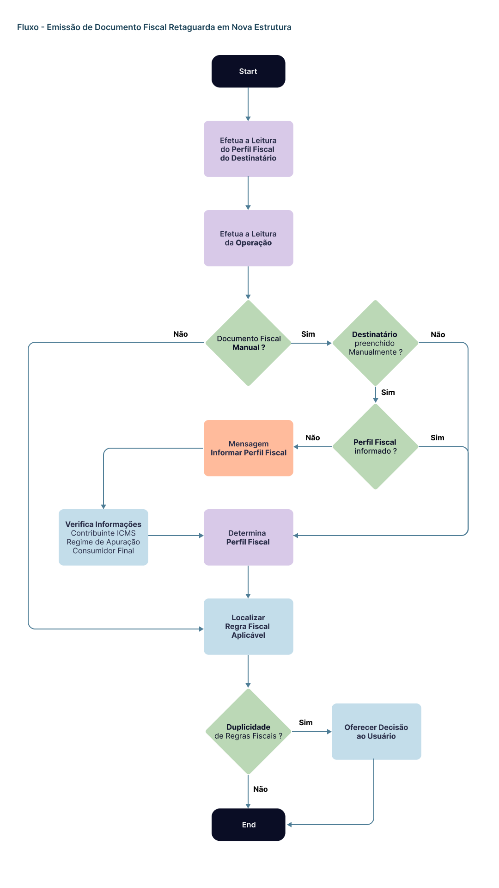

[Voltar ao Sumário](#documentação-de-requisitos---integrações-fiscais) | [Voltar ao Roadmap](#roadmap) | [Voltar ao Resumo](#resumo)

## Relatórios

A alteração da Regra de Negócio implica em atualizar os relatórios do Sistema para que as informações tributárias utilizadas sejam lidas do caminho correto. Abaixo a lista de Relatórios afetados.

| Nome do Relatório             | Caminho                                                              | Dados Envolvidos                                                                                                                                                                                           | Regra de Negócio                                                                                                                                                                                                                  |
| :---------------------------- | :------------------------------------------------------------------- | :--------------------------------------------------------------------------------------------------------------------------------------------------------------------------------------------------------- | :-------------------------------------------------------------------------------------------------------------------------------------------------------------------------------------------------------------------------------- |
| Usabilidade de Relatórios     | **Usuários / Usabilidade de Relatórios > Verificar Compatibilidade** | Campos de Tributos direcionados para a Regra Fiscal listados em [Cadastro de Produtos / Alterações de Campos](#alterações-de-campos)                                                                       | Ajustar a Condição de Leitura dos Campos para agregar os campos movidos para a Regra Fiscal, os não movidos deverão permanecer na condição.                                                                                       |
| Alíquota de ICMS de Produtos  | **Estoque / Alíquotas de ICMS de Produtos**                          | Código do Tributo e Alíquota do ICMS exibidos no Relatório                                                                                                                                                 | Identificar uma Regra Fiscal de Saída de **Operação de Venda a Consumidor Final** e obter os dados                                                                                                                                |
| Análise Comparativo de Vendas | **Vendas / Análise Comparativo de Vendas**                           | Valores de Impostos expressos no Relatório.                                                                                                                                                                | Verificar a origem dos impostos relacionados no Relatório. Caso necessário, obter os dados de uma Regra Fiscal de Saída de **Operação de Venda a Consumidor Final**.                                                              |
| **Sintegra de Entrada**       | **Informativos / Sintegra**                                          | Dados de Tributos para o Registro 75 que são lidos do Cadastro do Produto.   Revisar Procedure **SP_SINTEGRA_R54e**                                                                                  | Utilizar uma Regra Fiscal de Saída de **Operação de Venda a Consumidor Final** para obter os mesmos campos.                                                                                                                       |
| **Sintegra de Saída ECF**     | **Informativos / Sintegra**                                          | Procedures do Arquivo.                                                                                                                                                                                     | Utilizar uma Regra Fiscal de Saída de **Operação de Venda a Consumidor Final** para obter os mesmos campos do Cadastro de Produtos, se necessário. [Ver Seção Cadastro de Produtos / Alterações de Campos](#alterações-de-campos) |
| **Sintegra de Saída NFs**     | **Informativos / Sintegra**                                          | Dados de Tributos para o Registro 75 que são lidos do Cadastro do Produto.   Revisar Procedure **SP_SINTEGRA_R54S**   Revisar Consulta Principal, dados do cadastro são lidos para tributação. | Utilizar uma Regra Fiscal de Saída de **Operação de Venda a Consumidor Final** para obter os mesmos campos.                                                                                                                       |
| **Sintegra Unificado**        | **Informativos / Sintegra**                                          | Todos os dados.                                                                                                                                                                                            | Revisar todas as Consultas do Relatório, que une todos os dados dos Sintegras Anteriores.                                                                                                                                         |
| **SPED Fiscal**               | **Informativos / SPED Fiscal**                                       | Registros 0200 e SQLs, C170 e SQLs                                                                                                                                                                         | Revisar todas as Consultas substituir informações tributárias de Saída por dados de uma Regra Fiscal de **Operação de Venda a Consumidor Final** conforme relação de campos.                                                      |
| **SPED Contribuições**        | **Informativos / SPED Contribuições**                                | Registros 0200 e SQLs, C170 e SQLs, C481 e C485.                                                                                                                                                           | Revisar todas as Consultas substituir informações tributárias de Saída por dados de uma Regra Fiscal de **Operação de Venda a Consumidor Final** conforme relação de campos.                                                      |
| **Apuração de ICMS**          | **Fiscal / Apuração de ICMS**                                        | Registros C170, C175, C470                                                                                                                                                                                 | Revisar todas as Consultas substituir informações tributárias de Saída por dados de uma Regra Fiscal de **Operação de Venda a Consumidor Final** conforme relação de campos.                                                      |
| **Documentos Fiscais**        | **Fiscal / Documentos Fiscais**                                      | SP_REL_DOCS_FISCAIS                                                                                                                                                                                        | Revisar a Procedure. Se necessário obter os dados lidos do Cadastro de uma Regra Fiscal de **Operação de Venda a Consumidor Final** conforme relação de campos.                                                                   |

## Gerador de Etiquetas

O Gerador de Etiquetas é um Recurso que permite a criação de Layouts com base nas informações do Produtos, Clientes ou Fornecedor. Para a Geração de Etiquetas de Produtos, os dados do Cadastro de Produtos são carregados, e a partir da Nova Regra de Negócio, os dados de Tributos disponibilizados deverão ser carregados de uma **Regra de Venda a Consumidor Final** conforme a Relação de Campos do Produto a Mover para Regra Fiscal [Ver Seção Cadastro de Produtos / Alteração de Campos](#alterações-de-campos)

[Voltar ao Sumário](#documentação-de-requisitos---integrações-fiscais) | [Voltar ao Roadmap](#roadmap) | [Voltar ao Resumo](#resumo)

## Nova Tela - Gerenciador Tributário

Os Integradores Fiscais oferecem recurso ao Usuário para consultar a Tributação de vários produtos em uma única Requisição (em Lote), obtendo retorno imediato (em alguns casos) conforme as configurações da operação solicitada. Além disso, permite o envio do Cadastro Completo para revisão. Deste modo é necessário construir uma Nova Tela para disponibilizar o recurso ao Usuário, conforme elementos iniciais levantados:

| Elemento            | Posicionamento                               | Nome/Texto                                               | Descritivo                                                                                                                        | Conjunto de Dados e Opções                                                                                                                                                                                                                                                                                       | Regras de Negócio                                                                                                                                                                                                                                                                                                                                                                                                                                                                                |
| :------------------ | :------------------------------------------- | :------------------------------------------------------- | :-------------------------------------------------------------------------------------------------------------------------------- | :--------------------------------------------------------------------------------------------------------------------------------------------------------------------------------------------------------------------------------------------------------------------------------------------------------------- | :----------------------------------------------------------------------------------------------------------------------------------------------------------------------------------------------------------------------------------------------------------------------------------------------------------------------------------------------------------------------------------------------------------------------------------------------------------------------------------------------- |
| Grupo de Filtros    | Início                                       | Segmentação                                              | Grupo que organiza os campos para pesquisa de Produtos por Segmentação do Sistema Ganso.                                          | Filtros de Marca, Seção, Grupo, Subgrupo, Ambiente de Utilização, Fornecedor Padrão e Agrupamento de Preços.                                                                                                                                                                                                     | Validar Hierarquia de Segmentação                                                                                                                                                                                                                                                                                                                                                                                                                                                                |
| Grupo de Filtros    | Início                                       | Produto                                                  | Grupo que organiza os campos para pesquisa de Produtos por Características.                                                       | Filtros "Contém, Começa Com, Igual a" para os campos **Descrição, Referência do Fabricante, Referência Auxiliar e Localização**, Status do Produto, Empresas (Filiais), Caixas de Seleção para as opções **Produtos com EAN/GTIN, Produtos Enviados para Integrador Fiscal, Produtos com Código do Integrador**. | A opção **"Produtos com EAN/GTIN"** deve retornar apenas produtos cujo Código de Barras seja maior ou igual a 8 dígitos.    A opção **"Produtos Enviados para Integrador Fiscal"** refere-se ao itens que foram enviados uma vez em Lote para Revisão Tributária.    A opção **"Produtos com Código do Integrador"** deverá ser exibida apenas se o Integrador implementar tal recurso, e deve listar apenas produtos que possuírem a informação preenchida no Cadastro de Produtos. |
| Botão               | Grupo de Filtros do Produto                  | Limpar filtros                                           | Botão que aciona o comando para limpar todos os filtros, inclusive os do Grupo Segmentação                                        | Todos os filtros                                                                                                                                                                                                                                                                                                 | Exibir uma Mensagem de Confirmação e decisão do Usuário.                                                                                                                                                                                                                                                                                                                                                                                                                                         |
| Botão               | Grupo de Filtros do Produto                  | Pesquisar                                                | Botão que aciona a pesquisa considerando os filtros informados, inclusive os do Grupo Segmentação.                                | Todos os filtros                                                                                                                                                                                                                                                                                                 | Verificar se nenhum filtro foi preenchido, se sim, informar ao Usuário que a Consulta retornará **todos os produtos**.    Se Integrador Ativo igual a **iMendes**, informar que mesmo listando todos os Produtos, há um Limite de Produtos serão enviados por lote devido a limitação da API. **Consultar a Documentação do Integrador**                                                                                                                                                   |
| Grade de Dados      | Abaixo do Grupo de Filtros do Produto        | Resultado dos Filtros                                    | Tabela de Dados contendo os Produtos resultantes dos filtros informados pelo usuário.                                             | Conter Caixa de Seleção, Código, Código de Barras, Descrição, NCM, CEST, Marca, Seção, Grupo, Subgrupo, Código do Integrador, Enviado para Integrador Fiscal ([Ver Seção Cadastro de Produtos](#cadastro-de-produtos)), Histórico                                                                                | Permitir selecionar um ou mais Produtos do Resultado.   Permitir configurar as colunas a exibir na Grade de Dados. Exibir uma "_dica_" quando o usuário passar o mouse sobre um Produto, que deve exibir os dados Tributários **Antes e Depois**.    Observar a Limitação de Produtos do Integrador.                                                                                                                                                                                 |
| Texto               | Abaixo da Grade de Resultado - lado esquerdo | Tecla de Atalho [F4] - Selecionar Todos/Inverter Seleção | Ação para permitir selecionar Todos os Produtos da Grade de Resultado ou Inverter a Seleção atual                                 | Todos os dados da Grade de Resultado                                                                                                                                                                                                                                                                             | Permitir selecionar o inverter a seleção dos Produtos do Resultado usando a Tecla de Atalho.    Observar o Limite de Seleção do Integrador                                                                                                                                                                                                                                                                                                                                                 |
| Texto               | Abaixo da Grade de Resultado - lado esquerdo | [F5] - Limpar Seleção                                    | Ação para permitir limpar a Seleção atual da Grade de Resultado dos Filtros                                                       | Todos os dados da Grade de Resultado                                                                                                                                                                                                                                                                             | -                                                                                                                                                                                                                                                                                                                                                                                                                                                                                                |
| Texto               | Abaixo Grade de Resultado - lado direito     | Produtos Listados                                        | Texto informativo que exibe o contador total de Produtos que a pesquisa retornou.                                                 | Produtos da Grade de Resultado                                                                                                                                                                                                                                                                                   | -                                                                                                                                                                                                                                                                                                                                                                                                                                                                                                |
| Texto               | Abaixo Grade de Resultado - lado direito     | Produtos Selecionados                                    | Texto informativo que exibe o contador de Produtos selecionados pelo Usuário.                                                     | Produtos da Grade de Resultado                                                                                                                                                                                                                                                                                   | -                                                                                                                                                                                                                                                                                                                                                                                                                                                                                                |
| Grupo de Parâmetros | Rodapé da Tela                               | Parâmetros para Consulta Tributária                      | Grupo que organiza os filtros específicos e as funções que estarão disponíveis conforme Integrador Ativo.                         | Finalidade de Operação, Perfil Fiscal, UFs de Origem/Destino.                                                                                                                                                                                                                                                    | Habilitar componentes conforme o Integrador Ativo. **Consultar Documentação do Integrador**                                                                                                                                                                                                                                                                                                                                                                                                      |
| Caixa de Combinação | Grupo de Parâmetros para Consulta Tributária | Finalidade da Operação                                   | Criar campo para definir a Finalidade da Operação previamente cadastrada                                                          | **Cadastro de Finalidade de Operação** ([Ver Seção Cadastro de Finalidade de Operações](#cadastro-de-finalidade-de-operações))                                                                                                                                                                                   | Deve existir uma Finalidade de Operação. Este campo poderá ser desabilitado se o Integrador Fiscal não utilizar.                                                                                                                                                                                                                                                                                                                                                                                 |
| Caixa de Combinação | Grupo de Parâmetros para Consulta Tributária | Perfil Fiscal                                            | Criar campo para definir o Perfil Fiscal previamente cadastrado.                                                                  | **Cadastro de Perfil Fiscal** ([Ver Seção Cadastro de Perfil Fiscal](#cadastro-de-perfil-fiscal))                                                                                                                                                                                                                | Deve existir um Perfil Fiscal previamente cadastrado com informações suficientes requeridas pelo Integrador.                                                                                                                                                                                                                                                                                                                                                                                     |
| Campo de Texto      | Grupo de Parâmetros para Consulta Tributária | UFs de Origem/Destino                                    | Criar campo para definir as UFs para as quais o usuário deseja obter as Tributações.                                              | Unidades Federadas Brasileiras                                                                                                                                                                                                                                                                                   | Permitir a digitação de mais de uma UF, separadas por vírgula, limitada até 5 UFs.   Validar se a UF digitada é válida, e não permitir a digitação de UFs repetidas. Desabilitar quando Integrador não requer esta informação. **Consultar Documentação do Integrador**                                                                                                                                                                                                                    |
| Botão               | Grupo de Parâmetros para Consulta Tributária | Enviar Lote para Revisão                                 | Botão para acionar o Envio dos Produtos selecionados para Revisão Tributária pelo Integrador Fiscal.                              | Todos os Produtos Selecionados                                                                                                                                                                                                                                                                                   | Verificar Limite de Envio. **Consultar Documentação do Integrador**                                                                                                                                                                                                                                                                                                                                                                                                                              |
| Botão               | Grupo de Parâmetros para Consulta Tributária | Consultar Tributação                                     | Botão para acionar o comando de Consultar Tributação para os produtos selecionados na Grade de Dados.                             | Produtos Selecionados                                                                                                                                                                                                                                                                                            | Consultar Documentação do Integrador para disponibilidade desta função.                                                                                                                                                                                                                                                                                                                                                                                                                          |
| Botão               | Grupo de Parâmetros para Consulta Tributária | Consultar Atualizações                                   | Botão para acionar o comando para Consultar Alterações/Atualizações de Tributação para os produtos selecionados na Grade de Dados | Todos os dados                                                                                                                                                                                                                                                                                                   | Consultar Documentação do Integrador para disponibilidade desta função.                                                                                                                                                                                                                                                                                                                                                                                                                          |
| Botão               | Grupo de Parâmetros para Consulta Tributária | Pendências                                               | Botão para acionar a visualização de Produtos Pendentes de Classificação pelo Integrador Fiscal                                   |                                                                                                                                                                                                                                                                                                                  | Consultar Documentação do Integrador para disponibilidade desta função.                                                                                                                                                                                                                                                                                                                                                                                                                          |

O _Protótipo_ abaixo exemplifica os elementos descritos acima para a Nova Tela.

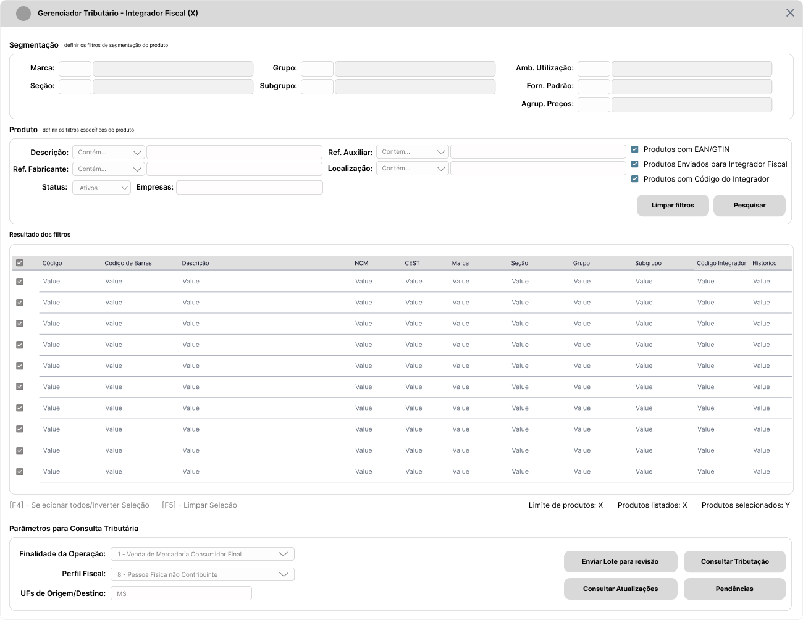

[Voltar ao Sumário](#documentação-de-requisitos---integrações-fiscais) | [Voltar ao Roadmap](#roadmap) | [Voltar ao Resumo](#resumo)

A função **Pendências** contida nesta tela, será utilizada para visualizar quais Produtos estão pendentes de revisão na API do Integrador Fiscal. Alguns integradores retornam esta informação junto com o Lote dos Produtos que foram classificados com sucesso, e estes devem ser marcados no Cadastro de Produtos como Pendentes de Classificação. Outros integradores, requerem que seja realizada uma Consulta à API para esta verificação. Deste modo, é necessário criar uma Tela de Visualização para estes dados, contendo os elementos abaixo:

| Tipo de Elemento   | Nome/Texto             | Descritivo                                                                                                                                     | Dados Envolvidos                                                                                                                                         | Regras de Negócio                                                                         |
| :----------------- | :--------------------- | :--------------------------------------------------------------------------------------------------------------------------------------------- | :------------------------------------------------------------------------------------------------------------------------------------------------------- | :---------------------------------------------------------------------------------------- |
| **Grade de Dados** | Produtos Pendentes     | Grade que exibe os Produtos Pendentes de Classificação na API do Integrador.                                                                   | Exibir Caixa de Seleção, Código do Produto, Código de Barras, Descrição, NCM, CEST, Código do Integrador (quando houver), Status (Classificado/Pendente) | Considerar os Produtos marcados como "Pendente de Classificação" no Cadastro de Produtos. |
| **Botão de Ação**  | Consultar Retorno      | Botão de Ação para enviar um Comando de Consulta à API, com intiuito de obter o retorno de Classificação/Tributação dos Produtos selecionados. | Produtos selecionados na Grade de Dados                                                                                                                  | Habilitar apenas se a Documentação do Integrador informar a existência do recurso.        |
| **Botão de Ação**  | Reenviar Produtos      | Botão de Ação para reenviar os Produtos selecionados para a API do Integrador realizar a Classificação.                                        | Produtos selecionados na Grade de Dados                                                                                                                  | Habilitar apenas se a Documentação do Integrador informar a existência do recurso.        |
| **Botão de Ação**  | Atualizar Selecionados | Botão de Ação para Atualizar os Produtos selecionados conforme Classificação Concluída pelo Integrador.                                        | Produtos selecionados na Grade de Dados com Status "Classificado".                                                                                       | Habilitar apenas se a Documentação do Integrador informar a existência do recurso.        |

O Protótipo abaixo exemplifica os elementos descritos acima:

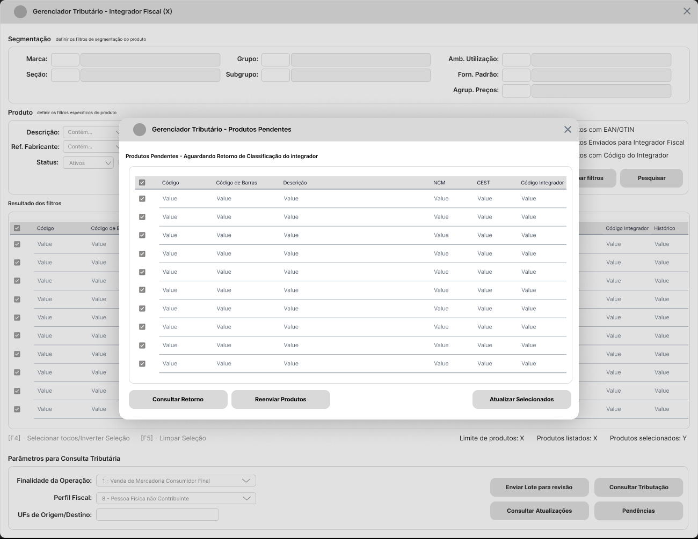

[Voltar ao Sumário](#documentação-de-requisitos---integrações-fiscais) | [Voltar ao Roadmap](#roadmap) | [Voltar ao Resumo](#resumo)

## Nova Tela - Consulta por Descrição de Produto

Determinados Integradores podem possuir recursos importantes para garantir que o Usuário consiga informações Tributárias de todos os seus Produtos, mesmo os que não possuírem **Código de Barras** padronizado ou dados específicos requeridos. Um dos recursos trata-se da **Pesquisa por Descrição**, em que é oferecida a **Base de Dados de Produtos do Integrador** para que o Usuário relacione o seu Produto e obtenha os dados Tributários conforme desejado. Este recurso deve ser disponibilizado quando o Integrador implementar, apenas quando o usuário optar por **Consultar através do Cadastro de Produtos** e deve ser acionada conforme as Regras de Negócio abaixo:

| Ação do Usuário                                              | Dados Inseridos                                                        | Mensagem ao Usuário                                                                                                                                                                                     | Decisão                                                                                                                                                                                                                                                                                                                                                                                                                       | Validações                                                                                                                                                                             |
| :----------------------------------------------------------- | :--------------------------------------------------------------------- | :------------------------------------------------------------------------------------------------------------------------------------------------------------------------------------------------------ | :---------------------------------------------------------------------------------------------------------------------------------------------------------------------------------------------------------------------------------------------------------------------------------------------------------------------------------------------------------------------------------------------------------------------------- | :------------------------------------------------------------------------------------------------------------------------------------------------------------------------------------- |
| Cadastrando Novo Produto                                     | Apenas Descrição do Produto                                            | Informar que a Consulta Tributária ocorrerá através da Descrição e que o Usuário deverá tomar a decisão em vincular um **Código do Integrador** para futuras consultas.                                 | Utilizar o **Método de Consulta** apropriado do Integrador e exibir os Produtos encontrados                                                                                                                                                                                                                                                                                                                                   | Solicitar Chave de Acesso Restrito para vincular o Código do Integrador. [Ver Seção Acessos Restritos](#acessos-restritos)                                                             |
| Cadastrando Novo Produto ou Utilizando um Produto Cadastrado | Descrição e Código de Barras inválido, mas com 8, 12, 13 ou 14 dígitos | Informar que o Código de Barras é inválido e solicitar que o usuário verifique o Código informado. Disponibilizar as opções para **"Continuar por Descrição"** e **"Continuar pelo Código de Barras"**. | Se Usuário **"Continuar por Descrição"**, exibir mensagem informando que a consulta ocorrerá através da Descrição, utilizar o **Método de Consulta** apropriado do Integrador e exibir os Produtos encontrados.   Se Usuário **"Continuar pelo Código de Barras"**, utilizar o **Método de Consulta** apropriado, exibir mensagem informando que o Produto pode não ser encontrado devido ao Código de Barras inválido. | Aplicar método de validação do Código de Barras pelo dígito verificador.    Exibir mensagem clara e objetiva sobre possível falha do Processo "Continuar pelo Código de Barras". |

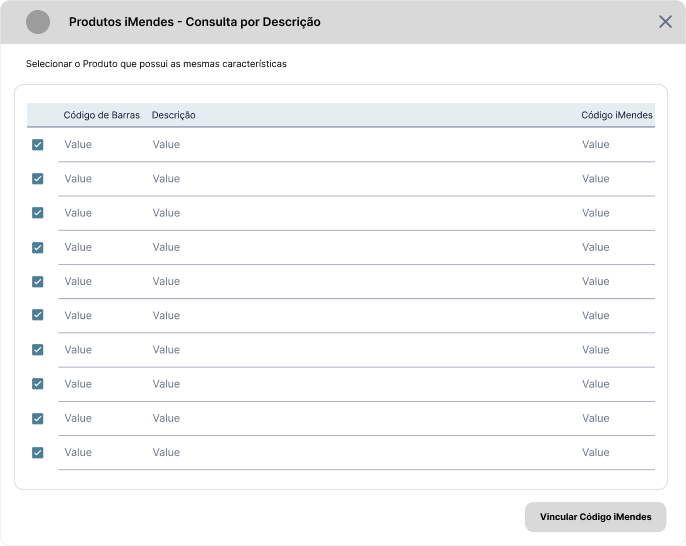

[Voltar ao Sumário](#documentação-de-requisitos---integrações-fiscais) | [Voltar ao Roadmap](#roadmap) | [Voltar ao Resumo](#resumo)

# Relação de Campos Ganso x Integrador Fiscal

Nesta Seção são descritos os **Relacionamentos das Informações** que são retornadas pelas APIs dos Integradores Fiscais, e os respectivos Campos de Informações do Sistema Ganso que deverão receber os dados, a princípio. A relação está divida em 2 tabelas: **Produto e Produto Parâmetros** quando as informações tributárias compoem apenas dados do **Cadastro do Produto**. Na Seção que envolve a **Regra Fiscal** ([Ver Seção Regra Fiscal x Integrador](#regra-fiscal-x-integrador-fiscal)) há uma nova relação por tratar-se de Estruturas distintas.

## Tabela Produto

| Campo do Ganso          | Descritivo                                   | Retorno iMendes | Retorno FGF | Retorno Mix Fiscal | Regra de Negócio                                                                                                                   |
| :---------------------- | :------------------------------------------- | :-------------: | :---------: | :----------------: | :--------------------------------------------------------------------------------------------------------------------------------- |
| NCM                     | NCM do Produto                               |      `nCM`      |  `codNcm`   |       `ncm`        | -                                                                                                                                  |
| CEST                    | Código CEST do Produto                       |     `cEST`      |  `codCest`  |       `cest`       | Se Integrador igual a **iMendes** remover a máscara do retorno e gravar apenas os dígitos.                                         |
| prod_esp_com_codigo_anp | Código ANP do Produto Específico Combustível |    `codAnp`     |      -      |         -          | Se existir retorno para esta informação, gravar o Código ANP no Produto e preencher o campo "PRODUTO_ESPECIFICO" com a sigla 'COM' |
| ex_tipi                 | Exclusão da TIPI                             |      `ex`       |  `exTipi`   |      `ex_ipi`      | -                                                                                                                                  |

## Tabela Produto Parâmetros

| Campo do Ganso                                  | Descritivo                                                                    |          Retorno iMendes           |         Retorno FGF          |  Retorno Mix Fiscal   | Regra de Negócio                                                                                                                                                                                                                                                                                                                                                                                                                                                                                                                                                                                                                                                                                                                                                                                                                                                                                                                                                                                                                                                                                                                                                                                                                                                                                                                                   |
| :---------------------------------------------- | :---------------------------------------------------------------------------- | :--------------------------------: | :--------------------------: | :-------------------: | :------------------------------------------------------------------------------------------------------------------------------------------------------------------------------------------------------------------------------------------------------------------------------------------------------------------------------------------------------------------------------------------------------------------------------------------------------------------------------------------------------------------------------------------------------------------------------------------------------------------------------------------------------------------------------------------------------------------------------------------------------------------------------------------------------------------------------------------------------------------------------------------------------------------------------------------------------------------------------------------------------------------------------------------------------------------------------------------------------------------------------------------------------------------------------------------------------------------------------------------------------------------------------------------------------------------------------------------------- |
| cst_pis_entrada                                 | CST de PIS de Entrada                                                         |         `pisCofins/cstEnt`         |    `cstPisCofinsEntrada`     |   `cst_pis_entrada`   | O CST de PIS de Entrada deve ser igual ao CST de Cofins de Entrada. Somente o Integrador Mix Fiscal diferencia os campos de Entrada                                                                                                                                                                                                                                                                                                                                                                                                                                                                                                                                                                                                                                                                                                                                                                                                                                                                                                                                                                                                                                                                                                                                                                                                                |
| cst_cofins_entrada                              | CST de Cofins de Entrada                                                      |         `pisCofins/cstEnt`         |    `cstPisCofinsEntrada`     | `cst_cofins_entrada`  | O CST de Cofins de Entrada deve ser igual ao CST de PIS de Entrada. Somente o Integrador Mix Fiscal diferencia os campos de Entrada                                                                                                                                                                                                                                                                                                                                                                                                                                                                                                                                                                                                                                                                                                                                                                                                                                                                                                                                                                                                                                                                                                                                                                                                                |
| cst_pis                                         | CST de PIS de Saída                                                           |         `pisCofins/cstSai`         |     `cstPisCofinsSaida`      |    `cst_pis_saida`    | O CST de PIS de Saída deve ser igual ao CST de Cofins de Saída. Somente o Integrador Mix Fiscal diferencia os campos de Saída                                                                                                                                                                                                                                                                                                                                                                                                                                                                                                                                                                                                                                                                                                                                                                                                                                                                                                                                                                                                                                                                                                                                                                                                                      |
| cst_cofins                                      | CST de Cofins de Saída                                                        |         `pisCofins/cstSai`         |     `cstPisCofinsSaida`      |  `cst_cofins_saida`   | O CST de PIS de Saída deve ser igual ao CST de Cofins de Saída. Somente o Integrador Mix Fiscal diferencia os campos de Saída                                                                                                                                                                                                                                                                                                                                                                                                                                                                                                                                                                                                                                                                                                                                                                                                                                                                                                                                                                                                                                                                                                                                                                                                                      |
| codigo_tributo_pis_entrada / f_pis_compra       | Alíquota de PIS de Entrada                                                    |        `pisCofins/aliqPis`         |         `al_pis_in`          |  `aliq_pis_entrada`   | Gravar o Código do Tributo do PIS que consta na Tabela "TRIBUTOS" do Sistema Ganso, que corresponde à Alíquota retornada pelo parceiro. Gravar a Alíquota no campo f_pis_compra.                                                                                                                                                                                                                                                                                                                                                                                                                                                                                                                                                                                                                                                                                                                                                                                                                                                                                                                                                                                                                                                                                                                                                                   |
| codigo_tributo_cofins_entrada / f_cofins_compra | Alíquota de Cofins de Entrada                                                 |       `pisCofins/aliqCofins`       |        `al_cofins_in`        | `aliq_cofins_entrada` | Gravar o Código do Tributo do Cofins que consta na Tabela "TRIBUTOS" do Sistema Ganso, que corresponde à Alíquota retornada pelo parceiro. Gravar a Alíquota no campo f_cofins_compra.                                                                                                                                                                                                                                                                                                                                                                                                                                                                                                                                                                                                                                                                                                                                                                                                                                                                                                                                                                                                                                                                                                                                                             |
| codigo_tributo_pis_saida / f_pis_venda          | Alíquota de PIS de Saída                                                      |        `pisCofins/aliqPis`         |         `al_pis_out`         |   `aliq_pis_saida`    | Gravar o Código do Tributo do PIS que consta na Tabela "TRIBUTOS" do Sistema Ganso, que corresponde à Alíquota retornada pelo parceiro. Gravar a Alíquota no campo f_pis_venda.                                                                                                                                                                                                                                                                                                                                                                                                                                                                                                                                                                                                                                                                                                                                                                                                                                                                                                                                                                                                                                                                                                                                                                    |
| codigo_tributo_cofins_saida / f_cofins_venda    | Alíquota de Cofins de Saída                                                   |       `pisCofins/aliqCofins`       |       `al_cofins_out`        |  `aliq_cofins_saida`  | Gravar o Código do Tributo do Cofins que consta na Tabela "TRIBUTOS" do Sistema Ganso, que corresponde à Alíquota retornada pelo parceiro. Gravar a Alíquota no campo f_cofins_venda.                                                                                                                                                                                                                                                                                                                                                                                                                                                                                                                                                                                                                                                                                                                                                                                                                                                                                                                                                                                                                                                                                                                                                              |
| cst_natureza_receita_piscofins                  | CST da Natureza da Receita de PIS e Cofins                                    |          `pisCofins/nri`           |      `naturezaReceita`       |       `nat_rec`       | Verificar a existência do Código de Natureza da Receita (campo "codigo_natureza_receita" da tabela "NATUREZA_RECEITA") onde os campos "cst_pis" e "cst_cofins" correspondem ao CST de PIS e Cofins retornados pelo Integrador. Se existir, gravar no Campo do Ganso. Se não existir, criar um Registro Genérico na Tabela "NATUREZA_RECEITA" preenchendo os campos:   CODIGO_NATUREZA_RECEITA: Código Retornado pelo Integrador   NATUREZA_RECEITA: 'Natureza criada pelo Integrador (x)'   CST_PIS e CST_COFINS: CST de PIS e Cofins Retornados pelo Integrador, tanto de entrada quanto de saída, separados por vírgula. Ex.: '70,06'                                                                                                                                                                                                                                                                                                                                                                                                                                                                                                                                                                                                                                                                                                   |
| cst_ipi_entrada                                 | CST de IPI de Entrada                                                         |            `iPI/cstEnt`            |              -               |           -           | Informar o Código de Retorno no Campo de destino. Somente o Integrador iMendes fornece retorno para este campo.                                                                                                                                                                                                                                                                                                                                                                                                                                                                                                                                                                                                                                                                                                                                                                                                                                                                                                                                                                                                                                                                                                                                                                                                                                    |
| cst_ipi                                         | CST de IPI de Saída                                                           |            `iPI/cstSai`            |              -               |           -           | Informar o Código de Retorno no Campo de destino. Somente o Integrador iMendes fornece retorno para este campo.                                                                                                                                                                                                                                                                                                                                                                                                                                                                                                                                                                                                                                                                                                                                                                                                                                                                                                                                                                                                                                                                                                                                                                                                                                    |
| codigo_tributo_ipi                              | Alíquota de IPI de Saída                                                      |           `iPI/aliqipi`            |              -               |           -           | Gravar o Código do Tributo que consta na Tabela "PRODUTO_TRIBUTO" onde o campo "SITUACAO" seja igual a 1, "SITUACAO_TRIBUTARIA" seja igua a 'T' e o campo "CST" corresponda ao valor retornado pelo Integrador.                                                                                                                                                                                                                                                                                                                                                                                                                                                                                                                                                                                                                                                                                                                                                                                                                                                                                                                                                                                                                                                                                                                                    |
| codigo_cfop_nfc                                 | Código Fiscal de Operação ou Prestação (CFOP) de Saída                        |          `CaracTrib/cFOP`          |              -               |           -           | Somente o Integrador **iMendes** retorna esta informação, contudo é obrigatória para o Sistema Ganso. Se Mix Fiscal, preencher com o **CFOP Padrão** informado na **Finalidade de Operação** cuja **Operação** seja de **Venda a Consumidor Final**, cujo **Cenário** seja de **Saída Não Contribuinte (SNC)**. Se FGF, preencher com o **CFOP Padrão** informado na **Finalidade de Operação** cuja **Operação** seja de **Venda a Consumidor Final**                                                                                                                                                                                                                                                                                                                                                                                                                                                                                                                                                                                                                                                                                                                                                                                                                                                                                             |
| cst                                             | CST de ICMS de Saída                                                          |          `CaracTrib/cST`           |        `cstIcmsSaida`        |      `cst_saida`      | Concatenar o dígito '0' como prefixo quando o Integrador for igual a **iMendes ou Mix Fiscal**. O Integrador **FGF** retornará os 3 dígitos requeridos pelo Sistema Ganso.                                                                                                                                                                                                                                                                                                                                                                                                                                                                                                                                                                                                                                                                                                                                                                                                                                                                                                                                                                                                                                                                                                                                                                         |
| cst_nfc                                         | CST de ICMS de Saída (NFC-e/SAT)                                              |          `CaracTrib/cST`           |        `cstIcmsSaida`        |      `cst_saida`      | Concatenar o dígito '0' como prefixo quando o Integrador for igual a **iMendes ou Mix Fiscal**. O Integrador **FGF** retornará os 3 dígitos requeridos pelo Sistema Ganso.                                                                                                                                                                                                                                                                                                                                                                                                                                                                                                                                                                                                                                                                                                                                                                                                                                                                                                                                                                                                                                                                                                                                                                         |
| csosn                                           | CSOSN de ICMS de Saída - Se CRT = 1 ou 2                                      |         `CaracTrib/cSOSN`          |        `cstIcmsSaida`        |      `cst_saida`      | Concatenar o dígito '0' como prefixo quando o Integrador for igual a **iMendes ou Mix Fiscal**. O Integrador **FGF** retornará os 4 dígitos requeridos pelo Sistema Ganso.                                                                                                                                                                                                                                                                                                                                                                                                                                                                                                                                                                                                                                                                                                                                                                                                                                                                                                                                                                                                                                                                                                                                                                         |
| csosn_nfc                                       | CSOSN de ICMS de Saída (NFC-e/SAT)                                            |         `CaracTrib/cSOSN`          |        `cstIcmsSaida`        |      `cst_saida`      | Concatenar o dígito '0' como prefixo quando o Integrador for igual a **iMendes ou Mix Fiscal**. O Integrador **FGF** retornará os 4 dígitos requeridos pelo Sistema Ganso. Gravar somente se CRT da Empresa igual 1 ou 2.                                                                                                                                                                                                                                                                                                                                                                                                                                                                                                                                                                                                                                                                                                                                                                                                                                                                                                                                                                                                                                                                                                                          |
| f_rbc_icms_sai_estadual                         | Percentual de Redução de Base de Cálculo do ICMS Estadual                     |     `CaracTrib/reducaoBcIcms`      |      `perReducaoSaida`       |    `redbase_saida`    | Informar no campo de destino o valor retornado pelo Integrador.                                                                                                                                                                                                                                                                                                                                                                                                                                                                                                                                                                                                                                                                                                                                                                                                                                                                                                                                                                                                                                                                                                                                                                                                                                                                                    |
| f_rbc_icms_sai_interestadual                    | Percenutal de Redução de Base de Cálculo do ICMS Interestadual                | `CaracTrib/redBcIcmsInterestadual` |              -               |           -           | \* FGF não possui esta informação. Mix Fiscal retorna, mas dependerá do cenário.                                                                                                                                                                                                                                                                                                                                                                                                                                                                                                                                                                                                                                                                                                                                                                                                                                                                                                                                                                                                                                                                                                                                                                                                                                                                   |
| f_st_mva_saida                                  | Percentual de Margem de Valor Agregado ou Índice de Valor Agregado de Saída   |          `CaracTrib/iVA`           |           `perMva`           |         `mva`         | Informar no campo de destino o valor retornado pelo Intergrador.                                                                                                                                                                                                                                                                                                                                                                                                                                                                                                                                                                                                                                                                                                                                                                                                                                                                                                                                                                                                                                                                                                                                                                                                                                                                                   |
| f_st_mva                                        | Percentual de Margem de Valor Agregado ou Índice de Valor Agregado de Entrada |        `CaracTrib/iVAAjust`        |           `perMva`           |         `mva`         | Informar no campo de destino o valor retornado pelo Intergrador.                                                                                                                                                                                                                                                                                                                                                                                                                                                                                                                                                                                                                                                                                                                                                                                                                                                                                                                                                                                                                                                                                                                                                                                                                                                                                   |
| percentual_fcp                                  | Percentual de Entrada do Fundo de Combate a Pobreza                           |          `CaracTrib/fCP`           |           `perFcp`           |        `fecp`         | Informar no campo de destino o valor retornado pelo Integrador.                                                                                                                                                                                                                                                                                                                                                                                                                                                                                                                                                                                                                                                                                                                                                                                                                                                                                                                                                                                                                                                                                                                                                                                                                                                                                    |
| cod_beneficio_fiscal                            | Código do Benefício Fiscal de Saída                                           |        `CaracTrib/codBenef`        | `CodBenefAjusteIncentivoCST` |       `cBenef`        | Informar no campo de destino o valor retornado pelo Integrador.                                                                                                                                                                                                                                                                                                                                                                                                                                                                                                                                                                                                                                                                                                                                                                                                                                                                                                                                                                                                                                                                                                                                                                                                                                                                                    |
| percentual_diferimento                          | Percentual de Diferimento de Entrada                                          |         `CaracTrib/pDifer`         | `AliqIcmsDesoneradoEntrada`  |           -           | Mix Fiscal não retorna esta informação.                                                                                                                                                                                                                                                                                                                                                                                                                                                                                                                                                                                                                                                                                                                                                                                                                                                                                                                                                                                                                                                                                                                                                                                                                                                                                                            |
| codigo_tributo                                  | Código do Tributo de ICMS de Saída Estadual para NFC-e/SAT-CF-e               |         `infPDV/pICMSPDV`          |      `perAliqPDVSaida`       |     `aliq_saida`      | Se o Valor retornado na Tag descrita for maior que zero, gravar o Código do Tributo que consta na Tabela "PRODUTO_TRIBUTO" onde o campo "SITUACAO" seja igual a 0, o campo "SITUACAO_TRIBUTARIA" seja igual a 'T' e o campo "CST" corresponda ao valor retornado na Tag descrita.    Se Mix Fiscal e valor retornado igual a 0 e o campo `cst_saida` é igual a '60', gravar o Código do Tributo que consta na Tabela "PRODUTO_TRIBUTO" onde o campo "SITUACAO" seja igual a 0 e "SITUACAO_TRIBUTARIA" seja igual a 'F'.    Se Mix Fiscal e valor retornado igual a 0 e o campo `cst_saida` é igual a '40', gravar o Código do Tributo que consta na Tabela "PRODUTO_TRIBUTO" onde o campo "SITUACAO" seja igual a 0 e "SITUACAO_TRIBUTARIA" seja igual a 'I'.    Se Mix Fiscal e valor retornado igual a 0 e o campo `cst_saida` é igual a '41', gravar o Código do Tributo que consta na Tabela "PRODUTO_TRIBUTO" onde o campo "SITUACAO" seja igual a 0 e "SITUACAO_TRIBUTARIA" seja igual a 'N'.    Se iMendes ou FGF, e o campo o "SITUACAO_TRIBUTARIA" é igual ao campo `infPDV/simbPDV`(iMendes) ou `tipoTributacaoPDV`(FGF), gravar o Código do Tributo que consta na Tabela "PRODUTO_TRIBUTO" onde o campo "SITUACAO" seja igual a 0 e "SITUACAO_TRIBUTARIA" seja igual ao campo mencionado (conforme integrador). |
| f_icms_venda                                    | Alíquota de ICMS de Saída Estadual para NFC-e/SAT-CF-e                        |         `infPDV/pICMSPDV`          |      `perAliqPDVSaida`       |     `aliq_saida`      | Gravar o valor retornado pelo Integrador.                                                                                                                                                                                                                                                                                                                                                                                                                                                                                                                                                                                                                                                                                                                                                                                                                                                                                                                                                                                                                                                                                                                                                                                                                                                                                                          |

[Voltar ao Sumário](#documentação-de-requisitos---integrações-fiscais) | [Voltar ao Roadmap](#roadmap) | [Voltar ao Resumo](#resumo)

## Campos Dependentes

Alguns Integradores podem disponibilizar recurso para o Usuário decidir quais tributos poderão ser Atualizados durante a Consulta através do Cadastro do Produto. Contudo, determinadas informações tributárias são dependentes, e não podem ser ignoradas individualmente, ou seja, se uma delas for ignorada, as dependentes também devem ser. Portanto, abaixo estão relacionados os campos dependentes por Grupo de Impostos.

| Grupo de Impostos    | Campos Dependentes                                               |  Tabela Referenciada   | Regra de Negócio                                                                                                                 |
| :------------------- | :--------------------------------------------------------------- | :--------------------: | :------------------------------------------------------------------------------------------------------------------------------- |
| ICMS                 | **codigo_tributo, cst, cst_nfc, csosn, csosn_nfc, f_icms_venda** | **Produto Parâmetros** | Se usuário desmarcar um dos campos, todos os demais relacionados deverão ser desmarcados também.                                 |
| PIS e COFINS Entrada | **cst_pis_entrada e cst_cofins_entrada**                         | **Produto Parâmetros** | Ambos CSTs devem ser iguais, trata-se de impostos "gêmeos". O usuário não pode desmarcar apenas um CST de PIS/COFINS de Entrada. |
| PIS e COFINS Saída   | **cst_pis e cst_cofins**                                         | **Produto Parâmetros** | Ambos CSTs devem ser iguais, trata-se de impostos "gêmeos". O usuário não pode desmarcar apenas um CST de PIS/COFINS de Saída.   |
| IPI                  | **codigo_tributo_ipi e cst_ipi**                                 | **Produto Parâmetros** | Se usuário desmarcar um dos campos, o outro deve ser desmarcado também.                                                          |

---

[Voltar ao Sumário](#documentação-de-requisitos---integrações-fiscais) | [Voltar ao Roadmap](#roadmap) | [Voltar ao Resumo](#resumo)

## Regra Fiscal x Integrador Fiscal

Os Integradores Fiscais possuem dados para alimentar a Regra Fiscal de Entrada e Saída do Sistema Ganso. A Tabela a seguir aponta quais campos obrigatórios da **Regra Fiscal Ganso** devem ser alimentados pelo Retorno da **Consulta Avançada** para cada Integrador.

| Campo do Ganso                  | Tabela              | Descritivo                                                 |             Retorno iMendes              |                                         Retorno FGF                                         |                                     Retorno Mix Fiscal                                      | Regra de Negócio                                                                                                                                                                                                                                                                                                                                                                                                                                                                                                                                                                                                      |
| :------------------------------ | :------------------ | :--------------------------------------------------------- | :--------------------------------------: | :-----------------------------------------------------------------------------------------: | :-----------------------------------------------------------------------------------------: | :-------------------------------------------------------------------------------------------------------------------------------------------------------------------------------------------------------------------------------------------------------------------------------------------------------------------------------------------------------------------------------------------------------------------------------------------------------------------------------------------------------------------------------------------------------------------------------------------------------------------- |
| descricao                       | produto_prf         | Descrição da Regra Fiscal                                  |                    -                     |                                              -                                              |                                              -                                              | Criar uma descrição padronizada utilizando dados das informações tributárias de retorno. Sugestão: "RF INTEGRADOR - [Tipo Entrada ou Saída] NCM [NCM] - [Perfil Fiscal] - [UF]"                                                                                                                                                                                                                                                                                                                                                                                                                                       |
| codigo_filial                   | produto_prf         | Código da Filial de Consulta                               |                    -                     |                                              -                                              |                                              -                                              | Preencher com o Código da Filial que realizou a Consulta                                                                                                                                                                                                                                                                                                                                                                                                                                                                                                                                                              |
| data_inicial                    | produto_prf         | Data de Vigência Inicial                                   |                    -                     |                                              -                                              |                                              -                                              | Preencher com a Data Atual da Criação da Regra                                                                                                                                                                                                                                                                                                                                                                                                                                                                                                                                                                        |
| data_final                      | produto_prf         | Data de Vigência Final                                     |                    -                     |                                              -                                              |                                              -                                              | Deixar em branco                                                                                                                                                                                                                                                                                                                                                                                                                                                                                                                                                                                                      |
| status                          | produto_prf         | Status da Regra                                            |                    -                     |                                              -                                              |                                              -                                              | Marcar como "Ativa"                                                                                                                                                                                                                                                                                                                                                                                                                                                                                                                                                                                                   |
| tipo_operacao                   | produto_prf         | Tipo de Regra Fiscal (Entrada ou Saída)                    |      Depende da Operação Consultada      |                                      Preencher com 'S'                                      |                                      Preencher com 'S'                                      | Preencher com 'E' ou 'S' conforme disponibilidade de dados do Integrador                                                                                                                                                                                                                                                                                                                                                                                                                                                                                                                                              |
| orig_finalidoperacao            | produto_prf         | Código da Finalidade da Operação (Critério)                |      Depende da Operação Consultada      | Preencher com o Código da Finalidade que corresponda à Operação de Venda a Consumidor Final | Preencher com o Código da Finalidade que corresponda à Operação de Venda a Consumidor Final | Preencher com o Código da **Finalidade do Produto** relacionado à Finalidade de Operação cadastrada que foi enviada para Consulta à API. [Ver Seção Cadastro de Finalidade de Operação](#cadastro-de-finalidade-de-operações)                                                                                                                                                                                                                                                                                                                                                                                         |
| orig_perfil_fiscal              | produto_prf         | Código do Perfil Fiscal (Critério)                         |   Depende do Perfil Fiscal Consultado    |        Preencher com o Código do Perfil Fiscal que corresponda à "Consumidor Final"         |        Preencher com o Código do Perfil Fiscal que corresponda à "Consumidor Final"         | Preencher com o Código da Característica Tributária relacionada ao **Perfil Fiscal** ([Ver Seção Cadastro de Perfil Fiscal](#cadastro-de-perfil-fiscal)) enviado para consulta à API.                                                                                                                                                                                                                                                                                                                                                                                                                                 |
| orig_uf                         | produto_prf         | UFs de Origem (Critério)                                   |   Depende da UF da Operação Consultada   |                                              -                                              |                                              -                                              | Preencher com as UFs retornadas na Tag correspondente                                                                                                                                                                                                                                                                                                                                                                                                                                                                                                                                                                 |
| ncm                             | produto_prf         | NCM do Produto (Critério)                                  |               `Grupos/nCM`               |                                            `ncm`                                            |                                            `ncm`                                            | Preencher com o NCM retornado na Tag correspondente                                                                                                                                                                                                                                                                                                                                                                                                                                                                                                                                                                   |
| cest                            | produto_prf         | CEST do Produto (Critério)                                 |              `Grupos/cEST`               |                                           `cest`                                            |                                           `cest`                                            | Preencher com o CEST retornado na Tag correspondente. Eliminar a máscara do retorno deste campo.                                                                                                                                                                                                                                                                                                                                                                                                                                                                                                                      |
| orig_cfop                       | produto_prf         | CFOP de Origem (Critério)                                  |             `CaracTrib/cFOP`             |                                              -                                              |                                              -                                              | Preencher com o CFOP retornado na Tag correspondente ou utilizar o CFOP Padrão da Operação configurado na Finalidade de Operação. \*                                                                                                                                                                                                                                                                                                                                                                                                                                                                                  |
| orig_cst                        | produto_prf         | CST/CSOSN de Origem                                        |             `CaracTrib/cST`              |                             `cstIcmsEntrada` ou `cstIcmsSaida`                              |                                `cst_entrada` ou `cst_saida`                                 | Preencher com o CST ou CSOSN retornado pela Tag correspondente. Se Integrador retornar apenas 2 dígitos, complementar o primeiro dígito com o dígito '0' ou conforme **Documentação do Integrador**                                                                                                                                                                                                                                                                                                                                                                                                                   |
| sugere_cfop_sn                  | produto_prf         | Definir o CFOP                                             |                    -                     |                                              -                                              |                                              -                                              | Preencher com 'S' para que o campo de CFOP seja preenchido com a informação retornada da Tag correspondente                                                                                                                                                                                                                                                                                                                                                                                                                                                                                                           |
| sugere_cfop                     | produto_prf         | CFOP a aplicar                                             |             `CaracTrib/cFOP`             |                       Código do CFOP Padrão da Finalidade de Operação                       |                       Código do CFOP Padrão da Finalidade de Operação                       | Preencher com o CFOP retornado pela Tag correspondente do Integrador, quando existir. **Consultar Documentação do Integrador**.   Quando não existir informação, utilizar o CFOP padrão da operação informado no Cadastro de Finalidade de Operação.                                                                                                                                                                                                                                                                                                                                                               |
| sugere_icms_cstcsosn_sn         | produto_prf         | Definir CST/CSOSN                                          |                    -                     |                                              -                                              |                                              -                                              | Preencher com 'S' para que o CST/CSOSN seja preenchido com a informação retornada da Tag correspondente                                                                                                                                                                                                                                                                                                                                                                                                                                                                                                               |
| sugere_icms_cstcsosn            | produto_prf         | CST/CSOSN a aplicar                                        |   `CaracTrib/cST` ou `CaracTrib/cSOSN`   |                                              -                                              |                                              -                                              | Preencher com o CST ou CSOSN retornado pela Tag correspondente do Integrador, adicionando como prefixo o dígito '0' ou conforme **Documentação do Integrador**                                                                                                                                                                                                                                                                                                                                                                                                                                                        |
| zerar_icms                      | produto_prf         | Zerar ICMS do Produto                                      |                    -                     |                                              -                                              |                                              -                                              | Se `CaracTrib/cST` = '60' e `CaracTrib/cFOP` = 'x403' ou 'x405' definir como 'S', caso contrário, definir como 'N'. **Consultar Documentação d Integrador**                                                                                                                                                                                                                                                                                                                                                                                                                                                           |
| sugere_icms_aliq_sn             | produto_prf         | Definir Alíquota Efetiva do ICMS (Alíquota Final)          |                    -                     |                                              -                                              |                                              -                                              | Preencher com 'S' se `CaracTrib/cST` diferente de '60' e `CaracTrib/cFOP` diferente de 'x403' ou 'x405'. **Consultar Documentação do Integrador**                                                                                                                                                                                                                                                                                                                                                                                                                                                                     |
| **sugere_icms_aliq_interna_sn** | produto_prf         | (Campo novo) Definir Alíquota Interna do ICMS              |                    -                     |                                              -                                              |                                              -                                              | Preencher com 'S' se `CaracTrib/cST` diferente de '60' e `CaracTrib/cFOP` diferente de 'x403' ou 'x405'. **Consultar Documentação do Integrador**                                                                                                                                                                                                                                                                                                                                                                                                                                                                     |
| codigo_produto_tributo          | produto_prf         | Código do Tributo da Alíquota Efetiva do ICMS a Aplicar    |            `infPDV/pICMSPDV`             |                                      `perAliqPDVSaida`                                      |                               `aliq_entrada` ou `aliq_saida`                                | **Regra 1** - Se UF igual a UF da Empresa Filial e o campo `CaracTrib/cST` igual a '60', preencher com o Código do Tributo da tabela "PRODUTO_TRIBUTO" onde a "SITUACAO_TRIBUTARIA" seja igual a 'F'.   **Regra 2** - Se UF igual a UF da Empresa Filial, `CaracTrib/cST` diferente de '60', e campo `CaracTrib/aliqIcmsInterna` maior que "zero", preencher com o Código do Tributo da tabela "PRODUTO_TRIBUTO" onde a "SITUACAO_TRIBUTARIA" igual a 'T' e campo "CST" seja igual ao campo `CaracTrib/aliqIcmsInterna`.                                                                                        |
| sugere_icms_aliq                | produto_prf         | Alíquota Efetiva de ICMS (Alíquota Final) a Aplicar        |            `infPDV/pICMSPDV`             |                                      `perAliqPDVSaida`                                      |                               `aliq_entrada` ou `aliq_saida`                                | **Regra 1** - Se UF igual a UF da Empresa Filial e o campo `CaracTrib/cST` igual a '60', preencher com o Código do Tributo da tabela "PRODUTO_TRIBUTO" onde a "SITUACAO_TRIBUTARIA" seja igual a 'F'.   **Regra 2** - Se UF igual a UF da Empresa Filial, `CaracTrib/cST` diferente de '60', e campo `CaracTrib/aliqIcmsInterna` maior que "zero", preencher com o Código do Tributo da tabela "PRODUTO_TRIBUTO" onde a "SITUACAO_TRIBUTARIA" igual a 'T' e campo "CST" seja igual ao campo `CaracTrib/aliqIcmsInterna`.                                                                                        |
| **sugere_icms_aliq_interna**    | produto_prf         | (Campo novo) Alíquota de ICMS Interna a Aplicar            |       `CaracTrib/aliqIcmsInterna`        |                                      `aliqIcmsInterna`                                      |                               `aliq_entrada` ou `aliq_saida`                                | **Regra 1** - Se UF igual a UF da Empresa Filial e o campo `CaracTrib/cST` igual a '60', preencher com o Código do Tributo da tabela "PRODUTO_TRIBUTO" onde a "SITUACAO_TRIBUTARIA" seja igual a 'F'.   **Regra 2** - Se UF igual a UF da Empresa Filial, `CaracTrib/cST` diferente de '60', e campo `CaracTrib/aliqIcmsInterna` maior que "zero", preencher com o Código do Tributo da tabela "PRODUTO_TRIBUTO" onde a "SITUACAO_TRIBUTARIA" igual a 'T' e campo "CST" seja igual ao campo `CaracTrib/aliqIcmsInterna`.                                                                                        |
| sugere_icms_rbc_sn              | produto_prf         | Definir Redução de Base de Cálculo do ICMS                 |                    -                     |                                              -                                              |                                              -                                              | Preencher com 'S' para que o campo Redução de Base seja preenchido                                                                                                                                                                                                                                                                                                                                                                                                                                                                                                                                                    |
| sugere_icms_rbc                 | produto_prf         | Percentual da Redução de Base de Cálculo do ICMS a Aplicar |        `CaracTrib/reducaoBcIcms`         |                                      `perReducaoSaida`                                      |                            `redbase_entrada` ou `redbase_saida`                             | Preencher com a informação do campo retornado conforme Saída ou Entrada.                                                                                                                                                                                                                                                                                                                                                                                                                                                                                                                                              |
| sugere_icms_pdiferimento_sn     | produto_prf         | Definir Diferimento                                        |                    -                     |                                              -                                              |                                              -                                              | Preencher com 'S' se o campo retornado for maior que zero.                                                                                                                                                                                                                                                                                                                                                                                                                                                                                                                                                            |
| sugere_icms_pdiferimento        | produto_prf         | Percentual de Diferimento do ICMS                          |            `CaracTrib/pDifer`            |                      `aliqIcmsDesoneradoEntrada ou aliqIcmsDesonerado`                      |                                              -                                              | Preencher com a informação do campo retornado.                                                                                                                                                                                                                                                                                                                                                                                                                                                                                                                                                                        |
| **sugere_icms_pdesoneracao_sn** | produto_prf         | (Campo novo) Definir Desoneração do ICMS                   |                    -                     |                                              -                                              |                                              -                                              | Preencher com 'S' se o campo `CaracTrib/pIsencao` ou `aliqIcmsDesoneradoEntrada ou aliqIcmsDesonerado` for maior que zero.                                                                                                                                                                                                                                                                                                                                                                                                                                                                                            |
| **sugere_icms_pdesoneracao**    | produto_prf         | (Campo novo) Percentual de Desoneração do ICMS             |           `CaracTrib/pIsencao`           |                      `aliqIcmsDesoneradoEntrada ou aliqIcmsDesonerado`                      |                                              -                                              | Preencher com a informação do campo retornado.                                                                                                                                                                                                                                                                                                                                                                                                                                                                                                                                                                        |
| sugere_fcp_aliq_sn              | produto_prf         | Definir FCP ICMS                                           |                    -                     |                                              -                                              |                                              -                                              | Preencher com 'S' se o campo retornado for maior que zero.                                                                                                                                                                                                                                                                                                                                                                                                                                                                                                                                                            |
| sugere_fcp_aliq                 | produto_prf         | Percentual de FCP ICMS                                     |             `CaracTrib/fCP`              |                                          `perFcp`                                           |                                           `fecp`                                            | Preencher com a informação do campo retornado.                                                                                                                                                                                                                                                                                                                                                                                                                                                                                                                                                                        |
| icmsst_lancamento               | produto_prf         | Lançamento do ICMS ST (alterado para Destaque)             |                    -                     |                                              -                                              |                                              -                                              | **Regra 1** - Se `CaracTrib/cST` = '60' e `CaracTrib/cFOP` = '1403' ou '1401', e UF igual a UF da Empresa Filial, definir como 'O' (Original).    **Regra 2** - Se `CaracTrib/cST` = '10' e `CaracTrib/cFOP` = '2401' ou '2403', `CaracTrib/aliqIcmsInterestadual` diferente de zero, e UF diferente da UF da Empresa Filial, definir como 'D' (Dentro da NF).   **Regra 3** - Se `CaracTrib/cST` = '60' e `CaracTrib/cFOP` = '2403', `CaracTrib/aliqIcmsInterestadual` diferente de zero, `CaracTrib/iVAAjust` diferente de zero, e UF diferente da UF da Empresa Filial, definir como 'F' (Fora da NF). |
| mod_bc_icms_st                  | produto_prf         | Modalidade da Base de Cálculo do ICMS ST                   |                    -                     |                                              -                                              |                                              -                                              | Se icmsst_lancamento igual a 'D' ou 'F', preencher este campo com o código 4.                                                                                                                                                                                                                                                                                                                                                                                                                                                                                                                                         |
| sugere_icmsst_rbc_sn            | produto_prf         | Definir Redução de Base de Cálculo do ICMS ST              |                    -                     |                                              -                                              |                                              -                                              | Se campo retornado maior que zero, preencher este campo com 'S', caso contrário, definir como 'N'.                                                                                                                                                                                                                                                                                                                                                                                                                                                                                                                    |
| sugere_icmsst_rbc               | produto_prf         | Percentual de Redução de Base de Cálculo do ICMS ST        |       `CaracTrib/reducaoBcIcmsSt`        |                                    `perReducaoSaida_st`                                     |                                             ``                                              | Preencher com a informação do campo retornado.                                                                                                                                                                                                                                                                                                                                                                                                                                                                                                                                                                        |
| icms_st_aliq                    | produto_prf         | Alíquota de ICMS ST                                        |          `CaracTrib/aliqIcmsSt`          |                                        `al_icms_st`                                         |                            `aliq_st_entrada` ou `aliq_st_saida`                             | Preencher com a informação do campo retornado.                                                                                                                                                                                                                                                                                                                                                                                                                                                                                                                                                                        |
| sugere_icmsst_fcp_aliq_sn       | produto_prf         | Definir Percentual de FCP ICMS ST                          |                    -                     |                                              -                                              |                                              -                                              | Se `CaracTrib/fCP` maior que zero, preencher este campo com 'S'.                                                                                                                                                                                                                                                                                                                                                                                                                                                                                                                                                      |
| sugere_icmsst_fcp_aliq          | produto_prf         | Percentual de FCP ICMS ST                                  |             `CaracTrib/fCP`              |                                          `perFcp`                                           |                                           `fecp`                                            | Preencher com a informação do campo retornado.                                                                                                                                                                                                                                                                                                                                                                                                                                                                                                                                                                        |
| origem_aliquota_icms            | **produto_prf_mva** | Alíquota de Origem do MVA                                  |    `CaracTrib/aliqIcmsInterestadual`     |                                      `aliqIcmsInterna`                                      |                           `aliq_nfe_entrada` ou `aliq_nfe_saida`                            | Preencher com a informação do campo retornado apenas se maior que Zero, e se o campo **icmsst_lancamento** for definido como 'D' ou 'F'.                                                                                                                                                                                                                                                                                                                                                                                                                                                                              |
| mva                             | **produto_prf_mva** | MVA - Margem de Valor Agregado Ajustada                    |           `CaracTrib/iVAAjust`           |                                    `perMvaInterestadual`                                    |                                            `mva`                                            | Preencher com a informação do campo retornado apenas se o maior que Zero, e se o campo **icmsst_lancamento** for definido como 'D' ou 'F'.                                                                                                                                                                                                                                                                                                                                                                                                                                                                            |
| **mva_saida**                   | produto_prf         | (Campo Novo) MVA - Margem de Valor Agregado de Saída       |             `CaracTrib/iVA`              |                                          `perMva`                                           |                                            `mva`                                            | Preencher com a informação do campo retornado apenas se o maior que Zero, e se o campo **icmsst_lancamento** for definido como 'D' ou 'F'.                                                                                                                                                                                                                                                                                                                                                                                                                                                                            |
| sugere_ipi_cst_sn               | produto_prf         | Definir CST de IPI                                         |                    -                     |                                              -                                              |                                              -                                              | Definir como 'S' para que o campo do CST seja preenchido                                                                                                                                                                                                                                                                                                                                                                                                                                                                                                                                                              |
| sugere_ipi_cst                  | produto_prf         | CST de IPI de Entrada                                      |           `Grupos/iPI/cstEnt`            |                                              -                                              |                                              -                                              | Preencher com a informação do campo retornado.                                                                                                                                                                                                                                                                                                                                                                                                                                                                                                                                                                        |
| sugere_ipi_aliq_sn              | produto_prf         | Definir Alíquota de IPI                                    |                    -                     |                                              -                                              |                                              -                                              | Definir como 'S' para que o campo da alíquota seja preenchido.                                                                                                                                                                                                                                                                                                                                                                                                                                                                                                                                                        |
| sugere_ipi_aliq                 | produto_prf         | Alíquota de IPI de Entrada                                 |           `Grupos/iPI/aliqipi`           |                                              -                                              |                                              -                                              | Preencher com a informação do campo retornado.                                                                                                                                                                                                                                                                                                                                                                                                                                                                                                                                                                        |
| sugere_pis_cst_sn               | produto_prf         | Definir CST de PIS                                         |                    -                     |                                              -                                              |                                              -                                              | Definir como 'S' para que o campo do CST seja preenchido.                                                                                                                                                                                                                                                                                                                                                                                                                                                                                                                                                             |
| sugere_pis_cst                  | produto_prf         | CST de PIS a Aplicar                                       | `pisCofins/cstEnt` ou `pisCofins/cstSai` |                        `cstPisCofinsEntrada` ou `cstPisCofinsSaida`                         |                            `cst_pis_entrada` ou `cst_pis_saida`                             | Preencher com a informação do campo retornado conforme tipo de Regra Fiscal (Entrada ou Saída)                                                                                                                                                                                                                                                                                                                                                                                                                                                                                                                        |
| sugere_pis_aliq_sn              | produto_prf         | Definir Alíquota de PIS                                    |                    -                     |                                              -                                              |                                              -                                              | Definir como 'S' para que o campo do CST seja preenchido.                                                                                                                                                                                                                                                                                                                                                                                                                                                                                                                                                             |
| sugere_pis_aliq                 | produto_prf         | Alíquota de PIS a aplicar                                  |           `pisCofins/aliqPis`            |                               `aliq_pis_in` ou `aliq_pis_out`                               |                           `aliq_pis_entrada` ou `aliq_pis_saida`                            | Preencher com a informação do campo retornado conforme tipo de Regra Fiscal (Entrada ou Saída)                                                                                                                                                                                                                                                                                                                                                                                                                                                                                                                        |
| sugere_cofins_cst_sn            | produto_prf         | Definir CST de Cofins                                      |                    -                     |                                              -                                              |                                              -                                              | Definir como 'S' para que o campo do CST seja preenchido.                                                                                                                                                                                                                                                                                                                                                                                                                                                                                                                                                             |
| sugere_cofins_cst               | produto_prf         | CST de Cofins a Aplicar                                    | `pisCofins/cstEnt` ou `pisCofins/cstSai` |                        `cstPisCofinsEntrada` ou `cstPisCofinsSaida`                         |                            `cst_pis_entrada` ou `cst_pis_saida`                             | Preencher com a informação do campo retornado conforme tipo de Regra Fiscal (Entrada ou Saída)                                                                                                                                                                                                                                                                                                                                                                                                                                                                                                                        |
| sugere_cofins_aliq_sn           | produto_prf         | Definir Alíquota de Cofins                                 |                    -                     |                                              -                                              |                                              -                                              | Definir como 'S' para que o campo do CST seja preenchido.                                                                                                                                                                                                                                                                                                                                                                                                                                                                                                                                                             |
| sugere_cofins_aliq              | produto_prf         | Alíquota de Cofins a Aplicar                               |          `pisCofins/aliqCofins`          |                             `aliq_cofins_in` ou `aliq_pis_out`                              |                        `aliq_cofins_entrada` ou `aliq_cofins_saida`                         | Preencher com a informação do campo retornado conforme tipo de Regra Fiscal (Entrada ou Saída)                                                                                                                                                                                                                                                                                                                                                                                                                                                                                                                        |
| sugere_piscofins_natrec_sn      | produto_prf         | Definir Natureza da Receita de PIS e Cofins                |                    -                     |                                              -                                              |                                              -                                              | Definir como 'S' para que o campo do CST seja preenchido.                                                                                                                                                                                                                                                                                                                                                                                                                                                                                                                                                             |
| sugere_piscofins_natrec_sn      | produto_prf         | Código da Natureza da Receita de PIS e Cofins              |             `pisCofins/nri`              |                                      `naturezaReceita`                                      |                                          `nat_rec`                                          | Verificar se Código já existe na tabela NATUREZA_RECEITA, se não existir, deve ser criado um Registro com este novo Código, e Descrição genérica como "Natureza criada pelo integrador" e preencher com a informação do campo retornado.                                                                                                                                                                                                                                                                                                                                                                              |

[Voltar ao Sumário](#documentação-de-requisitos---integrações-fiscais) | [Voltar ao Roadmap](#roadmap) | [Voltar ao Resumo](#resumo)

# Camada de Tratamento de Dados

Nesta seção, é descrita a **Camada de Tratamento de Dados** que objetiva tratar as informações consultadas na API Integrador Fiscal e direcioná-las corretamente para a **Regra Fiscal Ganso**.

Este Recurso **é útil apenas quando há Integração Fiscal ativada**, uma vez que, dados de _input_ serão retornados pelos Integradores Fiscais, e necessitam serem convertidos para a Estrutura Ganso. O recurso deve fornecedor as seguintes funcionalidades mínimas:

1. Relacionamento de Campos da Regra Fiscal - A rotina deve interpretar os campos de Origem e definir como Destino os campos da Regra Fiscal, de acordo com o relacionado nas Documentações de cada Integrador.
2. Conter Regras de Negócio para o Tratamento e Criação de Regras de Entrada e Saída - A rotina define a coerência das informações e consistência de dados, com base em combinações de dados Padronizados com as demais informações utilizadas para Consulta ao Integrador.
3. Efetuar Direcionamento de Dados Tratados para a Regra Fiscal - A rotina deve verificar a existência de Regras e definir a Atualização ou Criação de novas Regras, com finalidade de evitar redundâncias.

Em suma, o esquema ilustrado abaixo exemplifica o fluxo:

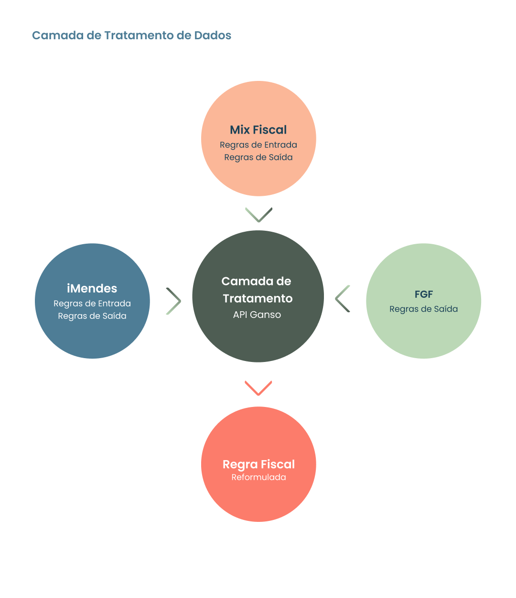

## Regras de Negócio Padrão

| Regra de Negócio | Descritivo                                                   | Padronizações                                                                                                                                                                                                                                   |
| :--------------- | :----------------------------------------------------------- | :---------------------------------------------------------------------------------------------------------------------------------------------------------------------------------------------------------------------------------------------- |
| RN1              | Integrador oferece **Código do CFOP** no Retorno da Consulta | Verificar a Finalidade de Operação enviada na Consulta ao Integrador para determinar se deve:  - **Criar Regra de Entrada** se CFOP retornado iniciar com 1, 2 ou 3.  - Criar **Regra de Saída** se CFOP retornado iniciar com 5, 6 ou 7. |
| RN2              | Integrador não oferece Regras de Entrada                     | Utilizar Regras de Saída de "Venda a Consumidor Final", para confrontar os dados e definir se ocorrerá **Atualização** ou **Criação** de uma Nova Regra.                                                                                        |

[Voltar ao Sumário](#documentação-de-requisitos---integrações-fiscais) | [Voltar ao Roadmap](#roadmap) | [Voltar ao Resumo](#resumo)

# Requisitos de Segurança

## Acessos Restritos

A seguir a Tabela de Acessos Restritos essenciais para Controle da Integração Fiscal
| Grupo | Descritivo | Regra de Negócio | Dependendência |
|:---|:---|:---|:---|
| Produto | Consultar Tributação de Produtos através do Integrador Fiscal | Impedir que o usuário execute consultas via função de consulta no Cadastro. | Parâmetro **Permitir Consultar Tributação através do Cadastro de Produtos** |
| Produto | Vincular Código do Integrador a um Produto Cadastrado | Impedir que o usuário vincule um Código de Produto do Integrador a um Produto durante a Inserção ou Atualização de Cadastro. | Parâmetro **Permitir Consultar Tributação por Descrição do Produto**.   **Nova Tela - Consulta por Descrição**    **Método de Consulta específico do Integrador** |
| Produto | Ativar parâmetro para não Tributar o Produto por Integradores Fiscais | Impedir que o Usuário ative o parâmetro do produto que impede o mesmo de ser enviado para Classificação Tributária e de Consultar e Atualizar a Tributação (Manualmente ou Automaticamente).    **Consultar Documentação do Integrador** sobre a disponibilidade do recurso | - |
| Cadastro de Finalidade de Operação | Criar Cenário Fiscal na API do Integrador | Impedir que o Usuário crie Cenário Fiscal com base nas informações inseridas no Cadastro de Finalidade, quando o Integrador implementar tal recurso. | - |
| Cadastro de Finalidade da Operação | Atualizar Cenário Fiscal na API do Integrador | Impedir que o Usuário efetue atualização das informações do Cenário Fiscal criado e enviado para uma API anteriormente, quando o Integrador implementar tal recurso. | - |

## Logs

A tabela a seguir, relaciona os Logs necessários por Integrador Fiscal, Regras de Negócio e Dados envolvidos.

| Nome do Log                          | Descritivo                                                               | Regras de Negócio                                                                                                                                                             | Dados                                                                                                                                                                 |
| :----------------------------------- | :----------------------------------------------------------------------- | :---------------------------------------------------------------------------------------------------------------------------------------------------------------------------- | :-------------------------------------------------------------------------------------------------------------------------------------------------------------------- |
| Consumo da API                       | Histórico de Acesso ou Consumo da API do Integrador Fiscal               | Armazenar dados da Consulta a cada nova Requisição à API do Integrador.                                                                                                       | Código da Filial, Data, Hora, Usuário de Consulta, Nome do Integrador, Nome da API Consumida, Método de Consulta, Número de Produtos enviados, Resposta da API        |
| Produto Log Consulta Tributária      | Histórico de Consultas por Produto                                       | Armazenar dados da Consulta Tributária realizada pelo Produto à API do Integrador.                                                                                            | Código do Produto, Código da Filial, Data, Hora, Usuário de Consulta, Nome do Integrador, Nome da API, Método de Consulta, Resposta da API, Dados de Retorno          |
| Produto Log Atualização Tributos     | Histórico de Tributos alterados por Produto                              | Armazenar dados dos Tributos que foram **alterados** e os **não alterados** e vincular a um Produto Log Consulta Tributária.                                                  | Código do Produto, Código da Filial, Todos os Campos de Tributos do Produto que foram atualizados, Todos os Campos de Tributos não atualizados, Data, Hora e Usuário. |
| Produto Log Envio Revisão Tributária | Histórico de Produtos enviados para Revisão Tributária para o Integrador | Armazenar os Produtos que foram enviados para Revisão Tributária, e quando houver retorno de atualização, sinalizar o Status como Revisado e gravar a Data e Hora do revisão. | Código Filial, Código do Produto, Data, Hora, Usuário de Envio, Status da Revisão, Integrador Fiscal                                                                  |
| Cenário Fiscal                       | Histórico de Alterações de Cenário Fiscal                                | Armazenar dados da atualização do Cenário Fiscal, quando o integrador implementar tal recurso                                                                                 | Código do Cenário do Integrador, Data, Hora, Usuário e Histórico (descritivo da alteração realizada)                                                                  |

[Voltar ao Sumário](#documentação-de-requisitos---integrações-fiscais) | [Voltar ao Roadmap](#roadmap) | [Voltar ao Resumo](#resumo)

# Simulações

## Processo de Atualização do Sistema após implementações

1. Organizar todos os Produtos e suas informações Tributárias para criar uma Regra Padrão de **"Venda a Consumidor Final"** por **Produto ou NCM**.
   1. Criar Regras por Conjuntos de Dados Distintos, uma vez que há diferenças de Tributação de Produtos entre **Tributados, Não Tributados e Substituição Tributária**.
   2. Agrupar os Critérios Principais, e criar um **Método** para determinar se a Regra será criada por NCM ou Produto, com base na quantidade de Produtos.
      1. Quando um Conjunto de Critérios e Tributações abrange muitos Produtos, e uma única ocorrência para o NCM, esta Regra pode ser definida por NCM.
      2. Quando há mais de uma ocorrência de Conjunto de Critérios e Tributações para um mesmo NCM, avaliar a quantidade de Produtos abrangidos para determinar a criação de Regra por Produto.
2. Criar o Perfil Fiscal **"Consumidor Final"**, definir a Característica Tributária como **"Pessoa Física não Contribuinte do ICMS"** e Contribuinte do ICMS como **Não Contribuinte**.
3. Criar o Perfil Fiscal **"Pessoa Jurídica Contribuinte do ICMS"**, definido a Característica Tributária como **"Varejista"** e Contribuinte do ICMS como **Contribuinte do ICMS**.
4. Criar o Perfil Fiscal **"Pessoa Jurídica Não Contribuinte do ICMS"**, definido a Característica Tributária como **"Pessoa Jurídica não Contribuinte do ICMS"** e Contribuinte do ICMS como **Não Contribuinte**.
5. Executar Atualização dos **Cadastros de Clientes Pessoa Física** definindo o **Regime Tributário** como **"Consumidor Final"** e **Perfil Fiscal** criado no passo 2 (Consumidor Final).
6. Executar Atualização dos **Cadastros de Clientes Pessoa Jurídica e Contribuinte do ICMS** anteriormente definido como **"Sim"**, definindo o **Regime Tributário** como **"Lucro Real"** e **Perfil Fiscal** criado no passo 3.
7. Executar Atualização dos **Cadastros de Clientes Pessoa Jurídica e Não Contribuinte do ICMS** anteriormente definido como **"Não"**, definindo o **Regime Tributário** como **"Lucro Real"** e **Perfil Fiscal** criado no passo 4.
8. Criar a **Finalidade Operação "Venda a Consumidor Final"**, definindo a **Operação** como **"Venda a Consumidor Final"**, Tipo de Movimentação como **"Saída"**, CFOP Padrão **"Vazio"** e Finalidade do Produto como **Mercadoria para Revenda**.
9. Criar **Regras Fiscais** utilizando a **Finalidade de Operação** criada no passo 6 e **Perfil Fiscal** criado no passo 2, obedecendo as seguintes definições:
   1. Quando o Produto possuir Alíquota de ICMS **diferente** de **"Subst. Trib."** e **CST Estadual** entre **"000,020,040,041"**, criar a Regra **"VENDA A CONSUMIDOR FINAL TRIBUTADO NCM XXXX UF"**. Utilizar o CFOP **"5102"** na Regra.
   2. Quando o Produto possuir Alíquota de ICMS igual a **"Subst. Trib."** e **CST Estadual** igual a **"060"**, criar a Regra **"VENDA A CONSUMIDOR FINAL ST NCM XXXX UF"**. Utilizar o CFOP **"5405"** na Regra.
   3. **Obs.:** O Sistema deve relacionar os Produtos a uma Regra sempre que a Operação corresponder, NCM e CEST, para que não ocorra duplicidade durante a utilização na operação de Venda a Consumidor Final.

O Fluxo abaixo, ilustra a operação descrita acima.

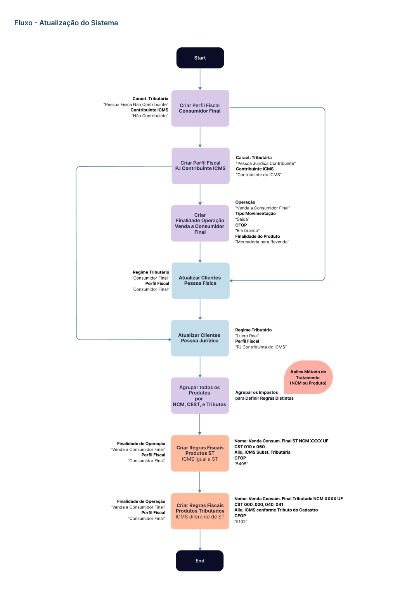

[Voltar ao Sumário](#documentação-de-requisitos---integrações-fiscais) | [Voltar ao Roadmap](#roadmap) | [Voltar ao Resumo](#resumo)
