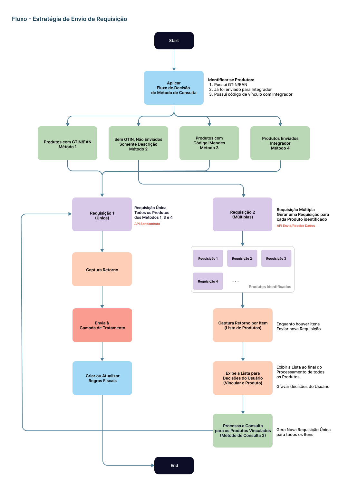

Sumário

- [Introdução](#introdução)
  - [Roadmap do Integrador](#roadmap-do-integrador)
- [Requisitos da Integração iMendes](#requisitos-da-integração-imendes)
  - [Parâmetros do Sistema](#parâmetros-do-sistema)
  - [Acessos Restritos](#acessos-restritos)
  - [Alterações no Cadastro de Empresas](#alterações-no-cadastro-de-empresas)
  - [Alterações no Cadastro de Produtos](#alterações-no-cadastro-de-produtos)
    - [Funções](#funções)
    - [Novos Campos](#novos-campos)
  - [Métodos de Consulta](#métodos-de-consulta)
  - [Composição da Requisição](#composição-da-requisição)
    - [Detalhamento da Estrutura JSON](#detalhamento-da-estrutura-json)
    - [Exemplo de Requisição API - JSON completo de Envio](#exemplo-de-requisição-api---json-completo-de-envio)
    - [Tratamento do Retorno de Informações](#tratamento-do-retorno-de-informações)
    - [Relação de Dados do Produto e Produto Parâmetros x Retorno do Integrador Fiscal](#relação-de-dados-do-produto-e-produto-parâmetros-x-retorno-do-integrador-fiscal)
  - [Tabela Produto](#tabela-produto)
  - [Tabela Produto Parâmetros](#tabela-produto-parâmetros)
- [Consultas em Lotes](#consultas-em-lotes)
  - [Regras de Negócio](#regras-de-negócio)
  - [Nova Tela - Gerenciador Tributário](#nova-tela---gerenciador-tributário)
- [Requisitos de Homologação](#requisitos-de-homologação)
  - [Checklist do MVP iMendes](#checklist-do-mvp-imendes)
- [Recursos Adicionais](#recursos-adicionais)

---

# Introdução

- O presente documento objetiva descrever em detalhes os processos e meios para Integração Fiscal de Consulta Tributária com o Parceiro **iMendes** no Sistema Ganso, com Foco em obter tributação para a Operação de **Venda a Consumidor Final**.
- No Modelo de Integração definido, o Sistema Ganso comunica-se com o portal tributário do Parceiro Integrador através de uma **API**, e realiza a consulta da Tributação dos produtos obtendo os dados para os mesmos.
- O Integrador Disponibiliza duas **APIs** principais que são: **Saneamento** e **Envia/Recebe Dados**, que respectivamente, retornam a tributação dos Produtos, e lista de produtos do Parceiro.
- A Consulta pode ocorrer em 3 momentos: durante a realização de um **Novo Cadastro**, consultando a tributação de um ou mais **Produtos Cadastrados** ou **Enviando Todos os Produtos** para Revisão Geral. O processo de revisão e classificação tributária denomina-se como **Saneamento** pelo Parceiro.
- A Resposta da Consulta é Imediata em consultas simples ou lotes pequenos, desde que o Produto e Código EAN/GTIN exista na base de dados do Integrador. O **Envio de Todos os Produtos** possui um prazo diferente, e requer até 45 dias para obter o retorno, considerando os que não possuem Código EAN/GTIN, para devolução integral das informações.
- O Integrador recomenda que o Sistema ofereça decisões inviduais ao usuário, ou seja, poderá ou não acatar as alterações tributárias para seus produtos através do próprio Sistema Ganso.
- O Integrador retorna dados suficientes para permitir a criação de Regras Fiscais de Entrada e de Saída completas no Sistema Ganso, entretanto, faz-se necessário o uso de um **Gerenciador Tributário** e uma **Camada de Tratamento de dados** para garantir o direcionamento correto dos dados.

## Roadmap do Integrador

Conforme Análise e Testes da Plataforma do Integrador, foram definidas as seguintes etapas para implementação da integração:

1.  Etapa 1 - Inclusão de Novos Dados no [Cadastro de Empresas](#alterações-no-cadastro-de-empresas) e Inclusão de Novos Parâmetros do Sistema em [Parâmetros do Sistema](#parâmetros-do-sistema)
2.  Etapa 2 - Implementação da Função de Consulta Tributação no [Cadastro de Produtos](#alterações-no-cadastro-de-produtos) e seus Métodos de Consulta descritos em [Métodos de Consulta](#métodos-de-consulta)
3.  Etapa 3 - Implementação da Rotina de Consulta Tributação e Envio/Recebimento de Dados em Lotes na Seção [Consultas em Lotes](#consultas-em-lotes)
4.  Etapa 4 - Validação das Implementações do MVP de acordo com o Checklist do Parceiro descritas em [Checklist MVP](#checklist-do-mvp-imendes)
5.  Etapa 5 - Implementações de Recursos Adicionais do Integrador para atender a Versão Final desejável em [Recursos Adicionais](#recursos-adicionais)

- **Roadmap ilustrado**

  

# Requisitos da Integração iMendes

Nesta Seção são descritos os Requisitos a Implementar da Integração iMendes, que atende à Homologação e abrange os principais recursos do Integrador. A princípio, devem ser implementados os **Parâmetros do Sistema**, para permitir a comunicação com o Integrador. Em seguida, Implementar uma função para **Consultar Tributação** através do **Cadastro de Produtos**, considerando 4 (quatro) Métodos de Consulta, que utilizam informações específicas para gerar a Requisição e obter os dados tributários.

## Parâmetros do Sistema

Nesta seção, são descritos os Parâmetros essenciais para o funcionamento desta Integração. Deve ser utilizada a nova aba de **Integrações Fiscais** dos Parâmetros do Sistema, e conter os elementos descritos abaixo:

| Tipo de Elemento          | Posicionamento      | Nome/Texto                                                                 | Descritivo                                                                                                                                                                                                                                    | Validações                                                                                                                                                                                                                                                                                                                |
| :------------------------ | :------------------ | :------------------------------------------------------------------------- | :-------------------------------------------------------------------------------------------------------------------------------------------------------------------------------------------------------------------------------------------- | :------------------------------------------------------------------------------------------------------------------------------------------------------------------------------------------------------------------------------------------------------------------------------------------------------------------------ |
| **Caixa de Seleção**      | Aba iMendes         | Ativar Integração de Consulta Tributária iMendes                           | Parâmetro Principal para Ativação das Configurações de Integração e funcionalidade no Sistema Ganso                                                                                                                                           | Não permitir ativar se houver outra Integração Fiscal Ativada no Sistema Ganso                                                                                                                                                                                                                                            |
| **Grupo**                 | Aba iMendes         | **Autenticação**                                                           | Organiza os campos de Configurações para conectividade com os Servidores iMendes                                                                                                                                                              | Ativar apenas se o Parâmetro Ativar Integração estiver selecionado                                                                                                                                                                                                                                                        |
| **Campo Texto**           | Grupo Autenticação  | URL da API Saneamento (Consulta Tributação)                                | Campo para informar a URL da API que retorna Dados da Tributação do Produto consultado.                                                                                                                                                       | Permitir até 255 caracteres.                                                                                                                                                                                                                                                                                              |
| **Campo Texto**           | Grupo Autenticação  | URL da API Envia/Recebe Dados (Outros Métodos)                             | Campo para informar a URL da API utilizada para os Recursos Adicionais do iMendes descritos em [Recursos Adicionais iMendes](#recursos-adicionais)                                                                                            | Permitir até 255 caracteres.                                                                                                                                                                                                                                                                                              |
| **Campo Texto Mascarado** | Grupo Autenticação  | Senha                                                                      | Campo para informar a Senha do Cliente Integrado.                                                                                                                                                                                             | Permitir até 30 caracteres alfanuméricos e símbolos                                                                                                                                                                                                                                                                       |
| **Caixa de Combinação**   | Grupo Autenticação  | Versão da API                                                              | Seleção da Versão da API contratada. Disponibilizar as versões 2.0 e 3.0 por padrão                                                                                                                                                           | Permitir selecionar apenas uma das versões                                                                                                                                                                                                                                                                                |
| **Campo de Texto**        | Grupo Autenticação  | Tempo de Resposta                                                          | Timeout ou Tempo de Resposta máximo da API. Tempo máximo que o Sistema deve aguardar para obter a resposta antes de efetuar uma nova requisição.                                                                                              | Campo Numérico, interpretado em segundos, com valor padrão definido em 15 segundos.                                                                                                                                                                                                                                       |
| **Botão de Ação**         | Grupo Autenticação  | Verificar Status                                                           | Botão para acionar um comando de teste de conectividade com as APIs utilizando os dados de Autenticação e URLs informadas.                                                                                                                    | Deve retornar uma Mensagem amigável de Sucesso ou Falha, informando quais APIs foram testadas.                                                                                                                                                                                                                            |
| **Caixa de Combinação**   | Grupo Autenticação  | Ambiente Ativo                                                             | Campo para selecionar o Ambiente de Comunicação Ativado, que pode ser definido entre "**1 - Homologação ou 2 - Produção**". Este código é enviado na Requisição durante uma consulta.                                                         | Permitir selecionar apenas um dos Ambientes.                                                                                                                                                                                                                                                                              |
| **Grupo**                 | Aba iMendes         | **Configurações**                                                          | Organiza os Parâmetros de Regra de Negócio e automatismos da Integração.                                                                                                                                                                      | Ativar apenas se o Parâmetro Ativar Integração estiver selecionado                                                                                                                                                                                                                                                        |
| **Caixa de Seleção**      | Grupo Configurações | Permitir consultar tributação de produtos através do Cadastro de Produtos  | Permite ao Usuário efetuar a Consulta Tributária durante o Cadastramento de um Novo Produto ou de um Produto Cadastrado através de uma ação no próprio Cadastro de Produtos. Se desativar, não exibir o Botão/Função no Cadastro de Produtos. | Observar os Métodos de Consulta ([Ver Seção Métodos de Consulta](#método-de-consulta-básico)) e Acesso Restrito ([Ver Seção Acessos Restritos](#acessos-restritos)) da Operação.                                                                                                                                          |
| **Caixa de Seleção**      | Grupo Configurações | Permitir consultar tributação por descrição do produto                     | Permite ao Usuário consultar a Base do Integrador por Descrição de Produtos e vincular um Produto Cadastrado que não possua Código de Barras Padronizado a um produto semelhante da Lista do Integrador.                                      | Solicitar Acesso Restrito durante o procedimento no Cadastro de Produtos [Ver Seção Acessos Restritos](#acessos-restritos). Se Parâmetro desativado, não considerar o respectivo método de consulta, e informar ao usuário que o cadastro do Produto deverá ter as informações complementadas para viabilizar a consulta. |
| **Campo de Texto**        | Grupo Configurações | Limite de produtos por Lote                                                | Permite definir o Limite Máximo de Produtos a enviar em um Lote por Requisição. Recomendado para atender clientes com limitações de conexão de internet                                                                                       | Limitar ao valor máximo de 1000 e mínimo de 100. Valor Padrão: 100                                                                                                                                                                                                                                                        |
| **Caixa de Seleção**      | Grupo Configurações | Verificar alterações tributárias de produtos automaticamente a cada n dias | Permite ao Sistema Ganso executar uma varredura automática na Base iMendes com finalidade de localizar atualizações de Tributações de Produtos, utilizando método específico da API Envia/Recebe dados.                                       | Informar um número inteiro de dias. Valor padrão: 15 dias                                                                                                                                                                                                                                                                 |

## Acessos Restritos

| Grupo   | Descritivo                                                                                 | Regra de Negócio                                                                                                                                                                                          |
| :------ | :----------------------------------------------------------------------------------------- | :-------------------------------------------------------------------------------------------------------------------------------------------------------------------------------------------------------- |
| Produto | Consultar a Tributação de um Produto (Consulta Individual) através do Cadastro de Produtos | Restringe um Usuário de efetuar a Consulta Tributária de um Produto e Atualizar seus Tributos se o Parâmetro "Permitir consultar tributação de produtos através do cadastro de produtos" estiver ativado. |
| Produto | Consultar Lista de Produtos do Integrador (Consulta por Descrição)                         | Restringe um Usuário de efetuar uma Consulta na Base do iMendes e vincular um Produto iMendes se o Parâmetro "Permitir consultar tributação por descrição do produto" estiver ativado.                    |
| Produto | Restringir Atualização ou Auditoria Tributária do Produto por Integradores Fiscais         | Restringe um Produto de receber Atualizações Tributárias de um Integrador Fiscal ativado ou de ser enviado para Revisão Tributária.                                                                       |

## Alterações no Cadastro de Empresas

O Integrador iMendes requer dados específicos da Empresa que consultará a tributação para compor uma requisição. Deste modo, é necessário criar um **Novo Campo** no Cadastro de Empresas para definir a "Subclassificação do CRT" que indica se a empresa é do **Lucro Real** ou **Lucro Presumido**, conforme descrito abaixo:

| Nome do Campo     | Descritivo                                                                                                                                                                                                                        | Validações                                                                           | Obrigatório |
| :---------------- | :-------------------------------------------------------------------------------------------------------------------------------------------------------------------------------------------------------------------------------- | :----------------------------------------------------------------------------------- | :---------: |
| Regime Tributário | Criar campo para informar a Subclassificação do CRT "3 - Regime Normal", que pode ser definida entre "**Lucro Real - LR**" ou "**Lucro Presumido - LP**". Este dado é obrigatório para enviar uma Requisição à API **Saneamento** | O Campo só pode ser preenchido se o CRT selecionado for igual a "3 - Regime Normal". |   **Sim**   |

## Alterações no Cadastro de Produtos

De modo a viabilizar a consulta breve da tributação de um produto, é necessário criar uma **Função** no Cadastro de Produtos que permita tal operação, além de **Novos Campos** para gerenciamento e auditoria, conforme abaixo:

### Funções

| Nome da Função       | Descritivo                                 | Regras de Negócio                                                                                                                                                                                                                       |
| :------------------- | :----------------------------------------- | :-------------------------------------------------------------------------------------------------------------------------------------------------------------------------------------------------------------------------------------- |
| Consultar Tributação | Aciona a Consulta Tributária ao Integrador | Ativar Função somente se o Parâmetro "Permitir consultar tributação de produtos através do Cadastro de Produtos". Solicitar Acesso Restrito para a Operação. [Ver Seção Acessos Restritos](#acessos-restritos) se Parâmetro habilitado. |

### Novos Campos

| Tipo                 | Posicionamento                     | Nome/Texto                             | Descritivo                                                                                                                                                                                                                                                                                | Regras de Negócio                                                                                                                                                                                |
| :------------------- | :--------------------------------- | :------------------------------------- | :---------------------------------------------------------------------------------------------------------------------------------------------------------------------------------------------------------------------------------------------------------------------------------------- | :----------------------------------------------------------------------------------------------------------------------------------------------------------------------------------------------- |
| **Campo**            | **Grupo de Dados do Produto**      | Código iMendes                         | Criar campo para armazenar e exibir o Código do Produto da Base do Integrador. Este Código é obtido quando ocorrer o vínculo durante a Consulta por Descrição efetuada pelo Usuário.                                                                                                      | Tipo Numérico Inteiro e Somente Leitura                                                                                                                                                          |
| **Campo**            | **Grupo de Tributação/Fiscal**     | Status da Integração Fiscal            | Criar campo para armazenar e exibir a Situação do Produto enviado para **Revisão Tributária**. Deve funcionar como uma espécie de "Log" da Revisão do Produto.                                                                                                                            | Criar Siglas específicas para representar a real situação como, por exemplo, **"NR - Não Revisado", "PR - Pendente de Revisão", "R - Revisado"**. Campo Somente leitura e visualmente destacado. |
| **Campo**            | **Grupo de Tributação/Fiscal**     | Auditado por iMendes                   | Criar campo para exibir a informação de que o Produto teve a tributação auditada/atualizada pelo Integrador Fiscal. Exibir a Data/Hora da última atualização tributária, p.ex.: "Auditado por iMendes em 29/11/2022 - 07:43".                                                             | Somente leitura e visualmente destacado.                                                                                                                                                         |
| **Caixa de Seleção** | **Grupo de Parâmetros do Produto** | **Não Tributar por Integrador Fiscal** | Parâmetro para restringir a atualização de Tributos do Produto pelo Integrador Fiscal. Por decisão do Usuário ou por orientação da Contabilidade, alguns produtos podem ser tributados seguindo a sua própria interpretação e não deverão receber atualizações tributárias do Integrador. | Solicitar Acesso Restrito. [Ver Seção Acessos Restritos](#acessos-restritos).                                                                                                                    |

[Voltar ao Sumário](#introdução) | [Voltar ao Roadmap](#roadmap)

## Métodos de Consulta

Conforme mencionado anteriormente, o Integrador iMendes possui 4 Métodos para Consultar a Tributação de um Produto. Deste modo, é necessário observá-los para a tomada de decisão durante a consulta tributária de um Produto, pois, a definição do Método _dependerá de quais informações serão fornecidas pelo Usuário ao Sistema_. Cada Método trata um _input_ distinto e possui uma API de consulta específica, que requer dados específicos. A seguir a definição de cada Método:

|    Método    |                   Tipo de Consulta                   | Descritivo                                                                                                                                                                                                                    |     API a Consumir     | Tags de Envio Principais                                                                               | Regras de Negócio                                                                                                                                                                                                                                                                                                                                                                                                                                                                    |
| :----------: | :--------------------------------------------------: | :---------------------------------------------------------------------------------------------------------------------------------------------------------------------------------------------------------------------------- | :--------------------: | :----------------------------------------------------------------------------------------------------- | :----------------------------------------------------------------------------------------------------------------------------------------------------------------------------------------------------------------------------------------------------------------------------------------------------------------------------------------------------------------------------------------------------------------------------------------------------------------------------------- |
| **Método 1** | **Código de Barras EAN/GTIN e Descrição do Produto** | Consultar a Tributação do Produto utilizando o Código de Barras EAN/GTIN e a Descrição do Produto.                                                                                                                            |     **Saneamento**     | `"codigo":"EAN", "codInterno":"N", "codIMendes":"", "descricao":"DESCRICAO"`, `"perfil"/"origem": "0"` | Identificar se o Código é um EAN válido, considerando tamanho de 8, 12, 13 ou 14 dígitos. Durante envio da Consulta, considerar sempre 14 dígitos para envio, preenchendo com Zeros à esquerda caso EAN diferente de tamanho 14. Se EAN válido, identificar se o Prefixo do Código de Barras inicia em "789" ou "790", ou "1789" ou "1790" para definir o campo **origem** igual a **0**, caso contrário enviar origem igual a 8. Capturar o retorno dos dados pela Tag `"prodEAN"`. |
| **Método 2** |                 **Apenas Descrição**                 | Consultar a Tributação de um Produto utilizando somente a **Descrição**. Método disponível em outro Endpoint, que retorna uma lista de Produtos semelhantes, e permite vincular um Produto da Lista com o Produto Cadastrado. | **Envia/Recebe Dados** | `"nomeservico":"DESCPRODUTOS", "dados":"CNPJ\|DESCRICAO" `                                             | Permitir vincular apenas **um** Produto iMendes com **um** Produto Cadastrado (Relacionamento 1:1), independente se possui ou não GTIN/EAN. Criar Método para Desvincular o Código iMendes quando necessário. Solicitar Acesso Restrito para esta operação. [Ver Seção Acessos Restritos](#acessos-restritos)                                                                                                                                                                        |
| **Método 3** |            **Código iMendes e Descrição**            | Consultar a Tributação do Produto utilizando o **Código iMendes** previamente vinculado ao Produto Cadastrado.                                                                                                                |     **Saneamento**     | `"codIMendes":"CODIGOVINCULADO", "descricao":"DESCRICAO"`                                              | Se o Produto possui um **Código iMendes**, utilizar esta informação para localizar a tributação.                                                                                                                                                                                                                                                                                                                                                                                     |
| **Método 4** |                  **Código Interno**                  | Consultar a Tributação do Produto utilizando o **Código Interno** do Produto Ganso previamente classificado pela iMendes. Este Método requer que a Base de Produtos tenha sido enviada anteriormente à iMendes.               |     **Saneamento**     | `"codInterno":"CODIGOINTERNO"`                                                                         | Método válido apenas se o Produto possuir o campo de **Status da Integração Fiscal** igual a **"Revisado" ou "Pendente de Revisão"**. [Ver definição do Campo no Cadastro de Produto](#alterações-no-cadastro-de-produtos)                                                                                                                                                                                                                                                           |

Para ilustrar a tomada de decisão que o Sistema Ganso deverá realizar conforme o _Input de dados_ do Usuário ou Dados coletados do Produto, o **Fluxo de Decisão** abaixo define a direção a ser tomada.


[Voltar ao Sumário](#introdução) | [Voltar ao Roadmap](#roadmap)

## Composição da Requisição

Após descritivo dos Métodos de Consulta que o Integrador oferece, abaixo é descrito como deve ser realizada uma Requisição à API do Integrador.
Conforme **Manual de Integração iMendes**, uma Consulta ao **Servidor de Integração** requer um padrão `JSON`. Supondo que o Sistema Ganso possua os Métodos implementados, a Consulta Simples (Apenas um Produto) através do **Cadastro de Produtos** pode ser compreendida através dos seguintes passos:

1. Usuário aciona a **Função de Consulta** do [Cadastro de Produtos](#alterações-no-cadastro-de-produtos).
2. O Sistema identifica **quais dados foram inseridos pelo Usuário** através do **Fluxo de Decisão de Método de Consulta** para definir o [**Método de Consulta**](#métodos-de-consulta) ideal e coleta as informações que compõem as _Tags_ principais do método utilizando a API correta.
3. Se o **Método de Consulta** identificado for igual a **"Método 2 - Apenas Descrição"**, continuar a partir do **Passo 8**, senão, continuar a partir do **Passo 4**.
4. O Sistema Coleta dados do Emitente (Dados da Empresa) e gera a _Tag_ `"emit"` do `JSON`.
5. O Sistema Coleta dados do Perfil do Destinatário da Operação, que nesta situação, trata-se de um Perfil **Consumidor Final** e gera a _Tag_ `"perfil"` do `JSON`.
6. O Sistema Coleta dados do Produto e gera a _Tag_ `"produtos"`.
7. O Sistema Constrói a estrutura `JSON` obedecendo a hierarquia estabelecida: `emit` > `perfil` > `produtos` e executa o **Passo 9**
8. Utilizar a **API Envia/Recebe Dados** e exibir a **Nova Tela de Consulta por Descrição** para Usuário decidir qual produto do iMendes vincular ao Produto Cadastrado. A partir deste ponto, o Produto possuirá um Código iMendes, e portanto, utilizará o Método de Consulta 3. O Sistema deve continuar do **Passo 2**.
9. O Sistema envia requisição à API indicada no Método identificado. [Ver Seção Parâmetros](#parâmetros-imendes)
10. O Sistema obtém retorno de dados tributários e os envia à **Camada de Tratamento** que determinará a Criação ou Atualização das Regras Fiscais correspondentes à Operação.

O Fluxo abaixo exemplifica as Estratégias de Envio de Requisição:



### Detalhamento da Estrutura JSON

Conforme descrito em Composição da Requisição, são necessários 3 grupos de informações: **Dados do Emitente (`emit`), Dados do Perfil (`perfil`) e Dados dos Produtos (`produtos`)**.

Os Dados do Emitente (Tag `emit`) deve conter os dados da **Empresa Consulente** e possui a seguinte relação de dados:

| Nome                  | Tag                 | Tipo      | Descritivo                                                                                                                                                                                                                   | Origem dos Dados                                                               | Preenchimento Obrigatório |
| :-------------------- | :------------------ | :-------- | :--------------------------------------------------------------------------------------------------------------------------------------------------------------------------------------------------------------------------- | :----------------------------------------------------------------------------- | :-----------------------: |
| Ambiente              | `"amb"`             | Código    | Tipo de Ambiente de Envio da Requisição, sendo 1 = Homologação e 2 = Produção.                                                                                                                                               | Consultar o Parâmetro "Ambiente Ativo" em [Parâmetros](#parâmetros-do-sistema) |          **Sim**          |
| CNPJ                  | `"cnpj"`            | Caractere | CNPJ do Emitente da Consulta (Cliente)                                                                                                                                                                                       | **Cadastro de Empresas** campo "CNPJ"                                          |          **Sim**          |
| CRT                   | `"crt"`             | Código    | Código do CRT da Empresa. 1 = Simples Nacional, 2 = Simples Nacional com excesso de sublimite ou 3 = Regime Normal                                                                                                           | **Cadastro de Empresas** campo "CRT"                                           |          **Sim**          |
| Regime Tributário     | `"regimeTrib"`      | Caractere | Regime Tributário da Empresa. Novo Campo Regime Tributário do Cadastro de Empresas. Se "Lucro Real" definir 'LR', se "Lucro Presumido" definir 'LP'                                                                          | **Cadastro de Empresas** campo novo "Regime Tributário".                       |          **Sim**          |
| UF                    | `"uf"`              | Caractere | UF do Emitente                                                                                                                                                                                                               | **Cadastro de Empresas** campo "UF" do Endereço                                |          **Sim**          |
| CNAE                  | `"cnae"`            | Caractere | CNAE do Emitente                                                                                                                                                                                                             | **Cadastro de Empresas** campo "CNAE"                                          |            Não            |
| Substituto Tributário | `"substICMS"`       | Caractere | Indicativo de Emitente Substituto Tributário. Se houver uma Inscrição Estadual de Substituto Tributário informada no Cadastro de Empresas, deve ser enviada esta informação tanto na tag `"emit"` quando na Tag `"produtos"` | **Cadastro de Empresas** grid de dados "Inscrição Substituto Tributário"       |            Não            |
| Dia                   | `"Dia"`             | Número    | Dia da Vigência combinada com Mês e Ano para consultas específicas por Data                                                                                                                                                  | Não necessário                                                                 |            Não            |
| Mês                   | `"Mês"`             | Número    | Mês da Vigência combinada com Dia e Ano para consultas específicas por Data                                                                                                                                                  | Não necessário                                                                 |            Não            |
| Ano                   | `"Ano"`             | Número    | Ano da Vigência combinada com Dia e Mês para consultas específicas por Data                                                                                                                                                  | Não necessário                                                                 |            Não            |
| Interdependente       | `"interdependente"` | Caractere | Informação específica. Enviar sempre como "N"                                                                                                                                                                                | Não necessário                                                                 |          **Sim**          |

Os Dados do Pefil (Tag `perfil`) compõe o **Perfil do Destinatário da Operação** para o qual se deseja obter a Tributação, ou seja, define a operação desejada.

| Nome                      | Tag            | Tipo                          | Descritivo                                                                                                                                                                                                                                                  | Regra de Negócio                                                                                             | Preenchimento Obrigatório |
| :------------------------ | :------------- | :---------------------------- | :---------------------------------------------------------------------------------------------------------------------------------------------------------------------------------------------------------------------------------------------------------- | :----------------------------------------------------------------------------------------------------------- | :-----------------------: |
| UF                        | `"uf"`         | **Lista de Dados**            | Lista de UFs para Consulta de Regras.                                                                                                                                                                                                                       | Informar a UF da Empresa Filial Logada.                                                                      |          **Sim**          |
| CFOP                      | `"cfop"`       | **Código da Operação**        | Código da Operação a ser Realizada. Deve ser enviada uma operação coerente com os dados desejados, por exemplo, uma Operação de Venda deve conter um CFOP que indique operação de Venda, mesmo que este não seja o correto (a iMendes retornará o correto). | Informar o Código **"5102"**.                                                                                |          **Sim**          |
| Característica Tributária | `"caracTrib"`  | **Lista de Códigos Inteiros** | Indica o **Tipo de Destinatário** da Operação. Esta informação deve ser obtida do Cadastro de Perfil Fiscal, do campo "Característica Tributária".                                                                                                          | Informar o Código 8, que corresponde a Característica de Pessoa Física não Contribuinte do ICMS              |          **Sim**          |
| Finalidade                | `"finalidade"` | Código                        | Indica a Destinação do Produto para a Operação informada. É importante para especificar a operação, e deve ser obtida do campo **"Finalidade do Produto"** do Cadastro da **Finalidade de Operação** informada para Consulta.                               | Informar o Código 0, que corresponde a Mercadoria para Revenda.                                              |          **Sim**          |
| Simples Nacional          | `"simplesN"`   | Caractere                     | Indica se o Destinatário da Operação é Simples Nacional ou Não. Preencher com "S" ou "N", conforme Regra de Negócio.                                                                                                                                        | Se CRT da Empresa Filial Logada é igual a 1 ou 2, enviar "S", senão, enviar "N".                             |          **Sim**          |
| Origem                    | `"origem"`     | Código                        | Indica a Origem da Mercadoria.                                                                                                                                                                                                                              | Se Tipo de Consulta igual a **Método 1**, e **Código de Barras** não iniciar em 789 ou 790, enviar Código 8. |          **Sim**          |
| Substituição Tributária   | `"substICMS"`  | Caractere                     | Indica se o destinatário é Substituto Tributário.                                                                                                                                                                                                           | Informar "N"                                                                                                 |          **Sim**          |

Obtidos os dados do Perfil, os Dados do Produto (Tag de `"produtos"`) é um **Conjunto** de Produtos e deve ser composta conforme dados e Regras de Negócio abaixo:

| Nome           | Tag            | Tipo      | Descritivo                                                                                                                               | Origem dos Dados                                                                                                          | Regras de Negócio                                                                                                                                                                                                                            | Preenchimento Obrigatório |
| :------------- | :------------- | :-------- | :--------------------------------------------------------------------------------------------------------------------------------------- | :------------------------------------------------------------------------------------------------------------------------ | :------------------------------------------------------------------------------------------------------------------------------------------------------------------------------------------------------------------------------------------- | :-----------------------: |
| Código         | `"codigo"`     | Código    | Código de Barras EAN/GTIN ou Código Interno do Produto quando o mesmo foi enviado previamente para Saneamento pela iMendes.              | **Cadastro de Produtos** campo Código de Barras Padrão ou Código Interno                                                  | Verificar o Método de Consulta apropriado para preenchimento deste campo, observando a Regra de Negócio. [Ver Seção Métodos de Consulta](#métodos-de-consulta)                                                                               |          **Sim**          |
| Código Interno | `"codInterno"` | Caractere | Indicativo de "Sim" ou "Não" para consulta via Código Interno. Será 'S" quando o Produto foi enviado previamente para Saneamento         | Preencher com "S" ou "N" de acordo com a Regra de Negócio                                                                 | Se o Produto está sinalizado como **"Enviado para Integrador Fiscal"**, enviar "S" e utilizar o **Método de Consulta 4** informando Código Interno do Produto na Tag `codigo` do JSON. [Ver Seção Métodos de Consulta](#métodos-de-consulta) |          **Sim**          |
| Descrição      | `"descricao"`  | Caractere | Descrição Completa do Produto                                                                                                            | **Cadastro de Produtos** campo "Descrição"                                                                                | Sempre enviar a Descrição Completa do Produto.                                                                                                                                                                                               |          **Sim**          |
| Código iMendes | `"codImendes"` | Código    | Código _Único_ fornecido pela iMendes. Quando um produto é vinculado ao código iMendes esta informação deve ser utilizada para consulta. | **Cadastro de Produtos** campo **"Codigo iMendes"** [Ver Seção Cadastro de Produtos](#alterações-no-cadastro-de-produtos) | Verificar se o Código iMendes está preenchido, se sim, enviar este Código, senão enviar em branco. Utilizar o **Método de Consulta 3** [Ver Seção Métodos de Consulta](#métodos-de-consulta)                                                 |          **Não**          |
| NCM            | `"ncm"`        | Caractere | Nomenclatura Comum do Mercosul                                                                                                           | **Cadastro de Produtos** campo "NCM"                                                                                      | Verificar se NCM está preenchido no Cadastro do Produto. Esta informação é importante para a correta classificação do produto.                                                                                                               |          **Não**          |

Após coleta dos dados, a Estrutura pode ser visualizada no Exemplo a seguir.

### Exemplo de Requisição API - JSON completo de Envio

A Estrutura abaixo exemplifica uma Consulta do Produto **Água Mineral** através do **Cadastro de Produtos** para **Operação de Saída por Venda a Consumidor Final** para o Estado de **MS** (Operação Interna). Na Tag `perfil/uf` é enviada apenas a UF correspondente à UF da Empresa Filial, ou seja, da Tag `emit/uf`.

```JSON
{
  "emit": {
    "amb": 1,
    "cnpj": "04391715000173",
    "crt": 3,
    "regimeTrib": "LR",
    "uf": "MS",
    "cnae": "",
    "substICMS": "N",
    "interdependente": "N"
  },
  "perfil": {
    "uf": ["MS"],
    "cfop": "5102",
    "caracTrib": [8],
    "finalidade": 0,
    "simplesN": "N",
    "origem": "0",
    "substICMS": "N"
  },
  "produtos": [
    {
      "codigo": "7894900531008",
      "codInterno": "N",
      "codIMendes": "",
      "descricao": "AGUA MINERAL CRYSTAL C/GAS 500ML",
      "ncm": "22011000"
    }
  ]
}
```

### Tratamento do Retorno de Informações

A Requisição de Exemplo retorna os dados em uma Estrutura `JSON` abaixo:

```JSON
 { "Cabecalho": {
        "sugestao": "Se a comunicação estiver lenta, reduza o número de UF's, Caract. Tributárias e produtos. Nessa ordem.",
        "amb": 1,
        "cnpj": "04391715000173",
        "dthr": "2022-08-18T11:37:34.7495236-03:00",
        "transacao": "48773646",
        "mensagem": "OK",
        "prodEnv": 1,
        "prodRet": 1,
        "prodNaoRet": 0,
        "comportamentosParceiro": "104;106;108",
        "comportamentosCliente": "",
        "versao": "2.3.5.0"
    },
    "Grupos": [
        {
            "codigo": "7408",
            "nCM": "22011000",
            "cEST": "03.005.04",
            "lista": "",
            "tipo": "",
            "codAnp": "",
            "passivelPMC": "S",
            "impostoImportacao": 20.00,
            "pisCofins": {
                "cstEnt": "73",
                "cstSai": "06",
                "aliqPis": 0.00,
                "aliqCofins": 0.00,
                "nri": "918",
                "ampLegal": "'Lei n 13.097/2015, Art. 28'",
                "redPis": 0,
                "redCofins": 0
            },
            "iPI": {
                "cstEnt": "03",
                "cstSai": "53",
                "aliqipi": 0.00,
                "codenq": "999",
                "ex": "00"
            },
            "Regras": [
                {
                    "uFs": [
                        {
                            "uF": "MS",
                            "CFOP": {
                                "cFOP": "5102",
                                "CaracTrib": [
                                    {
                                        "codigo": "8",
                                        "finalidade": "0",
                                        "codRegra": "1473",
                                        "codExcecao": 0,
                                        "cFOP": "5405",
                                        "cST": "60",
                                        "cSOSN": "",
                                        "aliqIcmsInterna": 17.00,
                                        "aliqIcmsInterestadual": 0.00,
                                        "reducaoBcIcms": 0.00,
                                        "reducaoBcIcmsSt": 0,
                                        "redBcICMsInterestadual": 0,
                                        "aliqIcmsSt": 0,
                                        "iVA": 0,
                                        "iVAAjust": 0,
                                        "fCP": 0.00,
                                        "codBenef": "",
                                        "pDifer": 0,
                                        "pIsencao": 0.00,
                                        "antecipado": "N",
                                        "desonerado": "N",
                                        "isento": "N",
                                        "tpCalcDifal": 0,
                                        "ampLegal": "'BASE LEGAL DA SUBSTITUICAO TRIBUTARIA - RICMS/MS, ANEXO III, SUBANEXO I, TABELAS IV-A E IV-B, ITEM 5.4'",
                                        "InfPDV": {
                                            "pICMSPDV": 0,
                                            "simbPDV": "F",
                                            "cstICMS": "60",
                                            "csosn": "",
                                            "cstSai": "06",
                                            "aliqPis": 0.00,
                                            "aliqCofins": 0.00
                                        },
                                        "Protocolo": {},
                                        "Convenio": {}
                                    }
                                ]
                            },
                            "mensagem": "OK"
                        }
                    ]
                }
            ],
            "prodEan": [
                "07894900531008"
            ],
            "Mensagem": "OK"
        }
    ],
    "SemRetorno": []
}
```

Os Dados Contidos no Grupo Cabeçalho (_Tag_ `"Cabecalho"`) contém as informações sobre a Requisição enviada e estes dados são importantes para orientar o Usuário e para gravação de Logs durante os processos de consulta. Abaixo, a relação de informações e sua utilidade:

| Tag                        | Descritivo                                                           | Utilidade                                              |
| :------------------------- | :------------------------------------------------------------------- | :----------------------------------------------------- |
| `"sugestao"`               | Mensagens da API                                                     | Apenas informativo                                     |
| `"amb"`                    | Ambiente Habilitado: 1 - Homologação / 2 - Produção                  | Validação do Parâmetro "Ambiente Ativo"                |
| `"cnpj"`                   | CNPJ do Cliente Integrado                                            | Validação Cadastral                                    |
| `"dthr"`                   | Data e Hora do Retorno dos dados                                     | Gravação de Logs de Consulta ou Retorno da API         |
| `"transacao"`              | Código da Transação gerada na API do Integrador                      | Auxiliar a solução de problemas                        |
| `"mensagem"`               | Mensagens da API                                                     | Apenas informativo                                     |
| `"prodEnv"`                | Produtos Enviados na Requisição                                      | Validação ou Verificação de Dados enviados             |
| `"prodRet"`                | Produtos Retornados pela Requisição                                  | Validação ou Verificação de Dados recebidos e enviados |
| `"comportamentosParceiro"` | Comportamentos configurados pelo Integrador para o Parceiro (Ganso)  | Apenas Informativo                                     |
| `"comportamentosCliente"`  | Comportamentos configurados pelo Integrador para o Cliente Integrado | Apenas Informativo                                     |
| `"versao"`                 | Versão da API utilizada para Consulta/Retorno                        | Apenas Informativo                                     |

O Integrador sugere a criação de um relatório de fácil acesso para estas situações.

Na sequencia, os Dados Contidos em Grupos (_Tag_ `"Grupos"`) é um conjunto de informações (_Array_) que contém os dados tributários dos Produtos consultados, e são organizados por código de grupo Tributário, NCM e demais informações tributárias coincidentes. Para cada **Grupo**, haverão Regras para cada **UF, Operação e Característica Tributária** consultada.
Abaixo o descritivo das informações deste grupo, considerando a ordem de cima para baixo do exemplo anterior:

| Tag                      | Descritivo                                                                                                                           |   Tag Pai   | Observações                                                                                                                                                                                                    |
| :----------------------- | :----------------------------------------------------------------------------------------------------------------------------------- | :---------: | :------------------------------------------------------------------------------------------------------------------------------------------------------------------------------------------------------------- |
| `Grupos`                 | Tag principal que organiza os dados tributários chave, o detalhamento da tributação e os produtos que utilizam a tributação do Grupo |      -      | Conjunto de dados                                                                                                                                                                                              |
| `codigo`                 | Código do Grupo Tributário correspondente aos dados da Requisição                                                                    |  `Grupos`   | Código de Agrupamento de Regras da Base do iMendes                                                                                                                                                             |
| `nCM`                    | NCM do Produto (Nomenclatura Comum do Mercosul)                                                                                      |  `Grupos`   | NCM correto para utilizar nos Produtos relativos ao Grupo.                                                                                                                                                     |
| `cEST`                   | CEST do Produto (Código Especificador da Substituição Tributária)                                                                    |  `Grupos`   | CEST correto para utilizar nos Produtos relativos ao Grupo.                                                                                                                                                    |
| `codAnp`                 | Código da ANP do Produto (Produto específico igual a Combustível)                                                                    |  `Grupos`   | Código da ANP correto a ser utilizado em Produtos Específicos                                                                                                                                                  |
| `impostoImportacao`      | Alíquota de Imposto de Importação aplicável ao Produto                                                                               |  `Grupos`   | Informação utilizada apenas no DF-e de Saída. Ainda não definida em Regra Fiscal                                                                                                                               |
| `pisCofins`              | Grupo de Informações do PIS e Cofins                                                                                                 |  `Grupos`   | Dados aplicáveis a todos os Produtos do Grupo                                                                                                                                                                  |
| `cstEnt`                 | CST de PIS e de COFINS de Entrada                                                                                                    | `pisCofins` | CST aplicável às operações de Entrada do Produto. PIS e COFINS são impostos gêmeos, portanto o CST de PIS e COFINS de Entrada devem ser iguais.                                                                |
| `cstSai`                 | CST de PIS e de COFINS de Saída                                                                                                      | `pisCofins` | CST aplicável às operações de Saída do Produto. PIS e COFINS são impostos gêmeos, portanto o CST de PIS e COFINS de Saída devem ser iguais.                                                                    |
| `aliqPis`                | Alíquota de PIS                                                                                                                      | `pisCofins` | Alíquota aplicável ao Produto. Se a _Tag_ `infPDV` existir no retorno, considerar esta Alíquota como Entrada, caso contrário, considerar para Entrada e Saída                                                  |
| `aliqCofins`             | Alíquota de Cofins                                                                                                                   | `pisCofins` | Alíquota aplicável ao Produto. Se a _Tag_ `infPDV` existir no retorno, considerar esta Alíquota como Entrada, caso contrário, considerar para Entrada e Saída                                                  |
| `nri`                    | Natureza da Receita                                                                                                                  | `pisCofins` | CST da Natureza da Receita para PIS e COFINS. Código único de identificação de Natureza do Produto                                                                                                             |
| `ampLegal`               | Amparo Legal do PIS e COFINS                                                                                                         | `pisCofins` | Informações sobre a Base Legal (da esfera Federal) para a Tributação do PIS e COFINS                                                                                                                           |
| `iPI`                    | Grupo de Informações do IPI                                                                                                          |  `Grupos`   | Dados Aplicáveis a todos os Produtos do Grupo                                                                                                                                                                  |
| `cstEnt`                 | CST de IPI de Entrada                                                                                                                |    `iPI`    | CST do IPI de Entrada aplicável às operações de Entrada do Produto                                                                                                                                             |
| `cstSai`                 | CST de IPI de Saída                                                                                                                  |    `iPI`    | CST do IPI de Saída aplicável às operações de Saída do Produto                                                                                                                                                 |
| `aliqipi`                | Alíquota de IPI                                                                                                                      |    `iPI`    | Alíquota de IPI aplicável à operação                                                                                                                                                                           |
| `codenq`                 | Código de Enquadramento do IPI                                                                                                       |    `iPI`    | Código de Enquadramento segundo a TIPI.                                                                                                                                                                        |
| `ex`                     | Código de Exceção/Exclusão da TIPI                                                                                                   |    `iPI`    | Código de Excessão/Exclusão segundo a TIPI.                                                                                                                                                                    |
| `Regras`                 | Grupo de Informações das Regras                                                                                                      |  `Grupos`   | Detalhamento das Regras Fiscais para os Produtos retornados                                                                                                                                                    |
| `uFs`                    | Grupo de Informações Tributárias por UF (Lista de UFs)                                                                               |  `Regras`   | Agrupamento das informações tributárias por UF da Lista de UFs informadas na Requisição                                                                                                                        |
| `uF`                     | Identificação de uma das UFs informadas na Requisição                                                                                |    `UFs`    | Identificação da UF correspondente aos dados aplicáveis correspondentes à UF informada na Requisição                                                                                                           |
| `CFOP`                   | Grupo de Informações Tributárias por CFOP (Lista de CFOPs)                                                                           |    `UFs`    | Agrupamento das informações tributárias por CFOP da Lista de CFOPs informados na Requisição                                                                                                                    |
| `cFOP`                   | Identificação do Código CFOP informado na Requisição                                                                                 |   `CFOP`    | Identificação do CFOP correspondente aos dados aplicáveis correspondentes aos CFOPs informado na Requisição                                                                                                    |
| `CaracTrib`              | Grupo de Informações Tributárias aplicáveis ao CFOP e UF retornados nos níveis acima                                                 |   `CFOP`    | Agrupamento das informações tributárias aplicáveis correspondentes à UF e CFOP informados na Requisição                                                                                                        |
| `codigo`                 | Código da Característica Tributária informada na Requisição. Fixada em 8                                                             | `CaracTrib` | Código da Característica Tributária informada na Requisição                                                                                                                                                    |
| `finalidade`             | Código da Finalidade do Produto informada na Requisição. Fixado em 0                                                                 | `CaracTrib` | Código da Finalidade do Produto informada na Requisição                                                                                                                                                        |
| `codRegra`               | Código da Regra Fiscal da Base do Integrador relativo ao Grupo de Tributação.                                                        | `CaracTrib` | Código da Regra Fiscal do Integrador. Gravar este Código no campo "Código Integrador" da Regra Fiscal do Sistema Ganso                                                                                         |
| `cFOP`                   | Código do CFOP aplicável à operação                                                                                                  | `CaracTrib` | Código do CFOP aplicável à operação consultada, ou seja, o CFOP efetivo da operação.                                                                                                                           |
| `cST`                    | CST do ICMS aplicável à operação                                                                                                     | `CaracTrib` | CST do ICMS aplicável à operação. Se a _Tag_ `infPDV` existir no retorno, considerar o campo `cstICMS`. Concatenar o Código enviado no campo `origem`da _Tag_ `perfil` para completar os 3 dígitos necessários |
| `cSOSN`                  | CSOSN do ICMS aplicável à operação                                                                                                   | `CaracTrib` | CSOSN do ICMS aplicável à operação. Se a _Tag_ `infPDV` existir no retorno, considerar o campo `csosn`. Concatenar o Código enviado no campo `origem`da _Tag_ `perfil` para completar os 4 dígitos necessários |
| `aliqIcmsInterna`        | Alíquota Interna do ICMS aplicável à operação                                                                                        | `CaracTrib` | Alíquota Interna do ICMS aplicável à operação. Se a _Tag_ `infPDV` existir no retorno, considerar o campo `pICMSPDV` e `simbPDV` para utilizar o tributo correto.                                              |
| `aliqIcmsInterestadual`  | Alíquota Interestadual do ICMS aplicável à operação                                                                                  | `CaracTrib` | Alíquota Interestadual do ICMS aplicável à operação. Se a _Tag_ `infPDV` existir no retorno, considerar o campo `pICMSPDV` e `simbPDV` para utilizar o tributo correto.                                        |
| `reducaoBcIcms`          | Percentual de Redução de Base de Cálculo do ICMS Normal aplicável à operação                                                         | `CaracTrib` | Percentual de Redução de Base de Cálculo aplicável ao ICMS Normal para Operações Internas                                                                                                                      |
| `reducaoBcIcmsSt`        | Percentual de Redução de Base de Cálculo do ICMS ST aplicável à operação                                                             | `CaracTrib` | Percentual de Redução de Base de Cálculo aplicável ao ICMS ST                                                                                                                                                  |
| `redBcICMsInterestadual` | Percentual de Redução de Base de Cálculo do ICMS Normal aplicável à operação                                                         | `CaracTrib` | Percentual de Redução de Base de Cálculo aplicável ao ICMS Normal para Operações Interestaduais                                                                                                                |
| `aliqIcmsSt`             | Alíquota do ICMS ST aplicável à operação                                                                                             | `CaracTrib` | Alíquota de ICMS ST aplicável                                                                                                                                                                                  |
| `iVA`                    | Percentual de Margem de Valor Agregado aplicável à Operação Interna                                                                  | `CaracTrib` | MVA% Aplicável à operação interna                                                                                                                                                                              |
| `iVAAjust`               | Percentual de Margem de Valor Agregado aplicável à Operação Interestadual                                                            | `CaracTrib` | MVA% Aplicável à operação interestadual conforme alíquota interestadual                                                                                                                                        |
| `fCP`                    | Percentual de Fundo de Combate à Pobreza aplicável à operação                                                                        | `CaracTrib` | Percentual de FCP aplicável ao ICMS Normal e ao ICMS ST                                                                                                                                                        |
| `codBenef`               | Código do Benefício Fiscal da Operação                                                                                               | `CaracTrib` | Informação do Produto                                                                                                                                                                                          |
| `pDifer`                 | Percentual de Diferimento do ICMS da Operação                                                                                        | `CaracTrib` | Diferimento Aplicável ao Valor do ICMS                                                                                                                                                                         |
| `pIsencao`               | Percentual de Desoneração do ICMS da Operação                                                                                        | `CaracTrib` | Desoneração Aplicável. Se campo `desonerado` igual a 'S' utilizar o percentual para cálculo da Desoneração. Caso contrário, ignorar.                                                                           |
| `ampLegal`               | Amparo Legal do ICMS                                                                                                                 | `CaracTrib` | Informações sobre a Base Legal (da esfera Estadual) para a Tributação do ICMS                                                                                                                                  |

[Voltar ao Sumário](#introdução) | [Voltar ao Roadmap](#roadmap-do-integrador)

Após Processo de Envio e Captura de Retorno, os seguintes passos devem ocorrer:

1. Para cada Produto pertencente ao Conjunto `prodEan`, atualizar os dados de Tributação para a Filial Logada conforme a Relação de Dados e Regras de Negócio.
2. Gravar Logs das Atualizações ocorridas para os Produtos.

### Relação de Dados do Produto e Produto Parâmetros x Retorno do Integrador Fiscal

Abaixo a relação de Campos do Sistema Ganso que deverão receber os dados. A relação está divida em 2 tabelas: **Produto e Produto Parâmetros**.

## Tabela Produto

Nesta Tabela, deverão ser atualizados os Dados que não dependem do Tipo de Operação Consultado.

| Campo a Atualizar       | Descritivo                                   | Retorno iMendes | Regra de Negócio                                                                                                                   |
| :---------------------- | :------------------------------------------- | :-------------: | :--------------------------------------------------------------------------------------------------------------------------------- |
| NCM                     | NCM do Produto                               |      `nCM`      | Aplicar o NCM de Retorno                                                                                                           |
| CEST                    | Código CEST do Produto                       |     `cEST`      | Remover a máscara do retorno e gravar apenas os dígitos.                                                                           |
| prod_esp_com_codigo_anp | Código ANP do Produto Específico Combustível |    `codAnp`     | Se existir retorno para esta informação, gravar o Código ANP no Produto e preencher o campo "PRODUTO_ESPECIFICO" com a sigla 'COM' |
| ex_tipi                 | Exclusão da TIPI                             |      `ex`       | Aplicar a Ex da TIPI de Retorno                                                                                                    |

## Tabela Produto Parâmetros

| Campo a Atualizar                               | Descritivo                                                                    |          Retorno iMendes           | Regra de Negócio                                                                                                                                                                                                                                                                                                                                                                                                                                                                                                                                                                                                                                                                                                                                                                                                                                                                                                                                                                                                                                                                                                                                                                                                                                   |
| :---------------------------------------------- | :---------------------------------------------------------------------------- | :--------------------------------: | :------------------------------------------------------------------------------------------------------------------------------------------------------------------------------------------------------------------------------------------------------------------------------------------------------------------------------------------------------------------------------------------------------------------------------------------------------------------------------------------------------------------------------------------------------------------------------------------------------------------------------------------------------------------------------------------------------------------------------------------------------------------------------------------------------------------------------------------------------------------------------------------------------------------------------------------------------------------------------------------------------------------------------------------------------------------------------------------------------------------------------------------------------------------------------------------------------------------------------------------------- |
| cst_pis_entrada                                 | CST de PIS de Entrada                                                         |         `pisCofins/cstEnt`         | O CST de PIS de Entrada deve ser igual ao CST de Cofins de Entrada.                                                                                                                                                                                                                                                                                                                                                                                                                                                                                                                                                                                                                                                                                                                                                                                                                                                                                                                                                                                                                                                                                                                                                                                |
| cst_cofins_entrada                              | CST de Cofins de Entrada                                                      |         `pisCofins/cstEnt`         | O CST de Cofins de Entrada deve ser igual ao CST de PIS de Entrada.                                                                                                                                                                                                                                                                                                                                                                                                                                                                                                                                                                                                                                                                                                                                                                                                                                                                                                                                                                                                                                                                                                                                                                                |
| cst_pis                                         | CST de PIS de Saída                                                           |         `pisCofins/cstSai`         | O CST de PIS de Saída deve ser igual ao CST de Cofins de Saída.                                                                                                                                                                                                                                                                                                                                                                                                                                                                                                                                                                                                                                                                                                                                                                                                                                                                                                                                                                                                                                                                                                                                                                                    |
| cst_cofins                                      | CST de Cofins de Saída                                                        |         `pisCofins/cstSai`         | O CST de PIS de Saída deve ser igual ao CST de Cofins de Saída.                                                                                                                                                                                                                                                                                                                                                                                                                                                                                                                                                                                                                                                                                                                                                                                                                                                                                                                                                                                                                                                                                                                                                                                    |
| codigo_tributo_pis_entrada / f_pis_compra       | Alíquota de PIS de Entrada                                                    |        `pisCofins/aliqPis`         | Gravar o Código do Tributo do PIS que consta na Tabela "TRIBUTOS" do Sistema Ganso, que corresponda à Alíquota retornada pelo parceiro. Gravar a Alíquota no campo f_pis_compra.                                                                                                                                                                                                                                                                                                                                                                                                                                                                                                                                                                                                                                                                                                                                                                                                                                                                                                                                                                                                                                                                   |
| codigo_tributo_cofins_entrada / f_cofins_compra | Alíquota de Cofins de Entrada                                                 |       `pisCofins/aliqCofins`       | Gravar o Código do Tributo do Cofins que consta na Tabela "TRIBUTOS" do Sistema Ganso, que corresponda à Alíquota retornada pelo parceiro. Gravar a Alíquota no campo f_cofins_compra.                                                                                                                                                                                                                                                                                                                                                                                                                                                                                                                                                                                                                                                                                                                                                                                                                                                                                                                                                                                                                                                             |
| codigo_tributo_pis_saida / f_pis_venda          | Alíquota de PIS de Saída                                                      |        `pisCofins/aliqPis`         | Gravar o Código do Tributo do PIS que consta na Tabela "TRIBUTOS" do Sistema Ganso, que corresponda à Alíquota retornada pelo parceiro. Gravar a Alíquota no campo f_pis_venda.                                                                                                                                                                                                                                                                                                                                                                                                                                                                                                                                                                                                                                                                                                                                                                                                                                                                                                                                                                                                                                                                    |
| codigo_tributo_cofins_saida / f_cofins_venda    | Alíquota de Cofins de Saída                                                   |       `pisCofins/aliqCofins`       | Gravar o Código do Tributo do Cofins que consta na Tabela "TRIBUTOS" do Sistema Ganso, que corresponda à Alíquota retornada pelo parceiro. Gravar a Alíquota no campo f_cofins_venda.                                                                                                                                                                                                                                                                                                                                                                                                                                                                                                                                                                                                                                                                                                                                                                                                                                                                                                                                                                                                                                                              |
| cst_natureza_receita_piscofins                  | CST da Natureza da Receita de PIS e Cofins                                    |          `pisCofins/nri`           | Verificar a existência do Código de Natureza da Receita (campo "codigo_natureza_receita" da tabela "NATUREZA_RECEITA") onde os campos "cst_pis" e "cst_cofins" correspondam ao CST de PIS e Cofins retornados pelo Integrador. Se existir, gravar no Campo do Ganso. Se não existir, criar um Registro Genérico na Tabela "NATUREZA_RECEITA" preenchendo os campos: <br> CODIGO_NATUREZA_RECEITA: Código Retornado pelo Integrador <br> NATUREZA_RECEITA: 'Natureza criada pelo Integrador (x)' <br> CST_PIS e CST_COFINS: CST de PIS e Cofins Retornados pelo Integrador, tanto de entrada quanto de saída, separados por vírgula. Ex.: '70,06'                                                                                                                                                                                                                                                                                                                                                                                                                                                                                                                                                                                                   |
| cst_ipi_entrada                                 | CST de IPI de Entrada                                                         |            `iPI/cstEnt`            | Informar o Código de Retorno no Campo de destino.                                                                                                                                                                                                                                                                                                                                                                                                                                                                                                                                                                                                                                                                                                                                                                                                                                                                                                                                                                                                                                                                                                                                                                                                  |
| cst_ipi                                         | CST de IPI de Saída                                                           |            `iPI/cstSai`            | Informar o Código de Retorno no Campo de destino.                                                                                                                                                                                                                                                                                                                                                                                                                                                                                                                                                                                                                                                                                                                                                                                                                                                                                                                                                                                                                                                                                                                                                                                                  |
| codigo_tributo_ipi                              | Alíquota de IPI de Saída                                                      |           `iPI/aliqipi`            | Gravar o Código do Tributo que consta na Tabela "PRODUTO_TRIBUTO" onde o campo "SITUACAO" seja igual a 1, "SITUACAO_TRIBUTARIA" seja igua a 'T' e o campo "CST" corresponda ao valor retornado pelo Integrador.                                                                                                                                                                                                                                                                                                                                                                                                                                                                                                                                                                                                                                                                                                                                                                                                                                                                                                                                                                                                                                    |
| codigo_cfop_nfc                                 | Código Fiscal de Operação ou Prestação (CFOP) de Saída                        |          `CaracTrib/cFOP`          | Informar no campo de destino o valor retornado pelo Integrador.                                                                                                                                                                                                                                                                                                                                                                                                                                                                                                                                                                                                                                                                                                                                                                                                                                                                                                                                                                                                                                                                                                                                                                                    |
| cst                                             | CST de ICMS de Saída                                                          |          `CaracTrib/cST`           | Concatenar o dígito '0' como prefixo                                                                                                                                                                                                                                                                                                                                                                                                                                                                                                                                                                                                                                                                                                                                                                                                                                                                                                                                                                                                                                                                                                                                                                                                               |
| cst_nfc                                         | CST de ICMS de Saída (NFC-e/SAT)                                              |          `CaracTrib/cST`           | Concatenar o dígito '0' como prefixo                                                                                                                                                                                                                                                                                                                                                                                                                                                                                                                                                                                                                                                                                                                                                                                                                                                                                                                                                                                                                                                                                                                                                                                                               |
| csosn                                           | CSOSN de ICMS de Saída - Se CRT = 1 ou 2                                      |         `CaracTrib/cSOSN`          | Concatenar o dígito '0' como prefixo                                                                                                                                                                                                                                                                                                                                                                                                                                                                                                                                                                                                                                                                                                                                                                                                                                                                                                                                                                                                                                                                                                                                                                                                               |
| csosn_nfc                                       | CSOSN de ICMS de Saída (NFC-e/SAT)                                            |         `CaracTrib/cSOSN`          | Concatenar o dígito '0' como prefixo. Gravar somente se CRT da Empresa igual 1 ou 2.                                                                                                                                                                                                                                                                                                                                                                                                                                                                                                                                                                                                                                                                                                                                                                                                                                                                                                                                                                                                                                                                                                                                                               |
| f_rbc_icms_sai_estadual                         | Percentual de Redução de Base de Cálculo do ICMS Estadual                     |     `CaracTrib/reducaoBcIcms`      | Informar no campo de destino o valor retornado pelo Integrador.                                                                                                                                                                                                                                                                                                                                                                                                                                                                                                                                                                                                                                                                                                                                                                                                                                                                                                                                                                                                                                                                                                                                                                                    |
| f_rbc_icms_sai_interestadual                    | Percenutal de Redução de Base de Cálculo do ICMS Interestadual                | `CaracTrib/redBcIcmsInterestadual` | Informar no campo de destino o valor retornado pelo Integrador.                                                                                                                                                                                                                                                                                                                                                                                                                                                                                                                                                                                                                                                                                                                                                                                                                                                                                                                                                                                                                                                                                                                                                                                    |
| f_st_rbc_icms_sai_estadual                      | Percentual de Redução de Base de Cálculo do ICMS ST Estadual                  |    `CaracTrib/reducaoBcIcmsSt`     | Informar no campo de destino o valor retornado pelo Integrador.                                                                                                                                                                                                                                                                                                                                                                                                                                                                                                                                                                                                                                                                                                                                                                                                                                                                                                                                                                                                                                                                                                                                                                                    |
| f_st_rbc_icms_sai_interestadual                 | Percenutal de Redução de Base de Cálculo do ICMS ST Interestadual             | `CaracTrib/redBcICMsInterestadual` | Informar no campo de destino o valor retornado pelo Integrador.                                                                                                                                                                                                                                                                                                                                                                                                                                                                                                                                                                                                                                                                                                                                                                                                                                                                                                                                                                                                                                                                                                                                                                                    |
| f_st_mva_saida                                  | Percentual de Margem de Valor Agregado ou Índice de Valor Agregado de Saída   |          `CaracTrib/iVA`           | Informar no campo de destino o valor retornado pelo Integrador.                                                                                                                                                                                                                                                                                                                                                                                                                                                                                                                                                                                                                                                                                                                                                                                                                                                                                                                                                                                                                                                                                                                                                                                    |
| f_st_mva                                        | Percentual de Margem de Valor Agregado ou Índice de Valor Agregado de Entrada |        `CaracTrib/iVAAjust`        | Informar no campo de destino o valor retornado pelo Integrador.                                                                                                                                                                                                                                                                                                                                                                                                                                                                                                                                                                                                                                                                                                                                                                                                                                                                                                                                                                                                                                                                                                                                                                                    |
| percentual_fcp                                  | Percentual de Entrada do Fundo de Combate a Pobreza                           |          `CaracTrib/fCP`           | Informar no campo de destino o valor retornado pelo Integrador.                                                                                                                                                                                                                                                                                                                                                                                                                                                                                                                                                                                                                                                                                                                                                                                                                                                                                                                                                                                                                                                                                                                                                                                    |
| cod_beneficio_fiscal                            | Código do Benefício Fiscal de Saída                                           |        `CaracTrib/codBenef`        | Informar no campo de destino o valor retornado pelo Integrador.                                                                                                                                                                                                                                                                                                                                                                                                                                                                                                                                                                                                                                                                                                                                                                                                                                                                                                                                                                                                                                                                                                                                                                                    |
| percentual_diferimento                          | Percentual de Diferimento de Entrada                                          |         `CaracTrib/pDifer`         | Informar no campo de destino o valor retornado pelo Integrador.                                                                                                                                                                                                                                                                                                                                                                                                                                                                                                                                                                                                                                                                                                                                                                                                                                                                                                                                                                                                                                                                                                                                                                                    |
| codigo_tributo                                  | Código do Tributo de ICMS de Saída Estadual para NFC-e/SAT-CF-e               |         `infPDV/pICMSPDV`          | Se o Valor retornado na Tag descrita for maior que zero, gravar o Código do Tributo que consta na Tabela "PRODUTO_TRIBUTO" onde o campo "SITUACAO" seja igual a 0, o campo "SITUACAO_TRIBUTARIA" seja igual a 'T' e o campo "CST" corresponda ao valor retornado na Tag descrita. <br><br> Se valor retornado igual a 0 e o campo `CaracTrib/cST` é igual a '60', gravar o Código do Tributo que consta na Tabela "PRODUTO_TRIBUTO" onde o campo "SITUACAO" seja igual a 0 e "SITUACAO_TRIBUTARIA" seja igual a 'F'. <br><br> Se valor retornado igual a 0 e o campo `CaracTrib/cST` é igual a '40', gravar o Código do Tributo que consta na Tabela "PRODUTO_TRIBUTO" onde o campo "SITUACAO" seja igual a 0 e "SITUACAO_TRIBUTARIA" seja igual a 'I'. <br><br> Se valor retornado igual a 0 e o campo `CaracTrib/cST` é igual a '41' ou '51', gravar o Código do Tributo que consta na Tabela "PRODUTO_TRIBUTO" onde o campo "SITUACAO" seja igual a 0 e "SITUACAO_TRIBUTARIA" seja igual a 'N'. <br><br> Se o campo o "SITUACAO_TRIBUTARIA" é igual ao campo `infPDV/simbPDV`, gravar o Código do Tributo que consta na Tabela "PRODUTO_TRIBUTO" onde o campo "SITUACAO" seja igual a 0 e "SITUACAO_TRIBUTARIA" seja igual ao campo mencionado. |
| f_icms_venda                                    | Alíquota de ICMS de Saída Estadual para NFC-e/SAT-CF-e                        |         `infPDV/pICMSPDV`          | Informar no campo de destino o valor retornado pelo Integrador.                                                                                                                                                                                                                                                                                                                                                                                                                                                                                                                                                                                                                                                                                                                                                                                                                                                                                                                                                                                                                                                                                                                                                                                    |

[Voltar ao Sumário](#introdução) | [Voltar ao Roadmap](#roadmap)

# Consultas em Lotes

Para viabilizar a Consulta para vários Produtos de uma só vez ou para que seja enviada a Base de Dados ao Integrador iMendes, é necessário implementar uma **Nova Tela de Gerenciador** que inicialmente deve processar apenas consultas para uma única **Operação**.
Além disso, é necessário obedecer as Regras de Negócio implícitas pela variação de Métodos de Consulta.

## Regras de Negócio

| Ação do Usuário                                                                                                                     | Regra de Negócio                                                                                                                                                                                                     | Resposta ao Usuário                                                                                                                                                                                                                                                                                                                 | Dados para Composição da Requisição                                         | Tags de Envio Principais                                        |
| :---------------------------------------------------------------------------------------------------------------------------------- | :------------------------------------------------------------------------------------------------------------------------------------------------------------------------------------------------------------------- | :---------------------------------------------------------------------------------------------------------------------------------------------------------------------------------------------------------------------------------------------------------------------------------------------------------------------------------- | :-------------------------------------------------------------------------- | :-------------------------------------------------------------- |
| Filtrar e Selecionar Produtos que requerem **Métodos de Consulta** distintos. [Ver Seção Métodos de Consulta](#métodos-de-consulta) | Tratar cada situação de modo distinto (conforme o Método de Consulta) para assegurar que a consulta seja realizada utilizando a API correta do Integrador.                                                           | O Sistema deve informar ao Usuário que determinados Produtos poderão ser consultados por meios distintos e que alguns deverão ser processados individualmente, como por exemplo, Produtos que precisam ser **Consultados na Base iMendes por Descrição**. [Ver na Seção Métodos de Consulta os Métodos 2 e 3](#métodos-de-consulta) | Código iMendes, campo "Status da Integração Fiscal" do Cadastro de Produtos | `produtos/codigo`, `produtos/codInterno`, `produtos/codImendes` |
| Utilizar a função [F4] - Selecionar Todos/Inverter Seleção                                                                          | Se usuário selecionar automaticamente um número de itens maior que o Limite de envio configurado em [Parâmetros](#parâmetros-do-sistema), quebrar o envio em requisições distintas contendo o número limite de itens | O Sistema deve informar ao Usuário que serão geradas mais de uma requisição contendo x produtos para consulta.                                                                                                                                                                                                                      | -                                                                           | -                                                               |

## Nova Tela - Gerenciador Tributário

O Integrador Fiscal oferece recurso ao Usuário para consultar a Tributação de vários produtos em uma única Requisição (em Lote), obtendo retorno imediato (para produtos já classificados pela iMendes) conforme as configurações da operação solicitada. Além disso, permite o envio do Cadastro Completo para revisão. Deste modo é necessário construir uma Nova Tela conforme elementos iniciais levantados:

| Elemento            | Posicionamento                               | Nome/Texto                                               | Descritivo                                                                                                                        | Conjunto de Dados e Opções                                                                                                                                                                                                                                                                                       | Regras de Negócio                                                                                                                                                                                                                                                                                                                                                                                                                                                                                     |
| :------------------ | :------------------------------------------- | :------------------------------------------------------- | :-------------------------------------------------------------------------------------------------------------------------------- | :--------------------------------------------------------------------------------------------------------------------------------------------------------------------------------------------------------------------------------------------------------------------------------------------------------------- | :---------------------------------------------------------------------------------------------------------------------------------------------------------------------------------------------------------------------------------------------------------------------------------------------------------------------------------------------------------------------------------------------------------------------------------------------------------------------------------------------------- |
| Grupo de Filtros    | Início                                       | Segmentação                                              | Grupo que organiza os campos para pesquisa de Produtos por Segmentação do Sistema Ganso.                                          | Filtros de Marca, Seção, Grupo, Subgrupo, Ambiente de Utilização, Fornecedor Padrão e Agrupamento de Preços.                                                                                                                                                                                                     | Validar Hierarquia de Segmentação                                                                                                                                                                                                                                                                                                                                                                                                                                                                     |
| Grupo de Filtros    | Início                                       | Produto                                                  | Grupo que organiza os campos para pesquisa de Produtos por Características.                                                       | Filtros "Contém, Começa Com, Igual a" para os campos **Descrição, Referência do Fabricante, Referência Auxiliar e Localização**, Status do Produto, Empresas (Filiais), Caixas de Seleção para as opções **Produtos com EAN/GTIN, Produtos Enviados para Integrador Fiscal, Produtos com Código do Integrador**. | A opção **"Produtos com EAN/GTIN"** deve retornar apenas produtos cujo Código de Barras seja maior ou igual a 8 dígitos. <br><br> A opção **"Produtos Enviados para Integrador Fiscal"** refere-se ao itens que foram enviados uma vez em Lote para Revisão Tributária, ou seja, que estão Aguardando a Tributação ou que já foram Revisados. <br><br> A opção **"Produtos com Código do Integrador"** deve listar apenas produtos que possuírem o Código iMendes preenchido no Cadastro de Produtos. |
| Botão               | Grupo de Filtros do Produto                  | Limpar filtros                                           | Botão que aciona o comando para limpar todos os filtros, inclusive os do Grupo Segmentação                                        | Todos os filtros                                                                                                                                                                                                                                                                                                 | Exibir uma Mensagem de Confirmação e decisão do Usuário.                                                                                                                                                                                                                                                                                                                                                                                                                                              |
| Grade de Dados      | Abaixo do Grupo de Filtros do Produto        | Resultado dos Filtros                                    | Tabela de Dados contendo os Produtos resultantes dos filtros informados pelo usuário.                                             | Conter Caixa de Seleção, Código, Código de Barras, Descrição, NCM, CEST, Marca, Seção, Grupo, Subgrupo, Código do Integrador, Enviado para Integrador Fiscal ([Ver Seção Cadastro de Produtos](#alterações-no-cadastro-de-produtos)), Histórico                                                                  | Permitir selecionar um ou mais Produtos do Resultado. <br><br>Permitir configurar as colunas a exibir na Grade de Dados. Exibir uma "_dica_" quando o usuário passar o mouse sobre um Produto para exibir os dados Tributários **Antes e Depois**. <br><br> Observar a Limitação de Produtos do Integrador.                                                                                                                                                                                           |
| Botão               | Grupo de Filtros do Produto                  | Pesquisar                                                | Botão que aciona a pesquisa considerando os filtros informados, inclusive os do Grupo Segmentação.                                | Todos os filtros                                                                                                                                                                                                                                                                                                 | Verificar se nenhum filtro foi preenchido, se sim, informar ao Usuário que a Consulta retornará **todos os produtos**. <br>Informar que mesmo listando todos os Produtos, há um Limite de Produtos por lote a enviar por limitação da API. **Consultar a Documentação do Integrador**                                                                                                                                                                                                                 |
| Texto               | Abaixo da Grade de Resultado - lado esquerdo | Tecla de Atalho [F4] - Selecionar Todos/Inverter Seleção | Ação para permitir selecionar Todos os Produtos da Grade de Resultado ou Inverter a Seleção atual                                 | Todos os dados da Grade de Resultado                                                                                                                                                                                                                                                                             | Permitir selecionar o inverter a seleção dos Produtos do Resultado usando a Tecla de Atalho. <br><br> Observar o Limite de Seleção do Integrador.                                                                                                                                                                                                                                                                                                                                                     |
| Texto               | Abaixo da Grade de Resultado - lado esquerdo | [F5] - Limpar Seleção                                    | Ação para permitir limpar a Seleção atual da Grade de Resultado dos Filtros                                                       | Todos os dados da Grade de Resultado                                                                                                                                                                                                                                                                             | -                                                                                                                                                                                                                                                                                                                                                                                                                                                                                                     |
| Texto               | Abaixo Grade de Resultado - lado direito     | Produtos Listados                                        | Texto informativo que exibe o contador total de Produtos que a pesquisa retornou.                                                 | Produtos da Grade de Resultado                                                                                                                                                                                                                                                                                   | -                                                                                                                                                                                                                                                                                                                                                                                                                                                                                                     |
| Texto               | Abaixo Grade de Resultado - lado direito     | Produtos Selecionados                                    | Texto informativo que exibe o contador de Produtos selecionados pelo Usuário.                                                     | Produtos da Grade de Resultado                                                                                                                                                                                                                                                                                   | -                                                                                                                                                                                                                                                                                                                                                                                                                                                                                                     |
| Grupo de Parâmetros | Rodapé da Tela                               | Parâmetros para Consulta Tributária                      | Grupo que organiza os filtros específicos e as funções que estarão disponíveis conforme Integrador Ativo.                         | Finalidade de Operação, Perfil Fiscal, UFs de Origem/Destino.                                                                                                                                                                                                                                                    | Desabilitar a exibição/alteração destes campos/funções.                                                                                                                                                                                                                                                                                                                                                                                                                                               |
| Caixa de Combinação | Grupo de Parâmetros para Consulta Tributária | Finalidade da Operação                                   | Criar campo para definir a Finalidade da Operação previamente cadastrada                                                          | Fixada em Venda de Mercadoria a Consumidor Final (CFOP 5102)                                                                                                                                                                                                                                                     | Fixar a Finalidade de Operação, que neste caso é o CFOP 5102.                                                                                                                                                                                                                                                                                                                                                                                                                                         |
| Caixa de Combinação | Grupo de Parâmetros para Consulta Tributária | Perfil Fiscal                                            | Criar campo para definir o Perfil Fiscal previamente cadastrado.                                                                  | Fixada em 8 - Pessoa Física não Contribuinte do ICMS                                                                                                                                                                                                                                                             | Fixar a Característica Tributária em "8 - Pessoa Física não Contribuinte do ICMS"                                                                                                                                                                                                                                                                                                                                                                                                                     |
| Campo de Texto      | Grupo de Parâmetros para Consulta Tributária | UFs de Origem/Destino                                    | Criar campo para definir as UFs para as quais o usuário deseja obter as Tributações.                                              | Unidades Federadas Brasileiras. Fixada em 'UF da Empresa Filial logada'                                                                                                                                                                                                                                          | Fixar em 'UF da Empresa Filial Logada'                                                                                                                                                                                                                                                                                                                                                                                                                                                                |
| Botão               | Grupo de Parâmetros para Consulta Tributária | Enviar Lote para Revisão                                 | Botão para acionar o Envio dos Produtos selecionados para Revisão Tributária pelo Integrador Fiscal.                              | Todos os Produtos Selecionados                                                                                                                                                                                                                                                                                   | Verificar Limite de Envio nos Parâmetros do Sistema. **Consultar Documentação do Integrador para Parametrização**                                                                                                                                                                                                                                                                                                                                                                                     |
| Botão               | Grupo de Parâmetros para Consulta Tributária | Consultar Tributação                                     | Botão para acionar o comando de Consultar Tributação para os produtos selecionados na Grade de Dados.                             | Produtos Selecionados                                                                                                                                                                                                                                                                                            | Identificar o Método de Consulta ideal para cada Produto.                                                                                                                                                                                                                                                                                                                                                                                                                                             |
| Botão               | Grupo de Parâmetros para Consulta Tributária | Consultar Atualizações                                   | Botão para acionar o comando para Consultar Alterações/Atualizações de Tributação para os produtos selecionados na Grade de Dados | Todos os dados                                                                                                                                                                                                                                                                                                   | Utilizar o Método Específico para consulta de alterações descrito em [Recursos Adicionais](#recursos-adicionais).                                                                                                                                                                                                                                                                                                                                                                                     |
| Botão               | Grupo de Parâmetros para Consulta Tributária | Pendências                                               | Botão para acionar a visualização de Produtos Pendentes de Classificação pelo Integrador Fiscal                                   | -                                                                                                                                                                                                                                                                                                                | Utilizar o Método Específico para consulta de pendências descrito em [Recursos Adicionais](#recursos-adicionais).                                                                                                                                                                                                                                                                                                                                                                                     |

A seguir, um exemplo de _Protótipo_ que exemplifica os elementos identificados na tabela acima para a Nova Tela.


[Voltar ao Sumário](#introdução) | [Voltar ao Roadmap](#roadmap)

# Requisitos de Homologação

Nesta seção contém a relação de recursos que o Sistema Ganso deve oferecer para que a Homologação seja concluída com sucesso.

## Checklist do MVP iMendes

| Item  | Requisito iMendes                                                                                                                                                                                                          | Requisito Ganso                                                                                | Grau de Importância | Implementado |
| :---: | :------------------------------------------------------------------------------------------------------------------------------------------------------------------------------------------------------------------------- | :--------------------------------------------------------------------------------------------- | :-----------------: | :----------: |
| MVP 1 | Opção para Usuário definir que o Produto Cadastrado não deve ser enviado à iMendes                                                                                                                                         | Documentação de Requisitos de Integrações / Cadastro de Produtos                               |      **Alto**       |      -       |
| MVP 2 | Opção para Usuário enviar informações manualmente                                                                                                                                                                          | [Ver Seção Consulta em Lotes](#consultas-em-lotes)                                             |      **Alto**       |      -       |
| MVP 3 | Captura de Retorno controlado por Log e **Reversão** de tributação atualizada de qualquer Produto em qualquer ponto do histórico                                                                                           | Documentação de Requisitos de Integrações / Requisitos de Segurança                            |      **Alto**       |      -       |
| MVP 4 | Consultar a Tributação de um único produto através do Cadastro do Produto e receber as atualizações após consulta                                                                                                          | Documentação de Requisitos de Integrações / Cadastro de Produtos                               |      **Alto**       |      -       |
| VF 1  | Opção para Usuário vincular um Produto próprio com o Código iMendes                                                                                                                                                        | [Ver Seção Métodos de Consulta - Método 2](#métodos-de-consulta)                               |      **Alto**       |      -       |
| VF 2  | Gravar e exibir no Cadastro do Produto um selo indicativo de auditoria da tributação pela IMendes                                                                                                                          | Documentação de Requisitos de Integrações / Cadastro de Produtos                               |      **Alto**       |      -       |
| VF 3  | Gravar e exibir o Retorno da Consulta por Produto contendo todos os campos retornados pela API e permitir a seleção de campos individuais para atualização. Apresentar a relação **Antes e Depois** e um Aceite do Usuário | -                                                                                              |      **Alto**       |      -       |
| VF 4  | Efetuar verificação períodica de Atualizações Tributárias dos Produtos auditados por iMendes através do Método **Alterados**                                                                                               | [Ver Seção Parâmetros do Sistema](#parâmetros-do-sistema), parâmetro **Verificação Periódica** |      **Alto**       |      -       |
| VF 5  | Criar um Relatório Gerencial para acompanhamento do Histórico de Mudanças Tributárias ocorridas em determinado período                                                                                                     | [Documentação de Requisitos de Integrações / Requisitos de Segurança                           |      **Alto**       |      -       |
| VF 6  | Implementar o **Simulador Tributário** que efetua uma verificação no Cadastro de Produtos e aponta os problemas tributários em Clientes ainda não integrados                                                               | -                                                                                              |      **Médio**      |      -       |
| VF 7  | Implementar mensagem de **Sugestão de Contratação da iMendes** para captura de novos clientes                                                                                                                              | -                                                                                              |      **Baixo**      |      -       |

**Legenda**: Coluna **Item**: MVP - Implementação Mínima | VF - Versão Final (Recursos Adicionais)

# Recursos Adicionais
